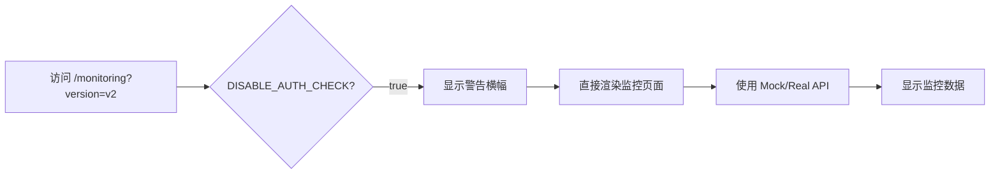
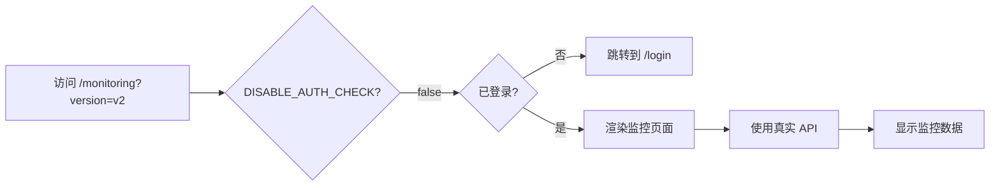

# 监控中心 v2 - 开发环境认证绕过指南

## 📋 问题描述

**现象**: 访问 `http://localhost:3000/monitoring?version=2` 时,会自动跳转到登录页面 `/login`

**根本原因**:
- 监控页面 (`src/app/monitoring/page.tsx`) 使用了 `useRequireAuth` Hook 强制认证检查
- 认证上下文 (`src/lib/contexts/auth-context.tsx`) 会检查 localStorage 中的 `access_token`
- 如果未登录(无 token),则自动跳转到登录页

**设计初衷**: 保护生产环境的敏感数据,防止未授权访问

---

## ✅ 解决方案：开发环境认证绕过

### 方案架构

通过环境变量 `NEXT_PUBLIC_DISABLE_AUTH_CHECK` 控制是否跳过认证检查:

```typescript
// src/app/monitoring/page.tsx (第 27 行)
const DISABLE_AUTH_CHECK = process.env.NEXT_PUBLIC_DISABLE_AUTH_CHECK === 'true'

if (DISABLE_AUTH_CHECK) {
  // 跳过认证,直接渲染监控页面
  return <MonitoringViewV2 />
}
```

### 优势

✅ **安全性**: 生产环境默认禁用,必须显式设置环境变量
✅ **便捷性**: 开发环境可以快速测试监控页面,无需登录
✅ **可见性**: 页面顶部显示黄色警告横幅,提醒开发者当前处于开发模式
✅ **可控性**: 可随时通过环境变量切换开启/关闭

---

## 🚀 使用方法

### 步骤 1: 配置环境变量

编辑 `frontend/.env.local` 文件:

```bash
# ==================== 开发环境配置 ====================
# 禁用认证检查（仅用于前端开发调试）
# - true:  跳过登录验证，直接访问监控页面（仅开发环境）
# - false: 需要登录才能访问（生产环境默认）
# ⚠️ 警告：生产环境必须设置为 false 或不设置此变量！
NEXT_PUBLIC_DISABLE_AUTH_CHECK=true

# ==================== 监控中心数据源配置 ====================
# 控制监控中心 v2 是否使用 Mock 数据
NEXT_PUBLIC_USE_MOCK_DATA=true
```

### 步骤 2: 重启开发服务器

```bash
cd frontend
pnpm dev
```

⚠️ **重要**: 环境变量修改后必须重启开发服务器才能生效!

### 步骤 3: 访问监控页面

直接访问以下 URL,无需登录:

- **v1 版本**: `http://localhost:3000/monitoring?version=v1`
- **v2 版本**: `http://localhost:3000/monitoring?version=v2`

---

## 🎨 界面效果

### 开发模式警告横幅

页面顶部会显示黄色警告横幅:

```
⚠️ 开发模式：已禁用认证检查 (NEXT_PUBLIC_DISABLE_AUTH_CHECK=true)
```

**样式特征**:
- 🟡 黄色背景 (`bg-yellow-100`)
- 🟡 黄色边框 (`border-yellow-400`)
- 📌 固定在页面顶部
- 🌙 支持深色模式

### 数据源标签

页面右上角显示当前数据源:

- 🟢 **绿色标签** "使用 Mock 数据" (NEXT_PUBLIC_USE_MOCK_DATA=true)
- 🟣 **紫色标签** "真实 API" (NEXT_PUBLIC_USE_MOCK_DATA=false)

---

## 🔒 生产环境安全

### 默认行为（安全）

如果 `.env.production` 或生产环境未设置 `NEXT_PUBLIC_DISABLE_AUTH_CHECK`:

```typescript
const DISABLE_AUTH_CHECK = process.env.NEXT_PUBLIC_DISABLE_AUTH_CHECK === 'true'
// → false (默认值)

// 执行正常的认证检查
const { isAuthenticated, isLoading } = useRequireAuth()
if (!isAuthenticated) {
  router.push('/login') // 跳转登录页
}
```

### 生产环境配置建议

**方式 1: 完全不设置该变量（推荐）**

```bash
# .env.production
# 不设置 NEXT_PUBLIC_DISABLE_AUTH_CHECK
```

**方式 2: 显式设置为 false**

```bash
# .env.production
NEXT_PUBLIC_DISABLE_AUTH_CHECK=false
```

### 部署检查清单

部署到生产环境前,请确认:

- [ ] `.env.production` 未设置 `NEXT_PUBLIC_DISABLE_AUTH_CHECK` 或设置为 `false`
- [ ] 生产环境环境变量中未设置 `NEXT_PUBLIC_DISABLE_AUTH_CHECK=true`
- [ ] 使用 CI/CD 部署时,确保环境变量配置正确
- [ ] 访问生产环境监控页面时,未登录会跳转到登录页

---

## 🛠️ 高级用法

### 场景 1: 临时禁用认证（快速测试）

```bash
# 在终端临时设置环境变量（无需修改 .env.local）
export NEXT_PUBLIC_DISABLE_AUTH_CHECK=true
pnpm dev
```

### 场景 2: 切换数据源

**使用 Mock 数据（前端独立开发）**:
```bash
NEXT_PUBLIC_DISABLE_AUTH_CHECK=true
NEXT_PUBLIC_USE_MOCK_DATA=true
```

**使用真实 API（后端联调）**:
```bash
NEXT_PUBLIC_DISABLE_AUTH_CHECK=true
NEXT_PUBLIC_USE_MOCK_DATA=false
NEXT_PUBLIC_API_URL=http://localhost:8000
```

### 场景 3: 模拟生产环境认证流程

```bash
# 禁用认证绕过,测试登录流程
NEXT_PUBLIC_DISABLE_AUTH_CHECK=false
```

访问 `http://localhost:3000/monitoring` 会跳转到 `/login`,模拟生产环境行为。

---

## 🐛 常见问题 (FAQ)

### Q1: 修改了 `.env.local` 但没有生效?

**A**: 环境变量修改后必须重启开发服务器:

```bash
# 停止服务器 (Ctrl + C)
# 重新启动
pnpm dev
```

### Q2: 页面仍然跳转到登录页?

**A**: 检查以下几点:

1. 确认 `.env.local` 文件位置正确 (在 `frontend/` 目录下)
2. 确认配置值为 `true` (小写,不要有空格)
   ```bash
   NEXT_PUBLIC_DISABLE_AUTH_CHECK=true  # ✅ 正确
   NEXT_PUBLIC_DISABLE_AUTH_CHECK=True  # ❌ 错误
   NEXT_PUBLIC_DISABLE_AUTH_CHECK= true # ❌ 错误(有空格)
   ```
3. 确认已重启开发服务器
4. 清除浏览器缓存或使用无痕模式测试

### Q3: 生产环境如何确保认证安全?

**A**:
1. 不要在 `.env.production` 中设置 `NEXT_PUBLIC_DISABLE_AUTH_CHECK`
2. 不要在 CI/CD 的生产环境变量中设置该变量
3. 代码中默认行为是 `false`,只有显式设置 `true` 才会禁用认证

### Q4: 如何同时禁用认证和使用真实 API?

**A**: 在 `.env.local` 中同时配置两个变量:

```bash
NEXT_PUBLIC_DISABLE_AUTH_CHECK=true  # 禁用认证
NEXT_PUBLIC_USE_MOCK_DATA=false      # 使用真实 API
NEXT_PUBLIC_API_URL=http://localhost:8000  # 后端地址
```

### Q5: 警告横幅如何去除?

**A**: 开发模式下警告横幅是故意设计的,用于提醒开发者当前处于非安全模式。生产环境下,由于 `DISABLE_AUTH_CHECK=false`,警告横幅不会显示。

如果确实需要隐藏,可以注释掉 `src/app/monitoring/page.tsx` 第 36-39 行的警告横幅代码(不推荐)。

---

## 📊 工作流程对比

### 开发流程 (认证绕过开启)



### 生产流程 (认证绕过关闭)



---

## 🔧 技术实现细节

### 代码位置

- **监控页面**: `frontend/src/app/monitoring/page.tsx` (第 20-75 行)
- **认证上下文**: `frontend/src/lib/contexts/auth-context.tsx` (第 326-337 行)
- **环境配置**: `frontend/.env.local`

### 关键代码片段

```typescript
// src/app/monitoring/page.tsx
export default function MonitoringPage() {
  const searchParams = useSearchParams()
  const version = searchParams?.get('version') || 'v1'

  // 认证绕过开关
  const DISABLE_AUTH_CHECK = process.env.NEXT_PUBLIC_DISABLE_AUTH_CHECK === 'true'
  const { isAuthenticated, isLoading } = useRequireAuth()

  // 开发模式:跳过认证
  if (DISABLE_AUTH_CHECK) {
    return (
      <div>
        <div className="bg-yellow-100 ...">
          ⚠️ 开发模式：已禁用认证检查
        </div>
        <MonitoringViewV2 />
      </div>
    )
  }

  // 生产模式:检查认证
  if (!isAuthenticated) {
    return null // useRequireAuth 会自动跳转到 /login
  }

  return <MonitoringViewV2 />
}
```

### 环境变量读取

Next.js 会在构建时将 `NEXT_PUBLIC_*` 前缀的环境变量注入到客户端代码中:

```typescript
// 运行时读取
process.env.NEXT_PUBLIC_DISABLE_AUTH_CHECK // 'true' | 'false' | undefined

// 转换为布尔值
const DISABLE_AUTH_CHECK = process.env.NEXT_PUBLIC_DISABLE_AUTH_CHECK === 'true'
```

---

## 📚 相关文档

- [Next.js 环境变量文档](https://nextjs.org/docs/basic-features/environment-variables)
- [监控中心 v2 实现方案](./监控中心v1.1-HTML预览优化与实现路线图.md)
- [认证系统架构设计](../../docs/architecture.md)

---

## 🤝 贡献指南

如果发现认证绕过功能的问题或有改进建议,请:

1. 在 `discuss/` 目录创建新的讨论文档
2. 提交 Issue 到项目仓库
3. 通过 PR 提交改进代码

---

**文档版本**: v1.0
**最后更新**: 2025-11-25
**维护者**: Claude Code
