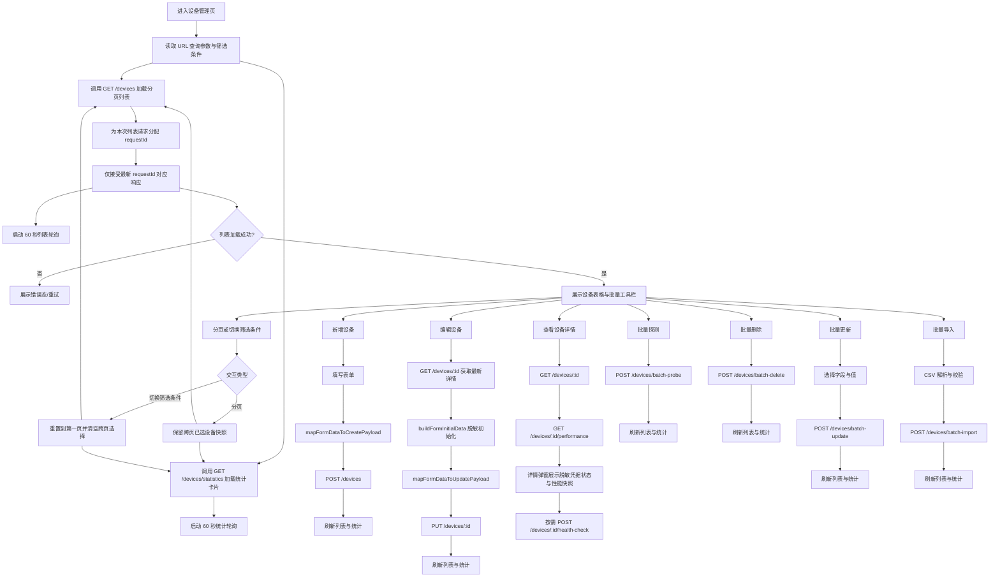

# 设备管理页面联调与业务流程梳理

## 页面职责

设备管理页负责承接以下主流程：

- 设备分页查询、筛选、搜索与统计展示
- 新增设备、编辑设备、删除设备
- 设备详情查看
- 单设备探测、批量探测
- 设备性能查看与健康检查
- 批量导入、批量更新、批量删除

## 前后端接口映射

| 页面能力 | 前端入口                                  | 前端 API                   | 后端接口                                |
| -------- | ----------------------------------------- | -------------------------- | --------------------------------------- |
| 设备列表 | `DeviceManagementView` 初始化、筛选、分页 | `fetchDevices()`           | `GET /devices`                          |
| 设备统计 | 统计卡片                                  | `fetchDeviceStats()`       | `GET /devices/statistics`               |
| 新增设备 | `AddDeviceModal`                          | `createDevice()`           | `POST /devices`                         |
| 编辑设备 | `EditDeviceModal`                         | `updateDevice()`           | `PUT /devices/:device_id`               |
| 删除设备 | 列表删除按钮                              | `deleteDevice()`           | `DELETE /devices/:device_id`            |
| 设备详情 | `DeviceDetailsModal` 打开时               | `fetchDevice()`            | `GET /devices/:device_id`               |
| 健康检查 | 详情弹窗按钮                              | `healthCheckDevice()`      | `POST /devices/:device_id/health-check` |
| 性能数据 | 详情弹窗打开/切换时间范围                 | `fetchDevicePerformance()` | `GET /devices/:device_id/performance`   |
| 批量删除 | 批量工具栏                                | `batchDeleteDevices()`     | `POST /devices/batch-delete`            |
| 批量更新 | 批量工具栏                                | `bulkUpdateDevices()`      | `POST /devices/batch-update`            |
| 批量探测 | 批量工具栏、本页探测                      | `batchProbeDevices()`      | `POST /devices/batch-probe`             |
| 批量导入 | 导入弹窗                                  | `bulkImportDevices()`      | `POST /devices/batch-import`            |

## 当前业务主流程图

## 本轮修复重点

- 设备编辑与详情弹窗改为“凭据只写不回显”，避免敏感信息从后端回流前端。
- 前端映射补齐 `snmp_port` 与 `*_configured` 状态，确保表单、详情、接口三处一致。
- 详情弹窗已真实接入健康检查与性能数据接口，不再只是静态占位展示。
- 设备统计改为基于 `alerts` 活跃告警统计，补齐 `alerting_devices` 字段，避免依赖设备缓存字段造成统计失真。
- 设备管理页已接入批量更新能力，并在操作成功后统一刷新列表与统计。
- 统计卡片已补齐与设备列表一致的 `60s` 轮询刷新，避免列表更新后统计仍停留旧值。
- 设备管理页批量选择已升级为“跨页 ID + 设备快照”模型，翻页后仍可保留已选设备并继续批量更新。
- 服务端分页场景下，切换筛选条件时仍会主动清空跨页选择，避免旧筛选结果残留为“幽灵选择”。
- 通用表格组件的页头复选框已改为只反映当前页勾选状态，跨页已选设备不会误导当前页的全选状态。
- `useDevices` 已增加“仅最新请求可回写状态”的保护，避免轮询、分页、筛选和操作刷新并发时出现旧响应覆盖新列表。
- 设备列表 API 映射已保留缺失的性能字段为空值，列表页在无采样时会显示 `-`，不再伪造 `0.0%`。
- 设备详情弹窗在性能指标缺失时统一展示 `-`，不再用 `0.0%` 伪装成真实采样值。
- 设备详情弹窗已补齐“打开详情 -> 拉性能 -> 执行健康检查 -> 切换时间范围再次拉取性能”的组件级回归测试。

## 现阶段结论

- 设备管理页主流程已经形成完整前后端闭环。
- 关键敏感字段已经改为脱敏返回，编辑场景留空不会误覆盖已有凭据。
- 批量更新、健康检查、性能查看三个此前未闭环的能力已接入主流程。
- 前端设备管理页与后端设备 API 已真实对接，当前未发现“静态假数据驱动页面”的残留路径。
- 列表查询链路已具备基础竞态保护，旧请求晚返回时不会再覆盖最新筛选/分页结果。
- 批量选择策略已调整为“同一筛选上下文内支持跨页保留选择”，批量更新弹窗能够正确展示跨页设备快照。
- 设备性能字段在“未返回采样值”的场景下已保持语义一致，前端不会再将缺失值误展示为 `0.0%`。

## 后续建议

- 为批量更新补充字段白名单测试，防止后续误把前端临时字段透传到后端。
- 若后续需要在多个设备子页面之间共享批量选择，建议再把当前页面内的设备快照模型上提到统一 store。
