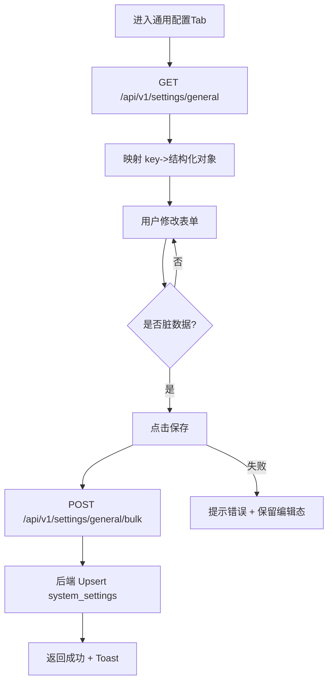
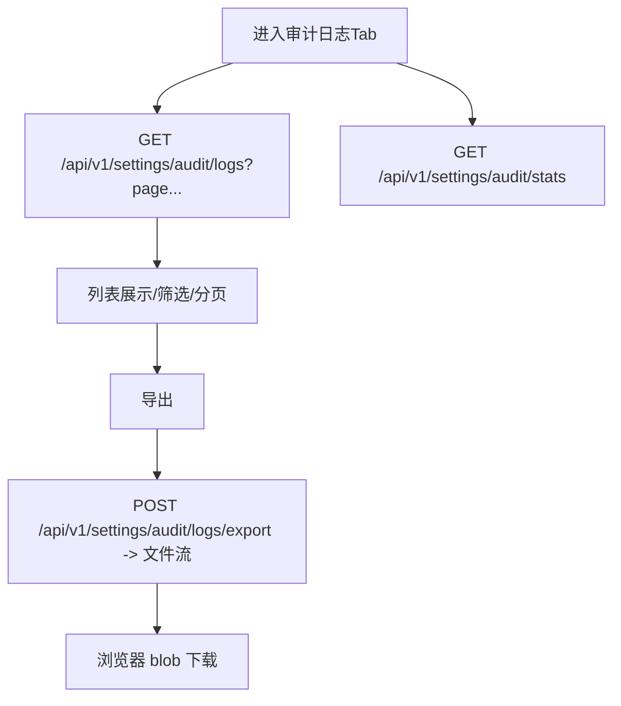
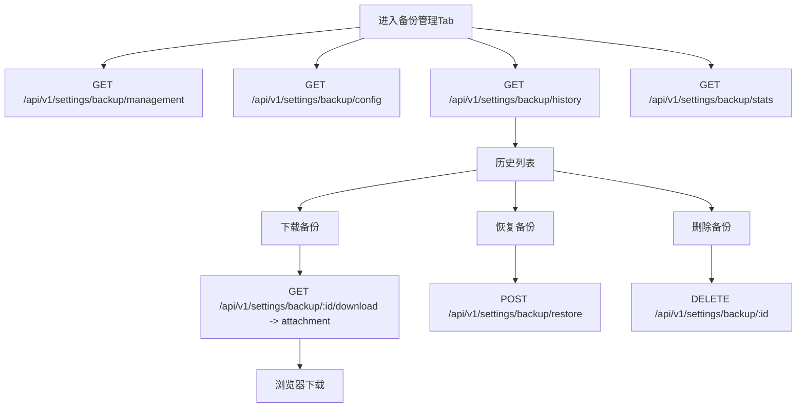
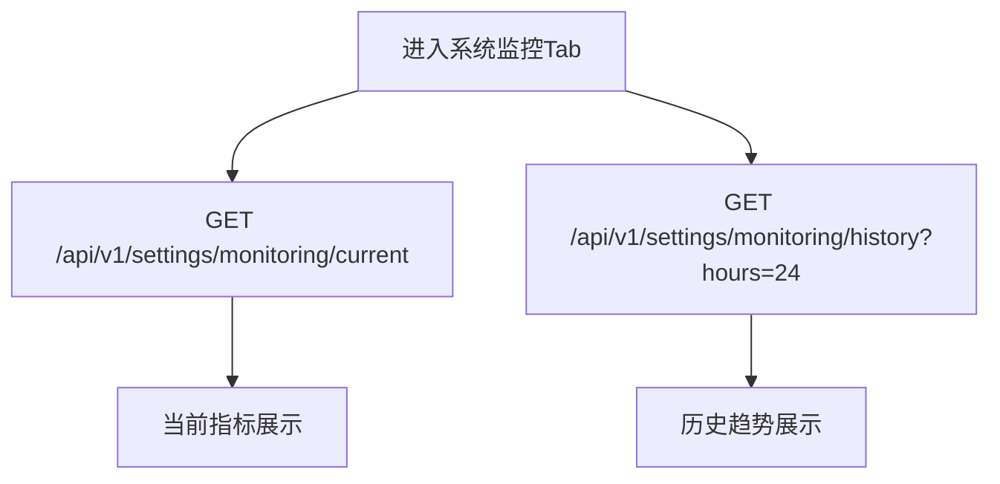

# 系统设置（8 子页面）前后端对接审查与业务流程图

更新时间：2026-02-28

## 1. 范围说明

本次审查对象为「系统设置」页面下 8 个子页面（Tab）：

- 通用配置（`general`）
- 日志设置（`logs`）
- 用户管理（`users`）
- 安全策略（`security`）
- 审计日志（`audit`）
- 备份管理（`backup`）
- 通知中心（`notifications`）
- 系统监控（`monitoring`）

审查目标：

1) 前端页面功能是否闭环（能查、能改、能反馈、能容错）
2) 前端是否真实对接后端 API（非 mock/console.warn/Promise.resolve）
3) 后端 API 是否真实落库/执行（非“记录但不发送/不生效”）
4) 梳理业务逻辑流程图（Mermaid），识别异常路径与缺口
5) 给出优化/修复/完善方案并落地执行（按影响面分批）

---

## 2. 对接矩阵总览（结论）

| Tab | 前端页面 | 前端 API | 后端 API | 落库/执行 | 结论 |
|---|---|---|---|---|---|
| 通用配置 | ✅ | ✅ | ✅ | ✅ | 基本完善 |
| 日志设置 | ✅ | ✅ | ✅ | ✅ | 基本完善 |
| 用户管理 | ⚠️ | ⚠️ | ✅ | ✅ | UI 功能缺口（新增/编辑/改密/权限查看等） |
| 安全策略 | ✅ | ❌（伪实现） | ⚠️（仅读 + sessions 列表） | ❌（不生效） | 需补齐：保存对接 + 强制生效机制 |
| 审计日志 | ✅ | ⚠️（导出走相对路径） | ✅ | ✅ | 需修复：导出跨域/鉴权一致性 |
| 备份管理 | ✅ | ⚠️（下载走相对路径） | ✅ | ✅ | 需修复：下载跨域/鉴权一致性 |
| 通知中心 | ✅ | ❌（saveAll 伪实现） | ⚠️（测试仅记录） | ❌（不发送） | 需补齐：保存对接 + 邮件/Webhook 真实发送 + 告警触发发送 |
| 系统监控 | ✅ | ✅ | ✅ | ✅ | 基本完善 |

说明：
- “⚠️”表示功能表面存在但存在关键缺口（跨域/伪实现/未执行）。
- “落库/执行”关注：是否写入 `system_settings` / 是否实际发送邮件/Webhook / 安全策略是否在鉴权链路立即生效。

---

## 3. 业务流程图（Mermaid）

### 3.1 通用配置（general）



### 3.2 日志设置（logs）

```mermaid
flowchart TD
  A[进入日志设置Tab] --> B[GET /api/v1/settings/general/settings?category=logs]
  B --> C[渲染保留天数/自动清理等]
  C --> D[用户修改配置]
  D --> E[保存 -> POST /api/v1/settings/general/bulk]
  E --> F[落库 system_settings(category=logs)]
  C --> G[Syslog状态 -> GET /api/v1/logs/syslog/status]
  G --> H[应用Syslog配置 -> POST /api/v1/logs/syslog/apply]
  C --> I[手动清理 -> POST /api/v1/logs/cleanup]
```

### 3.3 用户管理（users）

```mermaid
flowchart TD
  A[进入用户管理Tab] --> B[GET /api/v1/settings/users?page&keyword...]
  A --> C[GET /api/v1/settings/users/stats]
  A --> D[GET /api/v1/settings/roles]
  A --> E[GET /api/v1/settings/permissions]
  B --> F[列表展示/分页/搜索]
  F --> G[用户操作: 激活/停用/锁定/解锁/删除]
  G --> H[POST /api/v1/settings/users/:id/activate|deactivate|lock|unlock 或 DELETE]
  H --> I[刷新列表 + Toast]
  F --> J[新增/编辑用户]
  J --> K[POST/PUT /api/v1/settings/users]
  K --> I
  F --> L[重置密码]
  L --> M[POST /api/v1/settings/users/:id/change-password]
  M --> I
```

### 3.4 安全策略（security）

```mermaid
flowchart TD
  A[进入安全策略Tab] --> B[GET /api/v1/settings/security]
  A --> C[GET /api/v1/settings/security/sessions]
  B --> D[渲染密码策略/登录防护/会话策略等]
  D --> E[用户修改策略]
  E --> F[保存策略]
  F --> G[POST /api/v1/settings/general/bulk 写入 security.* keys]
  G --> H[后端落库 system_settings(category=security)]
  H --> I[策略需在鉴权链路生效]
  I --> J[登录/刷新/鉴权 中读取策略并执行限制]
  J -->|不满足| K[拒绝登录/强制下线/锁定用户]
```

### 3.5 审计日志（audit）



### 3.6 备份管理（backup）



### 3.7 通知中心（notifications）

```mermaid
flowchart TD
  A[进入通知中心Tab] --> B[GET /api/v1/settings/notifications/]
  B --> C[渲染 Email/SMS/Webhook 配置]
  C --> D[用户修改配置]
  D --> E[保存]
  E --> F[POST /api/v1/settings/general/bulk 写入 notification.* / email.* keys]
  F --> G[落库 system_settings]
  C --> H[测试邮件] --> I[POST /api/v1/settings/notifications/test-email]
  C --> J[测试Webhook] --> K[POST /api/v1/settings/notifications/test-webhook]
  I --> L[真实发送(应实现)]
  K --> M[真实HTTP请求(应实现)]
  N[告警创建/触发] --> O[按规则发送通知]
  O --> L
  O --> M
```

### 3.8 系统监控（monitoring）



---

## 4. 优先级与落地策略（执行计划摘要）

1) **低风险高收益**：修复审计导出/备份下载的跨域与鉴权一致性（统一走 `NEXT_PUBLIC_API_URL`）。
2) **用户管理闭环**：补齐“新增/编辑/重置密码/查看权限”等 UI，并对接 `/settings/roles` `/settings/permissions`。
3) **通知中心闭环**：实现 `saveAll` 真正落库；实现邮件/Webhook 测试“真实发送”；在告警触发点接入发送。
4) **安全策略真正生效**：保存对接落库 + 在登录/刷新/鉴权链路引入会话与策略校验（并发会话/记住我/强制下线/登录锁定等按配置立即生效）。
5) **验证与回归**：Go `go test ./...` + 前端 `npm test`/`npm run build`（按仓库实际脚本执行）确保无回归。

---

## 5. 已落地变更（2026-02-28）

### 5.1 前端

- 审计日志导出：改为使用 `NEXT_PUBLIC_API_URL` 后端绝对地址，避免前后端分离部署跨域失败。
- 备份文件下载：改为使用 `NEXT_PUBLIC_API_URL` 后端绝对地址，避免前后端分离部署跨域失败。
- 用户管理：补齐“新增/编辑/重置密码/查看权限”闭环；角色列表改为对接后端 `/settings/roles`。
- 通知中心：实现 `saveAll` 真实落库（`/settings/general/bulk`）；Webhook 测试请求携带当前 URL/Headers/Method。
- 安全策略：实现 `saveAll` 真实落库（`/settings/general/bulk`）。

### 5.2 后端

- 通知测试接口：邮件/Webhook 测试从“仅记录”改为“真实发送”（短信仍保留未实现提示）。
- 告警触发通知：新建告警时异步触发邮件/Webhook 发送（遵循 `alert_rules` 的 `email_enabled/webhook_enabled` 与系统设置总开关）。
- 安全策略即时生效（核心）：
  - 引入服务端会话（`user_sessions`）：登录创建会话；刷新令牌校验会话；登出失效；访问时校验会话有效性。
  - 支持并发会话数限制（策略调整后在下一次请求即时裁剪多余会话）。
  - 支持会话闲置超时（自动登出，策略调整后立即生效）。
  - 支持登录失败锁定（最大尝试次数/锁定时长）。
  - 密码策略生效：创建用户/重置密码时按策略校验（最小长度、大小写、数字、特殊字符、常见弱口令拦截）。
  - 密码更改后强制下线：管理员重置密码会使该用户所有会话立即失效。

### 5.3 兼容性提醒

- 登录令牌新增会话标识（`sid`），老令牌在策略生效后会被判定为未绑定会话而失效；需要重新登录获取新令牌。
