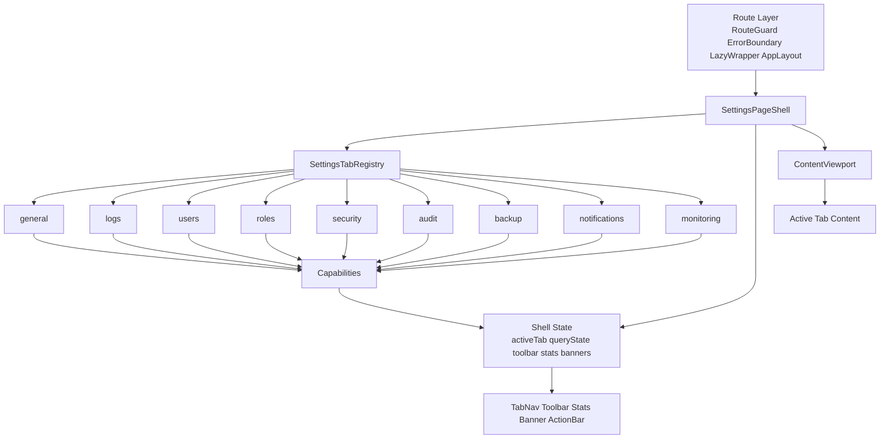
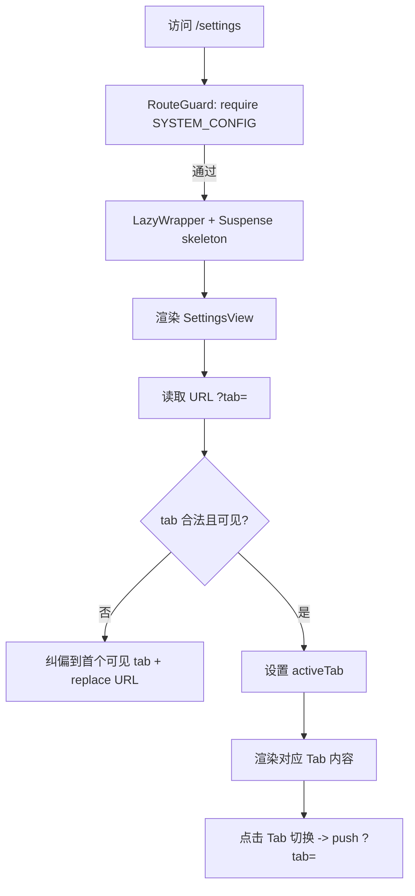
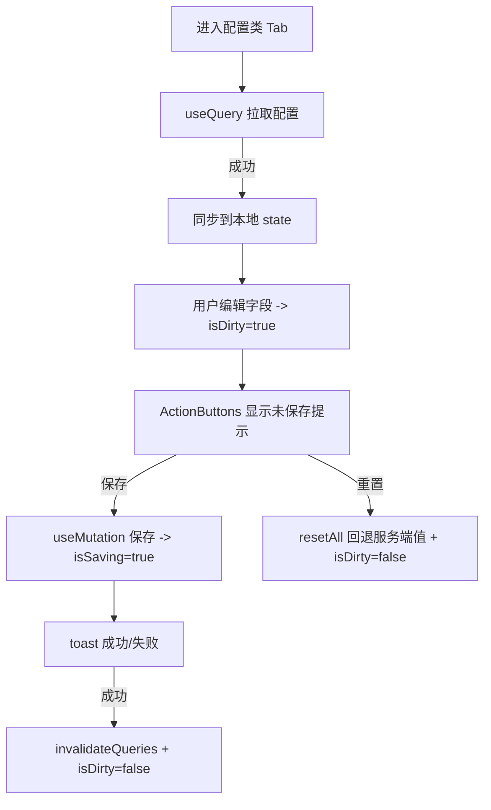
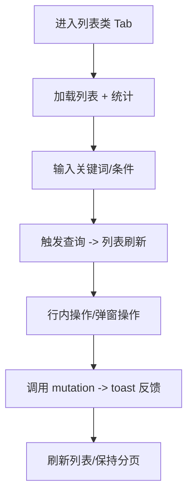

# 系统设置（9 子分页）UI/UX 现状梳理

更新时间：2026-03-19

## 1. 范围与目标

本文件聚焦“系统设置”页面（`/settings`）下 9 个子分页（Tab）的**前端 UI/UX 实现方式现状**，以代码为准梳理：

- 信息架构（导航/分区/字段/表格）
- 交互路径（编辑-保存、测试、导出、危险操作确认、分页等）
- 状态呈现（加载/错误/空态/进行中/成功失败反馈）
- 权限体验（入口守卫、Tab 可见性、按钮禁用与提示）
- 可访问性与一致性（A11y、暗色模式、交互语义、一致的组件体系）

> 说明：本文件是“现状基线”文档，用于后续迭代对照验收；其中“风险/建议”仅用于指出差距与方向，不在本文档内实施修复。

### 1.1 9 个子分页清单

- 通用配置（`general`）
- 日志设置（`logs`）
- 用户管理（`users`）
- 角色权限（`roles`）
- 安全策略（`security`）
- 审计日志（`audit`）
- 备份管理（`backup`）
- 通知中心（`notifications`）
- 系统监控（`monitoring`）

## 2. 与 UI/UX 强相关的技术与组件栈（现状）

### 2.1 页面框架与状态管理

- 路由：Next.js App Router（`frontend/src/app/settings/page.tsx`）。
- 组件形态：主要为 client component（`'use client'`），Tab 内容按需渲染。
- 数据获取与缓存：React Query（`useQuery/useMutation`），多数 Tab 用“服务端数据 → 本地 `useState` 编辑 → 批量保存”模式。
- 反馈：`react-hot-toast` 用于成功/失败提示。
- 动效：`framer-motion` 用于 Tab 导航 hover/tap 与内容淡入。

### 2.2 UI 组件与样式体系

- 样式：Tailwind + 主题 token（常见：`bg-card`、`border-border`、`text-muted-foreground`、`rounded-xl`）。
- 组件库：以 shadcn/ui 为主（Button/Card/Input/Select/Switch/Dialog/Skeleton/Badge/Label）。
- 图标：`lucide-react`。

### 2.3 懒加载与页面级骨架屏

- `/settings` 页面通过懒加载引入设置模块：`frontend/src/components/lazy/LazyComponents.tsx` 中 `LazySystemSettings`。
- 页面级加载：`LazyWrapper` 的 `Suspense fallback=<PageLoadingSkeleton />`（`frontend/src/app/settings/page.tsx`）。

## 3. 全局信息架构与导航（Settings 容器层）

### 3.1 路由入口权限与 Tab 可见性（现状策略）

- 路由入口：`frontend/src/app/settings/page.tsx` 使用 `RouteGuard`，要求 `Permission.SYSTEM_CONFIG` 才能进入 `/settings`。
- Tab 可见性：壳层 `frontend/src/features/settings/shell/SettingsPageShell.tsx` 内部按“最小权限”过滤可见 Tab（例如：用户管理/角色权限需要 `USERS_READ`，审计需要 `SYSTEM_LOGS`，监控需要 `MONITORING_READ`），可见 Tab 元数据来自注册表 `frontend/src/features/settings/registry/settings-tabs.tsx`（`requiredPermissions`）。

**UX 影响（重要）**

- 如果产品定位是“系统设置仅限系统配置管理员”，当前入口守卫与 Tab 过滤同时存在会显得“重复但无害”；但如果希望“审计员/监控查看者”可访问 `audit/monitoring`，现状会出现“有模块权限但无法进入页面”的不可达体验（需要在权限模型上做一次明确取舍）。

### 3.2 Tab 导航与深链接（`?tab=`）

实现位置：`frontend/src/features/settings/shell/SettingsPageShell.tsx` + `frontend/src/features/settings/hooks/useSettingsTabNavigation.ts`（`SettingsView.tsx` 作为壳层入口适配层）。

- 状态来源：读取 URL 查询参数 `tab` → 计算 `requestedTab` → 与“可见 Tab 集合”求交得到 `activeTab`。
- URL 纠偏：当 `tab` 非法或不可见时，会自动切到首个可见 Tab，并用 `router.replace` 回写 URL（避免“短暂渲染 + 无意义请求”）。
- 点击切换：用户点击 Tab 使用 `router.push` 写回 `?tab=`（使浏览器后退/前进可回到上一个 Tab）。
- 动效：Tab 使用 `motion.button`，hover/tap 缩放；激活态有底部 indicator（`layoutId="activeTabIndicator"`），内容区切换淡入淡出。

**UX 影响（重点）**

- “浏览器后退键”可回到上一个 Tab：用户点击切换使用 `push`，会进入历史栈（自动纠偏仍使用 `replace`，避免污染历史）。
- URL 被纠偏时是“静默纠偏”：用户分享链接或手动输入无权限 Tab 时，页面会切到其它 Tab，但缺少解释提示。

### 3.3 内容区高度/滚动策略

实现位置：注册表 `frontend/src/features/settings/registry/settings-tabs.tsx` 的 `scrollMode` + 壳层 `frontend/src/features/settings/shell/SettingsContentViewport.tsx`。

- `users/roles/audit` 使用 `scrollMode='panel'`：壳层填充高度，内容区内部滚动（更适合表格与高密度操作栏）。
- 其它 Tab 使用 `scrollMode='page'`：自然高度随页面滚动。

**UX 影响**

- 在不同 Tab 间切换时，滚动条策略可能变化（页面滚动 vs 内容区滚动），容易产生“高度跳动/定位丢失”的感受。

### 3.4 通用状态呈现与反馈模式（横切）

配置类 Tab（general/security/backup/notifications）在壳层化后已统一：

- 顶部动作区：由壳层 `SettingsToolbar` 统一渲染（子页通过 `useSettingsTabCapabilities` 上报保存/重置 actions 与 `dirty/saving/blockLeave`）。
- 加载：Tab 内 `Skeleton` 占位（不再依赖 `ActionButtons` 占位稳定布局）。
- 错误：Tab 内红色错误卡片（目前多为“仅展示错误，不提供重试按钮”）。
- 成功/失败：toast（保存成功/失败、重置成功等）。
- 危险操作：多数使用 `window.confirm`（删除/清理/恢复等）。

数据列表类 Tab（users/roles/audit）基本统一：

- 顶部统计卡：复用 `CompactStatCard`（`frontend/src/components/shared/CompactStatCard.tsx`）。
- 搜索/刷新：Input + Button（Enter/按钮触发）。
- 表格：原生 `<table>` + `Card` 包裹 + `overflow-x-auto` 横向溢出兜底。
- 分页：上一页/下一页按钮（多数缺少跳页/页大小/区间提示）。

监控类 Tab（monitoring）：

- 指标卡 + 进度条 + 服务表格；错误态提供 `EmptyState` + 重试。
- 自动刷新来自 hook（见 `frontend/src/features/settings/hooks/useSystemMonitoring.ts`）。

## 4. 九个子分页 UI/UX 实现方式现状（逐页梳理）

> 说明：每个子分页均按“入口组件/信息架构/关键交互/状态与反馈/权限与风险提示/现状风险点”描述。

### 4.1 通用配置（general）

入口组件：`frontend/src/features/settings/components/general/GeneralSettings.tsx`

**信息架构**

- 顶部：壳层 `SettingsToolbar`（保存/重置；未保存离开拦截）。
- 内容区：`divide-y` 分隔 4 个 section：
  - `BasicInfoSection.tsx`：应用名称、系统版本（只读）、时区
  - `InspectionConfigSection.tsx`：最大并发、默认超时、失败重试
  - `ReportConfigSection.tsx`：默认导出格式、最大导出记录数
  - `UserPreferenceSection.tsx`：主题/语言/日期格式/时间格式

**关键组件/控件**

- 复用 `shared/*`：`SectionHeader`、`ConfigItem`、`ConfigInput`、`ConfigSelect`。
- 表单编辑状态来自 `useGeneralSettings`（`frontend/src/features/settings/hooks/useGeneralSettings.ts`）：服务端数据同步到本地状态，任一字段变更直接 `isDirty=true`，保存后重置。

**状态与反馈**

- 加载：Skeleton。
- 错误：红色错误卡片（当前无“重试”按钮）。
- 保存/重置：toast 成功/失败。

**现状风险点（UI/UX）**

- 未保存离开拦截：已由壳层承接（`dirty/blockLeave` 时切换 Tab 会拦截，刷新/关闭页签触发 beforeunload）。
- 表单可访问性：`ConfigItem` 的 label 未与输入控件建立关联（见“可访问性 P0”）。

### 4.2 日志设置（logs）

入口组件：`frontend/src/features/settings/components/logs/LogsSettings.tsx`

**信息架构**

- 顶部：`ActionButtons`（保存/重置）+ `extraActions` 注入“立即清理”。
- 内容区：3 个 section
  - 数据保留：自动清理开关、设备日志保留天数
  - Syslog 接收：启用开关、协议、监听地址/端口、消息最大字节数、联动告警与限流；同时展示运行状态与计数卡片
  - 手动清理：单独的 destructive 按钮入口

**关键交互**

- “保存”：保存全部日志设置并 toast。
- “应用配置”：先保存再调用 apply（让 Syslog 即时生效），并可手动刷新状态；运行中时 5 秒轮询刷新状态。
- “立即清理/手动清理”：`window.confirm` 后执行清理，toast 显示删除条数。

**状态与反馈**

- 主配置有 skeleton/错误态；Syslog 状态有独立错误提示与“运行中/已停止”展示。

**现状风险点（UI/UX）**

- “保存 vs 应用配置”语义容易误解：按钮名为“应用配置”，但实际会隐式保存（先保存再 apply）。
- “清理”入口重复且禁用策略不一致：顶部 `extraActions` 默认不随保存/应用禁用；底部按钮会随 `isSaving` 禁用。
- 危险操作确认偏弱：清理仅 `window.confirm`，缺少更强的上下文（执行截止时间/基于当前输入还是已保存值）。

### 4.3 用户管理（users）

入口组件：`frontend/src/features/settings/components/users/UserManagement.tsx`

**信息架构**

- 统计卡：总用户数/正常/停用/锁定（`CompactStatCard`）。
- 操作栏：关键词搜索（Enter/按钮触发）+ “添加用户”按钮。
- 列表：表格（用户名/邮箱/姓名/角色/状态/最后登录/操作）+ 行内图标操作（查看权限/改密/编辑/锁定解锁/激活停用/删除）。
- 分页：上一页/下一页。

**关键弹窗**

- 新增/编辑：`UserFormDialog.tsx`（字段级校验主要为“必填+邮箱+密码一致/≥8”）。
- 重置密码：`UserPasswordDialog.tsx`。
- 查看权限：`UserPermissionsDialog.tsx`（按模块分组展示徽章）。

**权限体验（现状）**

- `users:read` 不足：直接 `EmptyState` 提示无权限。
- `users:create/update/delete` 不足：按钮禁用 + `title` 提示原因；提交动作也会 toast 二次提示。

**现状风险点（UI/UX）**

- 默认角色风险：新增用户默认角色来自 `roles[0]`；当角色接口失败或排序不稳定时，可能默认落到高权限角色（例如 `admin`），属于“默认值导致误创建高权限账号”的高风险 UX。
- 行内操作图标过密：高度依赖 `title`，对触屏与读屏可发现性较弱。
- 密码校验与“系统密码策略”不一致时会增加试错成本（安全策略可配置，但弹窗校验较弱）。

### 4.4 角色权限（roles）

入口组件：`frontend/src/features/settings/components/roles/RoleManagement.tsx`

**信息架构**

- 统计卡：总角色数/内置/自定义（实现为 `useMemo` 统计）。
- 操作栏：关键词筛选（本地过滤）+ 刷新按钮 + 新建角色按钮。
- 列表：表格（角色/描述/用户数/权限数/更新时间/操作）。
  - 内置角色：徽标“内置”；删除按钮禁用且说明。
- 空态：无结果显示 `EmptyState`。

**关键弹窗**

- 新建/编辑：`RoleFormDialog.tsx`（name 创建后不可改；校验仅允许字母数字`_`/`-`）。
- 分配权限：`RolePermissionsDialog.tsx`
  - 搜索、按 module 分组展示、滚动容器、选择计数与保存。
  - `canEdit=false` 时只读查看（保存按钮隐藏、checkbox 禁用）。

**现状风险点（UI/UX）**

- 权限分配弹窗缺少批量能力（按模块全选/清空/仅看已选），权限量大时成本高。
- 搜索输入与图标按钮可访问性（aria/label）不足（见“可访问性 P0/P1”）。

### 4.5 安全策略（security）

入口组件：`frontend/src/features/settings/components/security/SecuritySettings.tsx`

**信息架构**

- 顶部：壳层 `SettingsToolbar`（保存/重置；未保存离开拦截）。
- 内容区：`divide-y` 分隔 3 个 section
  - `SessionManagementSection.tsx`：会话超时、自动登出、记住我（条件展开）、最大并发、改密后强制登出
  - `PasswordPolicySection.tsx`：最小长度、复杂度要求（开关）、过期/历史、常见弱密码、登录失败锁定策略
  - `AuthenticationSection.tsx`：MFA、OAuth、IP 白名单（条件展开）

**关键控件特征**

- 大量开关复用 `ConfigSwitch`；数值输入复用 `ConfigInput`（部分 onChange 做了 `parseInt` + NaN 防御，部分未做）。
- `AuthenticationSection` 中“多选项”使用 `Badge onClick` 作为交互控件（视觉直观，但语义与键盘可操作性不足）。
- IP 白名单：输入 + “添加”按钮；已添加项用 `Badge` 展示，内置删除按钮（X 图标）。

**现状风险点（UI/UX）**

- 多选用 Badge 作为按钮：缺少按钮语义/键盘交互（Space/Enter）、缺少 aria（A11y 风险）。
- 表单 label 与控件关联在共享组件层不完善（见“可访问性 P0”）。

### 4.6 审计日志（audit）

入口组件：`frontend/src/features/settings/components/audit/AuditLogs.tsx`

**信息架构**

- 统计卡：总日志数/今日日志/成功率（不随搜索条件变化）。
- 操作栏：关键词搜索 + 导出按钮。
- 列表：表格（时间/用户/操作/资源/详情/IP/状态），详情列截断并用 `title` 展示完整文本。
- 分页：上一页/下一页。
- 错误且无数据：`EmptyState` + “重试”按钮；无数据：空态提示。

**关键交互**

- 导出：toast 提示成功/失败；导出范围由 API 默认策略决定（UI 不可见）。

**现状风险点（UI/UX）**

- 导出范围不透明：默认策略（例如默认最近 30 天）在 UI 未显性提示，用户容易误解为“导出全部/导出当前筛选”。
- 筛选维度不足：缺少审计常用的时间范围、动作、状态、用户、资源等过滤；大数据量场景检索成本高。
- 详情不可下钻：依赖 `title` 不利于移动端与结构化内容阅读；失败原因/错误信息未突出。
- 动作映射缺少兜底：后端新增 action 时可能显示空白标签（应至少回退显示原始 action）。

### 4.7 备份管理（backup）

入口组件：`frontend/src/features/settings/components/backup/BackupManagement.tsx`

**信息架构**

- 顶部：壳层 `SettingsToolbar`（保存/重置备份策略；未保存离开拦截）。
- 内容区分两段：
  - `BackupConfigSection.tsx`：自动备份（频率/时间条件展开）、保留天数、备份路径、备份内容（数据库/文件）、压缩开关、建议说明。
  - `BackupHistorySection.tsx`：磁盘使用情况进度条（>90% 红色提示）、手动备份按钮、备份列表表格（文件名/大小/类型/状态/时间/耗时/创建者/操作）。

**关键交互**

- 手动备份：按钮内显示“创建中...”与旋转图标。
- 下载/恢复/删除：图标按钮 + `window.confirm`；恢复成功后 toast 并延迟刷新页面（`setTimeout(() => window.location.reload(), 2000)`）。
- 恢复中遮罩：全屏遮罩 + spinner（避免用户误操作）。

**现状风险点（UI/UX）**

- 恢复完成后的“遮罩退场 vs 自动刷新”时机：遮罩可能先消失，2 秒后页面刷新，存在短暂误操作窗口。
- 暗色模式一致性：部分徽章/分割线/提示卡使用亮色背景但缺少 `dark:` 适配，深色主题下可能刺眼或对比不足。
- 列表浏览能力：若后端仅返回最近 N 条，`totalCount` 与实际展示条数可能不一致；当前无分页/查看更多能力。
- 图标按钮可访问性：下载/恢复/删除主要依赖 `title`，缺少 `aria-label`。

### 4.8 通知中心（notifications）

入口组件：`frontend/src/features/settings/components/notifications/NotificationSettings.tsx`

**信息架构**

- 顶部：壳层 `SettingsToolbar`（保存/重置；未保存离开拦截）。
- 内容区：`divide-y` 分隔 2 个 section
  - `EmailNotificationSection.tsx`：SMTP + 发件人 + 测试邮件
  - `SmsNotificationSection.tsx`：provider + key/secret/sign/template + 测试短信

**关键交互**

- 统一“启用开关 → 控件禁用态”：`disabled={!data.enabled}`，降低误填。
- 测试：各 section 维护 `isTestingLocal`，并额外接收页面级 `isTesting`（全局测试中状态）以禁用按钮。

**现状风险点（UI/UX）**

- 全局 `isTesting` 误导：任一渠道测试中，其他渠道按钮也可能显示“发送中/测试中”（文案逻辑用 `isTestingLocal || isTesting`），反馈不准确。
- “测试是否基于未保存配置”不透明：部分渠道测试接口只传收件人/手机号，用户易遇到“我刚改了配置但测试结果不变”的困惑。
- 敏感字段体验：密码/密钥/Token 输入框无“已设置/更新/清除”状态引导，且回显策略不透明（安全感与可操作性不足）。

### 4.9 系统监控（monitoring）

入口组件：`frontend/src/features/settings/components/monitoring/MonitoringDashboard.tsx`

**信息架构**

- 系统信息卡（hostname/platform/uptime/processUptime）。
- 资源监控：CPU/内存/磁盘三列卡片（大数值 + 进度条 + 阈值变色）。
- 网络：累计收发字节与包数（标题为“网络流量”）。
- 服务状态：表格（服务名称/状态/响应时间/运行时间）。

**状态与刷新**

- 错误且无数据：`EmptyState` + 重试。
- 加载：Skeleton（优先于空态，避免闪烁）。
- 自动刷新：hook 中默认 5 秒刷新，UI 未显示“最后更新时间/刷新中/暂停刷新”（可读性与信任感受影响）。

**现状风险点（UI/UX）**

- 阈值语义不一致：进度条已黄/红，但数值文本颜色仍固定为资源色（蓝/绿/紫），异常感知不强。
- 暗色模式：服务状态徽章使用亮色背景且缺少 `dark:` 适配，可能不协调。
- 排障信息不足：服务异常/降级时，未展示 `lastCheck/errorMessage` 等线索。

### 4.10 九个子分页的 UI/UX 差异对照

这一节不再重复逐页描述“有什么”，而是横向回答“9 个子分页在 UI/UX 上到底哪里不同”。

#### 4.10.1 按页面形态分组的差异

1) 表单配置型：`general`、`security`、`notifications`

- 共同点：都以 `ActionButtons + 分区表单 + 保存/重置` 为主路径，用户心智是“修改配置后统一提交”。
- 差异点：
  - `general` 偏“基础参数维护”，字段稳定、分组最平缓，几乎没有危险操作，适合低认知负担的连续填写。
  - `security` 偏“策略开关 + 条件展开”，有更多规则组合与条件显隐，认知负担高于 `general`，也更依赖文案解释。
  - `notifications` 偏“多渠道配置 + 联调验证”，除了保存，还强调“测试发送”，因此用户心智不是纯保存，而是“配置后立即验证链路是否通”。

2) 混合运营型：`logs`、`backup`

- 共同点：同时具备“配置表单”和“运行状态/运维动作”，不是单纯设置页。
- 差异点：
  - `logs` 更偏“运行时生效”，核心在“保存配置”和“应用 Syslog”之间切换，同时穿插即时清理、状态轮询、计数指标。
  - `backup` 更偏“资产与灾备管理”，既有策略配置，也有历史记录、磁盘占用、手动备份、恢复、下载、删除等生命周期操作，风险感更强。

3) 数据管理型：`users`、`roles`

- 共同点：都以“统计卡 + 搜索/操作栏 + 表格 + 弹窗”组织，主要动作发生在行内按钮与弹窗里。
- 差异点：
  - `users` 偏“对象 CRUD + 状态管理”，行内动作更多，包含激活/停用/锁定/改密/删除，操作频率高、风险分布细碎。
  - `roles` 偏“对象管理 + 权限编排”，行内动作相对少，但“权限分配弹窗”是页面核心，属于一次性高认知成本操作。

4) 只读检索型：`audit`

- 与 `users/roles` 同样采用列表表格，但 UX 目标完全不同。
- `audit` 不承担编辑动作，重点是“检索、对比、导出、追溯”，所以它更接近检索台而不是管理台。

5) 只读监控型：`monitoring`

- 与其余 8 个子页差异最大：没有保存、没有重置、没有弹窗编辑。
- UX 核心是“扫视健康度 + 观察变化”，因此页面更像监控看板，强调自动刷新、阈值颜色、信息密度与异常感知速度。

#### 4.10.2 9 个子分页的交互重心区别

| 子分页 | 页面主形态 | 核心用户目标 | 主要交互方式 | 反馈节奏 | 风险等级 |
| --- | --- | --- | --- | --- | --- |
| `general` | 低风险表单配置 | 修改系统基础参数 | 填写/选择后统一保存 | 慢节奏，保存即完成 | 低 |
| `logs` | 配置 + 运行时控制 | 调整保留策略与 Syslog 生效状态 | 保存、应用、刷新状态、清理 | 中快节奏，状态会变化 | 中高 |
| `users` | 列表管理 + 弹窗 | 管理账号全生命周期 | 搜索、行内操作、弹窗提交 | 快节奏，多次小操作 | 高 |
| `roles` | 列表管理 + 权限矩阵 | 管理角色与分配权限 | 搜索、弹窗编辑、权限勾选 | 中节奏，但单次决策重 | 高 |
| `security` | 策略表单配置 | 设置认证/密码/会话规则 | 条件展开、开关组合、统一保存 | 慢节奏，但需理解规则 | 高 |
| `audit` | 检索列表 | 查找、比对、导出审计记录 | 搜索、翻页、导出 | 中节奏，偏查阅 | 中 |
| `backup` | 配置 + 历史资产管理 | 管策略、做备份、恢复系统 | 保存、手动备份、下载、恢复、删除 | 慢节奏，但危险操作重 | 很高 |
| `notifications` | 多渠道配置 + 联调 | 配置通知链路并测试通达性 | 填表、切换启用、发送测试 | 中快节奏，强调验证结果 | 中高 |
| `monitoring` | 实时看板 | 快速判断系统是否健康 | 扫视指标、观察刷新、重试 | 持续节奏，信息自动变化 | 中 |

#### 4.10.3 在视觉组织上的区别

- `general` 与 `security` 都采用纵向 section 堆叠，但 `general` 更像“静态表单清单”，而 `security` 更像“策略面板”，因为它有更多 `border-t` 子分组、条件展开和解释提示块。
- `logs` 和 `backup` 都属于“双层信息架构”：
  - 上层是设置项/策略；
  - 下层是运行态/历史态。
  这使它们比纯配置页更像“设置 + 控制台”的复合页。
- `users`、`roles`、`audit` 都使用表格，但信息密度不同：
  - `users` 操作列最密，强调“对对象做动作”；
  - `roles` 表格更安静，真正复杂的是弹窗里的权限矩阵；
  - `audit` 表格字段偏长文本与时间线索，强调“看记录”，不是“改记录”。
- `monitoring` 完全放弃“表单/操作栏”结构，改为指标卡 + 进度条 + 服务表格，因此视觉上最接近 dashboard，而非 admin form。

#### 4.10.4 在状态反馈方式上的区别

- `general` / `security`
  - 反馈集中在“是否脏数据、是否保存成功、是否加载失败”。
  - 页面本身几乎没有实时状态，用户关注的是“配置是否落库”。
- `logs`
  - 同时存在“配置保存反馈”和“Syslog 服务运行反馈”两条链路。
  - 这是当前最容易让用户混淆“保存成功”和“配置已生效”的页面。
- `users` / `roles`
  - 反馈颗粒度最细，通常是一条记录一次操作一个 toast。
  - 成功反馈高频，但也最依赖弹窗提交和列表刷新的一致性。
- `audit`
  - 反馈偏“检索结果反馈”，例如查到了什么、导出了什么，而不是“修改成功”。
- `backup`
  - 反馈最强调危险感：确认框、恢复中遮罩、成功后刷新页面，都是为了让用户意识到“这是会改变系统状态的运维动作”。
- `notifications`
  - 除保存外，更依赖“测试是否成功”的即时反馈；它的 UX 核心不是“配完”，而是“证明确实能发出去”。
- `monitoring`
  - 反馈主要来自颜色、数值变化、自动刷新、错误重试，而不是 toast。

#### 4.10.5 在权限与风险提示上的区别

- `users`、`roles` 的权限提示最细：按钮级禁用、`title` 原因提示、无权限空态并存，体现“对象操作需要最小权限控制”。
- `audit` 与 `monitoring` 更偏“读权限”模型，风险不在编辑，而在“是否能看到敏感信息/运行状态”。
- `general`、`security`、`notifications`、`logs`、`backup` 更偏“配置权限”模型，但其中风险等级并不一致：
  - `general` 低；
  - `security` 高，因为会影响认证与登录策略；
  - `logs` 中高，因为会影响采集与清理；
  - `notifications` 中高，因为涉及密钥与联调；
  - `backup` 最高，因为恢复/删除可直接影响系统可用性与数据安全。

#### 4.10.6 在用户心智模型上的区别

- `general`
  - 用户心智是“改系统默认值”。
- `logs`
  - 用户心智是“改配置并让运行时服务立即按新规则执行”。
- `users`
  - 用户心智是“管理人”。
- `roles`
  - 用户心智是“管理权限集合”。
- `security`
  - 用户心智是“定义系统安全边界”。
- `audit`
  - 用户心智是“回看发生过什么”。
- `backup`
  - 用户心智是“确保能备、能查、能恢复”。
- `notifications`
  - 用户心智是“把告警/消息真正送出去”。
- `monitoring`
  - 用户心智是“快速判断是否异常并持续观察”。

#### 4.10.7 对设计统一的启示

- 不应该用一套完全相同的交互标准去约束这 9 个子页，因为它们本质上属于 5 种不同页面类型：表单配置、混合运营、数据管理、只读检索、实时看板。
- 统一应发生在“框架层”而不是“内容层”：
  - 统一容器、标题、间距、Skeleton、EmptyState、错误卡片、按钮样式、焦点态与可访问性语义；
  - 保留不同页面类型自己的交互节奏与视觉密度。
- 后续如果继续优化，建议按“页面类型”而不是按“业务模块”做设计规范：
  - 配置页规范
  - 列表管理页规范
  - 危险运维页规范
  - 检索导出页规范
  - 实时监控页规范

### 4.11 框架层统一技术架构（参考报表分析页）

**实施状态（截至 2026-03-20）：**已进入实施并完成阶段收口。`4.11` 的“壳层统一、内容自治”方向已在代码层落成骨架与核心能力（Tab 注册表、壳层容器、能力上报、统一顶部组件），并完成配置类页面（4 个）动作区迁移 + `Task 6~10`（危险确认、列表页工具栏/统计、监控页状态横幅、A11y 收尾），已通过 `tests/frontend/settings` 全量回归与 `pnpm -C frontend type-check` 验证。

这一节回答的问题是：

- 9 个子分页既然不能在内容层做成“一模一样”，那应该统一什么？
- 参考报表分析页（`/reports`）后，系统设置页在技术架构上应如何统一？

结论是：

- **统一在框架层**，不统一在业务内容层。
- 参考对象不是报表分析页的业务内容，而是它的**页面壳层设计架构**：
  - 路由壳层统一；
  - 页面主工作区统一；
  - Tab 注册与描述信息统一；
  - 统计区、工具栏、描述区、内容区的槽位统一；
  - 子页通过“能力上报”接入壳层，而不是各自散落实现。

#### 4.11.1 报表分析页可复用的架构基线

参考实现：

- 页面入口：`frontend/src/app/reports/page.tsx`
- 页面容器：`frontend/src/features/reports/components/ReportsView.tsx`
- 业务流程文档：`docs/flows/reports-analysis-flow.md`

报表分析页当前已经形成一套较清晰的**框架壳层模型**：

1) 路由壳层统一

- `RouteGuard + ErrorBoundary + LazyWrapper + AppLayout` 组成稳定的入口框架。
- 业务页面只需要关注自身容器，不需要每个子模块重复处理入口错误和懒加载。

2) 页面主工作区统一

- `ReportsView` 内部把页面组织为：
  - 顶部告警条（Mock Banner）
  - 统计卡条带（CompactStatCard）
  - 主工作区 Card
  - CardHeader 内的 Tab 导航、搜索区、当前 Tab 描述
  - CardContent 内的内容区与切换动效
- 这使得 4 个子模块虽然业务不同，但都运行在同一个页面框架里。

3) Tab 注册信息统一

- `ReportsView` 用 `tabs: TabConfig[]` 统一维护 `key/label/icon/description`。
- 这让“导航按钮”、“描述文本”、“内容切换”共享同一套元数据来源，避免写散。

4) 共享状态由容器统一分发

- `activeTab` 由容器维护；
- `searchText` 由容器维护，并传递给四个子模块；
- 子模块只消费这些共享输入，而不重复发明自己的顶栏搜索框。

5) 统一工作区与内容区分层

- 工作区固定为一个 `Card`；
- `CardHeader` 放框架层元素；
- `CardContent` 放业务子页；
- 子页只负责“内容”，而不是重新造一套页面框架。

这套做法的价值在于：**容器定义骨架，子页填充内容**。

#### 4.11.2 为什么系统设置页必须借鉴这种“壳层统一”而不是“内容统一”

从前文可见，系统设置 9 个子分页本质上属于 5 种不同页面形态：

- 表单配置型
- 混合运营型
- 数据管理型
- 只读检索型
- 实时看板型

如果试图在内容层强行统一，会出现两个问题：

1) 统一过度

- 会把 `monitoring` 这种实时看板，硬套到 `general/security` 这种表单结构上；
- 也会把 `users/roles` 这种管理列表，误做成“像配置页一样顶部固定保存按钮”的体验。

2) 统一失焦

- 现在真正混乱的不是每个子页“长得不一样”，而是：
  - 顶部动作区位置不一致；
  - 统计卡有的在内、有的在外；
  - 搜索/工具栏散落在子页内部；
  - 滚动策略依赖 `fillHeightTabs` 的硬编码；
  - 容器层并不知道子页是否有未保存状态、是否需要阻止切换、是否有危险操作。

因此，系统设置页更需要的是：

- **统一页面骨架、动作槽位、状态槽位、能力接口**
- 而不是统一所有子页的字段、表格、图表和交互密度

#### 4.11.3 面向系统设置页的统一架构目标

参考报表分析页后，系统设置页的目标架构应定义为：

- 一个统一的 `SettingsPageShell`
- 一个统一的 `SettingsTabRegistry`
- 一组统一的框架层槽位（slots）
- 一套统一的子页能力注册协议（capabilities）

也就是说，后续 9 个子页不再直接“各画各的顶栏/保存条/统计区/状态提示”，而是：

- 子页只声明自己是什么类型、需要什么能力；
- 页面壳层决定顶部怎么摆、动作怎么放、状态怎么显示、滚动怎么处理。

#### 4.11.4 建议的分层模型

建议将系统设置页的框架层统一为 5 层：

1) 路由层（Route Layer）

- 负责：鉴权、错误边界、懒加载、页面标题与 breadcrumb。
- 参考报表分析页：`RouteGuard + ErrorBoundary + LazyWrapper + AppLayout`
- 系统设置页应统一保留这一层，不让业务子页关心入口控制。

2) 页面壳层（Page Shell Layer）

- 负责：页面级骨架与统一布局。
- 建议固定为以下槽位：
  - `PageBannerSlot`：全局告警/环境提示/权限提示
  - `StatsSlot`：可选统计卡条带
  - `WorkbenchShell`：主工作区容器（建议沿用 Card 结构）
  - `TabNavSlot`：Tab 导航
  - `ToolbarSlot`：搜索、筛选、刷新、测试、主次按钮
  - `DescriptionSlot`：当前 Tab 简介
  - `StatusBannerSlot`：当前 Tab 运行态/错误态/只读态提示
  - `ContentViewport`：内容承载区

3) Tab 注册层（Tab Registry Layer）

- 负责：用一份统一配置描述 9 个子分页。
- 类似报表分析页的 `tabs: TabConfig[]`，但系统设置页需要更强的描述能力：
  - 权限要求
  - 页面类型
  - 默认滚动模式
  - 是否支持统计卡
  - 是否支持壳层工具栏
  - 是否可能阻止离开（例如未保存配置）

建议的描述模型：

```ts
type SettingsPageKind =
  | 'form'
  | 'ops'
  | 'table'
  | 'query'
  | 'dashboard'

interface SettingsTabDescriptor {
  key: TabType
  label: string
  icon: IconComponent
  description: string
  requiredPermissions: Permission[]
  kind: SettingsPageKind
  scrollMode: 'page' | 'panel'
  supportsStats: boolean
  toolbarMode: 'shell' | 'local' | 'mixed'
  component: React.ComponentType<SettingsTabProps>
}
```

4) 子页能力层（Capabilities Layer）

- 这是系统设置页比报表分析页**更需要**的一层。
- 报表分析页目前只需要共享 `activeTab/searchText`；
- 系统设置页则需要共享更复杂的“壳层能力”：
  - 是否有未保存更改
  - 是否正在保存/提交/恢复
  - 是否需要顶部主按钮
  - 是否需要危险操作按钮
  - 是否需要阻止切换 Tab
  - 是否要在顶部显示统计卡
  - 是否要显示运行状态 Banner

建议子页通过统一 hook 向壳层上报能力，例如：

```ts
interface SettingsTabCapabilities {
  dirty?: boolean
  saving?: boolean
  loading?: boolean
  blockLeave?: boolean
  stats?: StatCardDescriptor[]
  primaryActions?: PageAction[]
  secondaryActions?: PageAction[]
  banners?: BannerDescriptor[]
}
```

这样可以解决当前系统设置页最核心的架构痛点：

- `general/security/notifications/backup` 可以把“保存/重置”上报给壳层；
- `logs` 可以同时上报“保存”和“应用配置”；
- `users/roles/audit` 可以上报搜索、刷新、导出这类工具栏动作；
- `monitoring` 可以上报“最后刷新时间/自动刷新状态/重试”；
- 容器层由此知道哪些子页应阻止离开，哪些子页只是查询页。

5) 数据与业务层（Feature/Data Layer）

- 每个子页继续保持自己现有的 React Query / local state / modal 逻辑。
- 统一的不是数据细节，而是这些状态如何被“翻译”为壳层能力。

#### 4.11.5 从报表分析页迁移到系统设置页时，需要新增的架构能力

报表分析页是一个很好的基线，但系统设置页比它多了 3 类复杂性，因此必须在其基础上增强：

1) 未保存状态治理

- 报表分析页几乎没有“离开当前 Tab 会丢业务状态”的问题；
- 系统设置页的 `general/security/notifications/backup/logs` 都有本地编辑态。
- 因此系统设置页壳层必须支持：
  - 子页上报 `dirty/blockLeave`
  - 用户切换 Tab 时统一做离开拦截
  - 自动纠偏和用户主动切换使用不同策略（`replace` vs `push`）

2) 危险动作治理

- 报表分析页虽然有删除/下载/导出，但没有“恢复系统配置”这类高风险动作；
- 系统设置页有清理日志、恢复备份、删除用户、删除角色等动作。
- 因此框架层必须提供统一的：
  - 危险按钮语义
  - 确认对话框
  - 执行中遮罩/按钮 loading
  - 成功后刷新/跳转/重载策略

3) 权限层级治理

- 报表分析页入口权限相对单纯：至少 `reports:read`；
- 系统设置页内部的权限切分更细。
- 因此 `SettingsTabRegistry` 不能只描述 label/icon，还必须描述：
  - 页面入口权限策略
  - Tab 最小权限
  - 只读模式与禁用模式
  - 哪些动作降级为查看态

#### 4.11.6 统一技术架构蓝图（建议）

推荐将系统设置页调整为如下结构：



这个蓝图的重点不是“所有子页共用一套内容模板”，而是：

- 统一路由与容器
- 统一元数据
- 统一状态编排
- 统一能力注入
- 统一交互基础设施

#### 4.11.7 建议统一的技术构件

参考报表分析页后，系统设置页建议统一抽象出以下框架层构件：

1) 容器与布局

- `SettingsPageShell`
- `SettingsWorkbenchCard`
- `SettingsTabNav`
- `SettingsToolbar`
- `SettingsStatusBannerStack`
- `SettingsContentViewport`

2) 元数据与状态

- `settingsTabRegistry`
- `useSettingsShellState`
- `useSettingsTabQueryState`
- `useSettingsTabCapabilities`

3) 统一交互基础设施

- `SettingsConfirmDialog`：替代零散的 `window.confirm`
- `SettingsEmptyState`：统一按钮、可访问性、暗色模式
- `SettingsErrorState`：统一错误卡片与重试入口
- `SettingsStatsStrip`：统一统计卡条带
- `SettingsLeaveGuard`：统一未保存离开拦截

4) 统一可访问性规范

- Tab 按钮必须具备 `role/aria-selected/aria-controls`
- icon-only 操作按钮必须具备 `aria-label`
- 表单控件必须具备 `id/htmlFor/aria-describedby`
- 工具栏内搜索框必须具备显式 label 或 `aria-label`

#### 4.11.8 与当前系统设置页的差距映射

以当前 `SettingsView.tsx` 为基准，差距主要在以下几点：

1) 当前已有，但还不够的部分

- 已有 Tab 元数据：`key/label/icon/description`
- 已有 URL `?tab=` 深链接
- 已有内容区动效切换
- 已有权限过滤

2) 当前缺失的框架层能力

- 缺少统一的 `StatsSlot`
- 缺少统一的 `ToolbarSlot`
- 缺少统一的 `StatusBannerSlot`
- 缺少子页能力上报机制
- 缺少未保存离开拦截
- 缺少统一的危险操作对话框基础设施
- 缺少可配置的滚动模式与页面类型描述，只能依赖 `fillHeightTabs` 硬编码

3) 当前导致体验割裂的实现方式

- `ActionButtons` 只适用于部分表单页，且嵌在子页内部，不属于容器层能力
- 统计卡散落在子页内部，无法形成统一视觉节奏
- 搜索框/刷新/导出/测试按钮散落在各自子页中，无法统一位置与响应式行为
- 子页切换时容器不知道“是否有脏数据”

#### 4.11.9 框架层统一后的收益

如果按以上架构统一，系统设置页会获得以下收益：

1) 统一性提升，但不会抹平差异

- 用户看到的是同一套页面壳层；
- 进入任一 Tab，都知道统计区、工具栏、内容区、状态区分别在哪；
- 但每个 Tab 仍保留自己最适合的内容形态。

2) 设计与研发的协作边界更清晰

- 设计侧只需维护“框架层规范 + 页面类型规范”；
- 研发侧按注册表与能力协议接入，不再每页重造顶栏。

3) 后续迭代成本更低

- 新增第 10 个设置子页时，只需声明：
  - 它是什么类型；
  - 它需要哪些权限；
  - 它向壳层上报哪些能力；
  - 它的业务内容组件是什么。

4) 当前高频问题可被系统性消除

- 未保存切换丢失
- icon-only 按钮无 aria
- 搜索与工具栏位置不一致
- 统计卡节奏不统一
- 危险操作确认方式分裂

#### 4.11.10 建议写入后续实施规范的统一原则

基于报表分析页架构，系统设置页后续的框架层统一建议固定为以下原则：

- **原则 1：壳层统一，内容自治**
  - 容器统一负责导航、状态槽位、工具栏和可访问性基础设施；
  - 子页只负责业务内容。

- **原则 2：元数据驱动，不靠硬编码分支**
  - Tab 的权限、描述、页面类型、滚动模式、工具栏模式均来自注册表；
  - 避免继续扩展 `fillHeightTabs` 之类的硬编码数组。

- **原则 3：能力上报，不让容器猜测子页状态**
  - 容器不再猜哪个子页有保存按钮、哪个子页需要拦截离开；
  - 由子页通过能力协议显式声明。

- **原则 4：危险动作统一走框架级基础设施**
  - 清理、恢复、删除、导出等高影响动作应统一确认、统一 loading、统一结果反馈。

- **原则 5：统一 A11y 与响应式，不由子页各自处理**
  - Tab、工具栏、搜索框、统计卡、空态、错误态、图标按钮的可访问性语义，由壳层和共享组件兜底。

### 4.12 可实施的前端重构方案（组件 / hook / 注册表 / 迁移步骤）

**实施状态（截至 2026-03-20）：**`Task 1~10` 已完成开发与验证（`tests/frontend/settings` 全量回归通过 + `pnpm -C frontend type-check` 通过）。壳层统一能力已覆盖：危险确认、列表页 stats/toolbar、监控页 banners/actions、shared A11y 兜底与全量回归收口。

这一节将 `4.11` 从“目标架构”继续落到“可执行重构方案”。

基于本节，已单独拆出阶段化执行计划文档：`docs/plans/2026-03-19-system-settings-shell-refactor-implementation-plan.md`，后续可直接按任务粒度推进实施。

目标不是一次性推翻现有设置页，而是在**保持现有业务功能可用**的前提下，分阶段把系统设置页迁移到统一壳层架构。

#### 4.12.1 重构目标与边界

本轮前端重构的目标：

1) 将系统设置页从“单个 `SettingsView.tsx` 容器 + 各子页自行组织顶部能力”的方式，升级为“壳层统一 + 子页能力注入”。
2) 消除当前最影响体验和维护性的框架层问题：
   - Tab 切换丢失未保存状态
   - 顶部动作区/统计区/工具栏位置不统一
   - `fillHeightTabs` 硬编码
   - `window.confirm`、`EmptyState`、错误态分散实现
   - A11y 基础能力无法统一兜底
3) 为后续新增设置子页提供稳定接入规范。

本轮不做的事情：

- 不重写 9 个子页的业务逻辑。
- 不改动后端 API 与权限模型定义。
- 不在本轮统一所有视觉细节，只统一框架层基础设施。

#### 4.12.2 建议落地的目录结构

建议在 `frontend/src/features/settings` 下新增以下结构：

```text
frontend/src/features/settings/
  components/
    SettingsView.tsx                // 逐步瘦身为入口适配层
  shell/
    SettingsPageShell.tsx
    SettingsWorkbenchCard.tsx
    SettingsTabNav.tsx
    SettingsToolbar.tsx
    SettingsStatsStrip.tsx
    SettingsStatusBannerStack.tsx
    SettingsContentViewport.tsx
    SettingsConfirmDialog.tsx
    SettingsLeaveGuard.tsx
  registry/
    settings-tabs.tsx
  hooks/
    useSettingsShellState.ts
    useSettingsTabNavigation.ts
    useSettingsTabCapabilities.ts
    useSettingsLeaveGuard.ts
    useSettingsToolbarState.ts
    useSettingsTabQueryState.ts
  context/
    SettingsShellContext.tsx
  types/
    shell.types.ts
```

说明：

- `components/SettingsView.tsx` 不立即删除，而是作为迁移过渡入口。
- 真正的新架构集中在 `shell/registry/hooks/context/types` 五类目录中。

#### 4.12.3 建议新增的核心类型定义

建议新建：`frontend/src/features/settings/types/shell.types.ts`

核心类型应至少包含以下内容：

```ts
export type SettingsPageKind =
  | 'form'
  | 'ops'
  | 'table'
  | 'query'
  | 'dashboard'

export type SettingsScrollMode = 'page' | 'panel'
export type SettingsToolbarMode = 'shell' | 'local' | 'mixed'

export interface SettingsTabDescriptor {
  key: TabType
  label: string
  icon: IconComponent
  description: string
  requiredPermissions: Permission[]
  kind: SettingsPageKind
  scrollMode: SettingsScrollMode
  toolbarMode: SettingsToolbarMode
  supportsStats: boolean
  supportsLeaveGuard: boolean
  component: React.ComponentType<SettingsTabComponentProps>
}

export interface SettingsPageAction {
  key: string
  label: string
  variant?: 'default' | 'outline' | 'destructive' | 'secondary' | 'ghost'
  icon?: React.ReactNode
  disabled?: boolean
  loading?: boolean
  danger?: boolean
  onClick: () => void
}

export interface SettingsStatCardDescriptor {
  key: string
  title: string
  value: React.ReactNode
  icon: LucideIcon
  iconClassName?: string
  valueClassName?: string
}

export interface SettingsBannerDescriptor {
  key: string
  tone: 'info' | 'success' | 'warning' | 'danger'
  title?: string
  description: string
  action?: SettingsPageAction
}

export interface SettingsToolbarDescriptor {
  search?: {
    value: string
    placeholder?: string
    ariaLabel: string
    onChange: (value: string) => void
    onSubmit?: () => void
  }
  filters?: React.ReactNode
  primaryActions?: SettingsPageAction[]
  secondaryActions?: SettingsPageAction[]
}

export interface SettingsTabCapabilities {
  loading?: boolean
  dirty?: boolean
  saving?: boolean
  blockLeave?: boolean
  stats?: SettingsStatCardDescriptor[]
  toolbar?: SettingsToolbarDescriptor
  banners?: SettingsBannerDescriptor[]
  primaryActions?: SettingsPageAction[]
  secondaryActions?: SettingsPageAction[]
}
```

这组类型的作用是：把当前散落在子页内部的“页面级能力”转成可由壳层消费的结构化数据。

#### 4.12.4 注册表方案（Registry）

建议新建：`frontend/src/features/settings/registry/settings-tabs.tsx`

这一层负责统一维护 9 个子分页的元数据，而不是继续在 `SettingsView.tsx` 里内联写死。

建议写法：

```ts
export const settingsTabRegistry: SettingsTabDescriptor[] = [
  {
    key: 'general',
    label: '通用配置',
    icon: Settings,
    description: '系统基础配置与核心参数管理',
    requiredPermissions: [Permission.SYSTEM_CONFIG],
    kind: 'form',
    scrollMode: 'page',
    toolbarMode: 'shell',
    supportsStats: false,
    supportsLeaveGuard: true,
    component: GeneralSettingsTab,
  },
  {
    key: 'users',
    label: '用户管理',
    icon: Users,
    description: '系统用户账号与权限管理',
    requiredPermissions: [Permission.USERS_READ],
    kind: 'table',
    scrollMode: 'panel',
    toolbarMode: 'mixed',
    supportsStats: true,
    supportsLeaveGuard: false,
    component: UserManagementTab,
  },
]
```

注册表必须承担 4 件事：

1) 驱动 Tab 导航的显示。
2) 驱动权限过滤与默认 Tab 选择。
3) 驱动滚动模式与壳层布局模式。
4) 驱动“页面类型”的统一策略（表单页、表格页、看板页如何默认渲染）。

这样一来，`fillHeightTabs` 这类硬编码数组就可以被移除。

#### 4.12.5 壳层组件拆分方案

建议新增以下组件：

1) `SettingsPageShell.tsx`

- 位置：`frontend/src/features/settings/shell/SettingsPageShell.tsx`
- 职责：
  - 从注册表读取可见 Tab
  - 解析 URL `?tab=`
  - 管理当前激活 Tab
  - 组合 `TabNav / Toolbar / Stats / Banners / ContentViewport`
  - 连接 `useSettingsLeaveGuard`
- 它将取代当前 `SettingsView.tsx` 中绝大多数框架层职责。

2) `SettingsWorkbenchCard.tsx`

- 职责：统一主工作区容器样式。
- 对齐报表分析页的 `Card -> CardHeader -> CardContent` 模式。
- 用途：让设置页也从“一个大白盒子里拼内容”升级为有明确层次的工作台壳层。

3) `SettingsTabNav.tsx`

- 职责：
  - 渲染 tabs
  - 处理焦点态、ARIA 语义、左右键切换
  - 区分 `push` 与 `replace` 的导航来源
- 需要内建：
  - `role="tablist"`
  - `role="tab"`
  - `aria-selected`
  - `aria-controls`
  - `focus-visible` 样式

4) `SettingsToolbar.tsx`

- 职责：统一搜索、筛选、刷新、导出、测试、主次按钮的排布。
- 关键点：
  - 支持无 toolbar 的 Tab
  - 支持纯搜索
  - 支持“搜索 + filters + actions”的组合
  - 支持移动端换行与桌面端左右布局

5) `SettingsStatsStrip.tsx`

- 职责：统一统计卡条带。
- 复用 `CompactStatCard`，避免 `users/roles/audit` 各自定义统计区。
- 对 `monitoring` 这类不适合 CompactStatCard 的页可选择不使用，由 `kind='dashboard'` 走自定义内容。

6) `SettingsStatusBannerStack.tsx`

- 职责：统一渲染 info/warning/danger/success 提示条。
- 用来承接：
  - 无权限只读提示
  - Mock/环境提示
  - 运行中状态提示
  - 数据已过期/刷新失败提示

7) `SettingsContentViewport.tsx`

- 职责：统一内容区高度与滚动逻辑。
- 输入：`scrollMode = 'page' | 'panel'`
- 作用：替代当前 `fillHeightTabs` 条件判断。

8) `SettingsConfirmDialog.tsx`

- 职责：统一危险操作确认。
- 替代现有散落的 `window.confirm`。
- 必须支持：
  - 普通确认
  - 危险确认
  - 自定义按钮文案
  - loading 态
  - 可选“输入确认词”

9) `SettingsLeaveGuard.tsx`

- 职责：统一未保存离开拦截。
- 对接容器层和子页能力上报。

#### 4.12.6 Hook 设计方案

建议新增以下 hook：

1) `useSettingsShellState.ts`

- 职责：
  - 汇总当前壳层需要渲染的所有数据
  - 读取当前 Tab 的 descriptor
  - 合并来自子页的 capabilities
  - 输出给 `SettingsPageShell`

建议返回：

```ts
{
  activeTab,
  visibleTabs,
  descriptor,
  capabilities,
  setActiveTab,
}
```

2) `useSettingsTabNavigation.ts`

- 职责：
  - 处理 URL `tab` 解析
  - 非法/无权限 Tab 的纠偏
  - 区分“用户切换”和“系统纠偏”

建议规则：

- 系统纠偏：`router.replace`
- 用户点击切换：`router.push`

这样可修复当前“后退键无法回上一个 Tab”的 UX 问题。

3) `useSettingsTabCapabilities.ts`

- 职责：
  - 提供给子页上报能力的统一入口
  - 把子页内部的 `isDirty/isSaving/stats/actions/banners` 映射到壳层

建议模式：

- 通过 context 提供 `setCapabilities(tabKey, caps)`
- 子页在 mount/update 时上报
- unmount 时自动清理

4) `useSettingsLeaveGuard.ts`

- 职责：
  - 监听当前 Tab 是否 `blockLeave`
  - 在 Tab 切换时弹出统一确认对话框
  - 后续可扩展到浏览器刷新/路由离开拦截

5) `useSettingsToolbarState.ts`

- 职责：
  - 统一管理 toolbar 的 search/filter/action 组合状态
  - 让列表类页面（users/roles/audit）迁移到壳层工具栏时更平滑

6) `useSettingsTabQueryState.ts`

- 职责：
  - 统一管理可序列化到 URL 的查询状态
  - 例如：搜索词、分页页码、筛选值

建议只对表格/检索页启用，配置类页面不强制接入。

#### 4.12.7 组件接入协议（子页如何迁移）

为了降低迁移风险，建议每个子页从“直接渲染整页”调整为“只渲染内容体 + 向壳层上报能力”。

建议定义统一 props：

```ts
interface SettingsTabComponentProps {
  tabKey: TabType
}
```

迁移后的子页职责变化如下：

1) `general/security/notifications/backup`

- 保留自己的表单内容与数据 hook；
- 不再直接渲染顶部 `ActionButtons`；
- 改为上报：
  - `dirty`
  - `saving`
  - `primaryActions=[保存]`
  - `secondaryActions=[重置]`
  - `blockLeave=true`

2) `logs`

- 仍保留复杂业务内容；
- 上报：
  - `dirty/saving`
  - `primaryActions=[保存, 应用配置]`
  - `secondaryActions=[刷新状态, 清理]`
  - `banners=[运行状态或错误提示]`

3) `users/roles/audit`

- 把顶部统计卡和搜索/刷新/导出逐步迁移到壳层；
- 表格主体保留在子页内部。

4) `monitoring`

- 保留指标主体；
- 上报：
  - `secondaryActions=[重试, 暂停自动刷新/恢复自动刷新]`
  - `banners=[最近刷新时间、刷新失败但仍显示旧数据]`

#### 4.12.8 迁移步骤（分阶段实施）

建议分 6 个阶段迁移，避免一次性大改：

##### 阶段 0：建立类型、注册表和壳层空骨架

目标：

- 先搭出新架构外壳，但不改变现有子页内部实现。

新增文件：

- `frontend/src/features/settings/types/shell.types.ts`
- `frontend/src/features/settings/registry/settings-tabs.tsx`
- `frontend/src/features/settings/context/SettingsShellContext.tsx`
- `frontend/src/features/settings/shell/SettingsPageShell.tsx`
- `frontend/src/features/settings/hooks/useSettingsTabNavigation.ts`

修改文件：

- `frontend/src/features/settings/components/SettingsView.tsx`

实施方式：

- 让 `SettingsView.tsx` 只负责渲染 `SettingsPageShell`
- 保留现有子页组件不动
- 只把 `tabs` 元数据迁移到 registry

验收标准：

- 9 个 Tab 都能正常显示
- 权限过滤不回归
- URL `?tab=` 行为保持现状

##### 阶段 1：替换当前硬编码容器逻辑

目标：

- 用 `SettingsPageShell + SettingsContentViewport` 替换当前 `fillHeightTabs` 逻辑。

新增/修改：

- `shell/SettingsWorkbenchCard.tsx`
- `shell/SettingsTabNav.tsx`
- `shell/SettingsContentViewport.tsx`

实施方式：

- `SettingsTabNav` 接管当前 Tab 按钮渲染
- `SettingsContentViewport` 根据 descriptor.scrollMode 决定内容区滚动
- 删除 `fillHeightTabs`

验收标准：

- `users/roles/audit` 仍保持内部滚动
- 其余配置页仍保持正常页面滚动
- Tab 动效与样式不退化

##### 阶段 2：迁移配置类页面到壳层动作区

目标：

- 先迁移最容易标准化的一组：`general/security/notifications/backup`

新增/修改：

- `hooks/useSettingsTabCapabilities.ts`
- `hooks/useSettingsLeaveGuard.ts`
- `shell/SettingsToolbar.tsx`
- `shell/SettingsLeaveGuard.tsx`
- 修改：
  - `general/GeneralSettings.tsx`
  - `security/SecuritySettings.tsx`
  - `notifications/NotificationSettings.tsx`
  - `backup/BackupManagement.tsx`

实施方式：

- 子页去掉顶部 `ActionButtons`
- 改为向壳层上报“保存/重置/未保存状态”

验收标准：

- 这 4 个页面顶部动作区位置一致
- 切换 Tab 时可拦截未保存离开
- 保存/重置逻辑不回归

##### 阶段 3：迁移混合运营页和危险操作基础设施

目标：

- 迁移 `logs`，并引入统一确认对话框

新增/修改：

- `shell/SettingsConfirmDialog.tsx`
- 修改：
  - `logs/LogsSettings.tsx`
  - `backup/BackupHistorySection.tsx`
  - `users/UserManagement.tsx`
  - `roles/RoleManagement.tsx`

实施方式：

- 将 `window.confirm` 逐步替换为统一 dialog
- `logs` 上报多主动作/次动作

验收标准：

- `logs` 的保存/应用/刷新/清理位置统一
- `backup/users/roles` 危险确认交互统一

##### 阶段 4：迁移列表类页面的统计区与工具栏

目标：

- 迁移 `users/roles/audit` 的统计卡与工具栏

新增/修改：

- `shell/SettingsStatsStrip.tsx`
- 修改：
  - `users/UserManagement.tsx`
  - `roles/RoleManagement.tsx`
  - `audit/AuditLogs.tsx`

实施方式：

- 把统计卡通过 capabilities 上报
- 把搜索/刷新/导出迁移到 `SettingsToolbar`
- 表格本体与弹窗仍保留在子页

验收标准：

- 三个页面的统计区位置一致
- 搜索和主按钮位置一致
- 空态/错误态不回归

##### 阶段 5：迁移监控页与状态横幅体系

目标：

- 让 `monitoring` 接入壳层状态区，而不是保持完全孤立

新增/修改：

- `shell/SettingsStatusBannerStack.tsx`
- 修改：
  - `monitoring/MonitoringDashboard.tsx`

实施方式：

- `monitoring` 上报“刷新时间/自动刷新状态/错误状态”
- 工具栏承接“手动重试/暂停刷新”

验收标准：

- 监控页仍保持 dashboard 形态
- 但框架层位置与其它 Tab 统一

##### 阶段 6：统一共享组件与 A11y

目标：

- 把基础设施补齐到可长期维护水平

修改：

- `shared/EmptyState.tsx`
- `shared/ConfigItem.tsx`
- `shared/ConfigInput.tsx`
- `shared/ConfigSwitch.tsx`
- `shared/ConfigSelect.tsx`
- `shell/SettingsTabNav.tsx`
- `users/roles/backup` 中 icon-only 按钮

实施方式：

- 统一 `id/htmlFor/aria-describedby`
- icon-only button 增加 `aria-label`
- EmptyState 改为复用 Button 体系
- TabNav 增加键盘导航

验收标准：

- axe / 手工键盘测试不过不算完成

#### 4.12.9 文件级实施清单

建议优先创建的文件：

- Create: `frontend/src/features/settings/types/shell.types.ts`
- Create: `frontend/src/features/settings/registry/settings-tabs.tsx`
- Create: `frontend/src/features/settings/context/SettingsShellContext.tsx`
- Create: `frontend/src/features/settings/hooks/useSettingsTabNavigation.ts`
- Create: `frontend/src/features/settings/hooks/useSettingsTabCapabilities.ts`
- Create: `frontend/src/features/settings/hooks/useSettingsLeaveGuard.ts`
- Create: `frontend/src/features/settings/hooks/useSettingsShellState.ts`
- Create: `frontend/src/features/settings/shell/SettingsPageShell.tsx`
- Create: `frontend/src/features/settings/shell/SettingsWorkbenchCard.tsx`
- Create: `frontend/src/features/settings/shell/SettingsTabNav.tsx`
- Create: `frontend/src/features/settings/shell/SettingsToolbar.tsx`
- Create: `frontend/src/features/settings/shell/SettingsStatsStrip.tsx`
- Create: `frontend/src/features/settings/shell/SettingsStatusBannerStack.tsx`
- Create: `frontend/src/features/settings/shell/SettingsContentViewport.tsx`
- Create: `frontend/src/features/settings/shell/SettingsConfirmDialog.tsx`
- Create: `frontend/src/features/settings/shell/SettingsLeaveGuard.tsx`

建议优先修改的现有文件：

- Modify: `frontend/src/features/settings/components/SettingsView.tsx`
- Modify: `frontend/src/features/settings/components/general/GeneralSettings.tsx`
- Modify: `frontend/src/features/settings/components/security/SecuritySettings.tsx`
- Modify: `frontend/src/features/settings/components/notifications/NotificationSettings.tsx`
- Modify: `frontend/src/features/settings/components/backup/BackupManagement.tsx`
- Modify: `frontend/src/features/settings/components/logs/LogsSettings.tsx`
- Modify: `frontend/src/features/settings/components/users/UserManagement.tsx`
- Modify: `frontend/src/features/settings/components/roles/RoleManagement.tsx`
- Modify: `frontend/src/features/settings/components/audit/AuditLogs.tsx`
- Modify: `frontend/src/features/settings/components/monitoring/MonitoringDashboard.tsx`

#### 4.12.10 测试与验证策略

这次重构的风险在于“框架层改动大，但业务逻辑不能回归”，因此验证必须按层做：

1) 类型与静态验证

- `pnpm -C frontend type-check`

2) 组件层验证

- 为 `SettingsTabNav`、`SettingsToolbar`、`SettingsLeaveGuard`、`SettingsConfirmDialog`、`SettingsStatsStrip` 增加单测。
- 至少覆盖：
  - URL tab 纠偏
  - 用户点击切换 Tab
  - 有 dirty 时拦截切换
  - toolbar action 渲染与禁用态
  - 统计卡渲染与空数据兜底

3) 冒烟回归

- 逐页检查 9 个 Tab：
  - 是否能打开
  - 原有核心操作是否还在
  - 空态/错误态是否仍正常

4) A11y 回归

- 键盘走查：
  - Tab 可切换
  - toolbar 搜索框可聚焦
  - icon-only button 有可访问名称
  - dialog 可聚焦与关闭

#### 4.12.11 推荐实施顺序

如果只从“收益 / 风险 / 施工成本”平衡来排序，推荐顺序如下：

1) 先做注册表与壳层骨架（阶段 0-1）
2) 再做配置类页面统一动作区与离开拦截（阶段 2）
3) 再做危险操作统一确认（阶段 3）
4) 再做列表页统计区/工具栏迁移（阶段 4）
5) 最后做监控页接入与共享组件 A11y 收尾（阶段 5-6）

原因是：

- 阶段 0-2 能最快解决当前最明显的框架层问题；
- 阶段 3-4 开始回收“散落逻辑”；
- 阶段 5-6 作为体验与可维护性收尾。

#### 4.12.12 本节结论

`4.11` 解决的是“应该怎么统一”，而 `4.12` 解决的是“接下来前端怎么真正开始重构”。

按这份方案实施时，建议不要以“重写 Settings 页面”为目标，而要以“把现有 9 个子页逐步迁移到统一壳层”作为执行原则。这样既能控制风险，也能让每一阶段都形成可验证、可回滚、可继续推进的交付物。

#### 4.12.13 落地现状（截至 2026-03-20）

已落地的关键构件（路径为真实落地路径）：

- 类型与注册表：
  - `frontend/src/features/settings/types/shell.types.ts`
  - `frontend/src/features/settings/registry/settings-tabs.tsx`（9 个子分页 descriptor）
- 壳层容器与导航：
  - `frontend/src/features/settings/shell/SettingsPageShell.tsx`
  - `frontend/src/features/settings/shell/SettingsWorkbenchCard.tsx`
  - `frontend/src/features/settings/shell/SettingsContentViewport.tsx`
  - `frontend/src/features/settings/hooks/useSettingsTabNavigation.ts`
- 能力上报与离开拦截：
  - `frontend/src/features/settings/context/SettingsShellContext.tsx`
  - `frontend/src/features/settings/hooks/useSettingsTabCapabilities.ts`
  - `frontend/src/features/settings/hooks/useSettingsShellState.ts`
  - `frontend/src/features/settings/hooks/useSettingsLeaveGuard.ts`
  - `frontend/src/features/settings/shell/SettingsLeaveGuard.tsx`
- 统一顶部组件：
  - `frontend/src/features/settings/shell/SettingsTabNav.tsx`
  - `frontend/src/features/settings/shell/SettingsToolbar.tsx`
  - `frontend/src/features/settings/shell/SettingsStatsStrip.tsx`
  - `frontend/src/features/settings/shell/SettingsStatusBannerStack.tsx`
- 配置类页面（4 个）已迁移到壳层动作区：
  - `frontend/src/features/settings/components/general/GeneralSettings.tsx`
  - `frontend/src/features/settings/components/security/SecuritySettings.tsx`
  - `frontend/src/features/settings/components/notifications/NotificationSettings.tsx`
  - `frontend/src/features/settings/components/backup/BackupManagement.tsx`
- 危险操作统一确认（替换 settings 模块内的 `window.confirm`）：
  - 统一组件：`frontend/src/features/settings/shell/SettingsConfirmDialog.tsx`
  - 已接入：`frontend/src/features/settings/components/logs/LogsSettings.tsx`、`frontend/src/features/settings/components/users/UserManagement.tsx`、`frontend/src/features/settings/components/roles/RoleManagement.tsx`、`frontend/src/features/settings/components/backup/BackupHistorySection.tsx`
- 列表类页面（3 个）统计条带与工具栏已迁移到壳层：
  - `frontend/src/features/settings/components/users/UserManagement.tsx`
  - `frontend/src/features/settings/components/roles/RoleManagement.tsx`
  - `frontend/src/features/settings/components/audit/AuditLogs.tsx`
- 监控页状态横幅与动作编排已接入壳层：
  - `frontend/src/features/settings/components/monitoring/MonitoringDashboard.tsx`
- 共享组件与 A11y 兜底已补齐：
  - `frontend/src/features/settings/components/shared/ConfigItem.tsx` / `ConfigInput.tsx` / `ConfigSelect.tsx` / `ConfigSwitch.tsx` / `EmptyState.tsx`
  - `frontend/src/features/settings/shell/SettingsTabNav.tsx`（Tab 语义 + roving tabindex）
  - `users/roles/backup` 的 icon-only 按钮补齐 `aria-label`（避免仅依赖 title）

已补齐/新增的关键单测：

- 壳层：`tests/frontend/settings/shell/*`
- 配置类迁移：
  - `tests/frontend/settings/general/GeneralSettings.actions.test.tsx`
  - `tests/frontend/settings/security/SecuritySettings.shellActions.test.tsx`
  - `tests/frontend/settings/notifications/NotificationSettings.shellActions.test.tsx`
  - `tests/frontend/settings/backup/BackupManagement.shellActions.test.tsx`
- 日志页动作区迁移与危险确认：
  - `tests/frontend/settings/logs/LogsSettings.shellActions.test.tsx`
- 列表页 stats/toolbar 迁移：
  - `tests/frontend/settings/users/UserManagement.shellToolbar.test.tsx`
  - `tests/frontend/settings/roles/RoleManagement.shellToolbar.test.tsx`
  - `tests/frontend/settings/audit/AuditLogs.shellToolbar.test.tsx`
- 监控页状态横幅与动作编排：
  - `tests/frontend/settings/monitoring/MonitoringDashboard.shellStatus.test.tsx`
- 危险操作确认：
  - `tests/frontend/settings/users/UserManagement.confirmDialog.test.tsx`
  - `tests/frontend/settings/roles/RoleManagement.confirmDialog.test.tsx`
  - `tests/frontend/settings/backup/BackupHistorySection.confirmDialog.test.tsx`
- shared A11y：
  - `tests/frontend/settings/shared/*`

## 5. 关键用户流程（Mermaid）

### 5.1 页面入口与 Tab 切换（现状）



### 5.2 配置类 Tab 的“编辑-保存”通用流程



### 5.3 数据列表类 Tab 的“查询-操作”通用流程



## 6. 横切问题与优化机会清单（不实施，供后续迭代）

### P0（必须优先关注）

1) **配置类 Tab 切换会丢失未保存更改且无提示**（容器按需渲染导致组件卸载）
   - 影响：用户“误以为已改但被吞”，信任损耗高。
2) **表单可访问性结构性缺陷：label 与控件未可靠关联**（共享组件层）
   - 影响：读屏用户难以使用，自动化 a11y 扫描易报错。
3) **通知中心测试反馈误导（全局 isTesting 影响其它分区文案）**
   - 影响：用户误判系统状态、重复点击或以为卡死。
4) **审计导出范围不透明**（默认时间范围/筛选范围 UI 不可见）
   - 影响：合规/排障时拿到不完整数据而不自知。

### P1（重要体验与一致性）

- `/settings` 入口权限与 Tab 最小权限过滤策略需统一（产品策略明确后再改）。
- Tab 切换建议区分“用户切换 vs 自动纠偏”的导航写法（push vs replace）以改善后退体验。
- icon-only 操作按钮补 `aria-label`，并考虑收纳为“更多”菜单降低误触。
- `EmptyState` action 按钮建议复用 shadcn Button（主题/焦点/暗色一致）。
- 监控页面补“最后更新时间/刷新中/暂停刷新”，并展示服务异常线索字段。
- 备份恢复完成后的遮罩退场与自动刷新时机需统一（避免误操作窗口）。

### P2（可用性提升项）

- 列表分页增强：页码跳转、每页条数、区间提示（尤其审计/用户/角色）。
- 表单字段级校验与就地错误展示（复用 `ConfigItem error` 能力）。
- 统一 `divide-` 与 `border-` 的颜色 token（减少暗色模式割裂）。

## 7. 结论（现状基线）

系统设置页已形成三类稳定的 UI/UX 模式（配置表单 / 管理列表 / 监控看板），并在加载/错误/空态/成功失败反馈上具备可用底座；但当前最大风险来自“跨 Tab 的编辑状态丢失”和“共享表单组件的可访问性结构问题”。建议将这两类问题作为后续迭代的首要治理对象，在不改变现有视觉风格的前提下，通过统一的导航/状态管理与 A11y 改造显著提升可用性与一致性。
