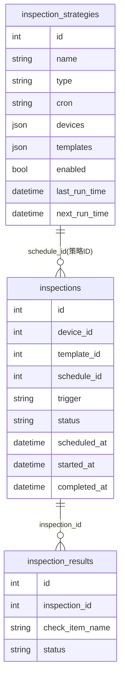
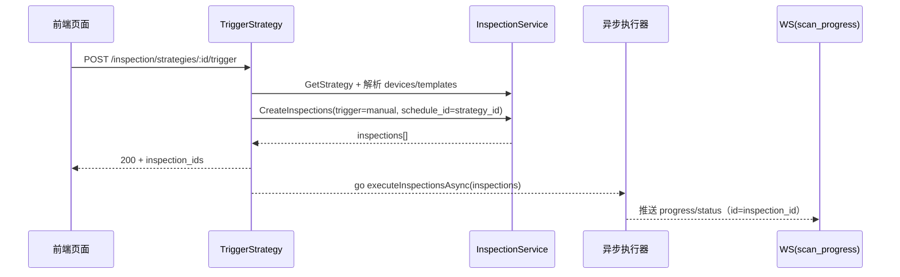
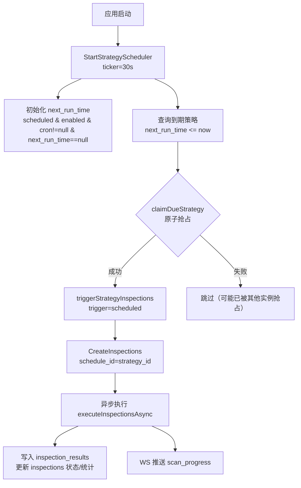

# 巡检策略触发与定时调度流程

## 概述

本文档梳理“巡检策略（`inspection_strategies`）”在**手动触发**与**定时触发**两种场景下的端到端流程，覆盖：
策略 → 创建巡检任务（`inspections`）→ 异步执行 → 写入结果（`inspection_results`）→ WS 进度推送。

> 说明：历史字段 `inspections.schedule_id` 当前用于关联 `inspection_strategies.id`（用于按策略查询执行历史），属于命名遗留。

## 数据模型关系



## 手动触发流程

### 当前实现（已落地）

- 接口：`POST /api/v1/inspection/strategies/:id/trigger`
- 处理器：`backend-go/internal/http/handlers/inspection.go` 的 `TriggerStrategy` / `triggerStrategyInspections`
- 核心行为：创建 `inspections`（`status=pending`）后**异步执行**，并通过 WS 推送进度。



### 关键点与约定

1. `inspections.schedule_id` 当前用于关联策略 `inspection_strategies.id`，用于执行历史按策略过滤（字段命名遗留）。
2. 若策略未配置设备（`devices` 为空），接口返回 400（提示“策略未配置设备”）。
3. 巡检执行过程中会更新 `inspections.status`、统计字段，并写入 `inspection_results`；页面通过轮询/WS 获取实时状态。

## 定时触发流程

### 当前实现（已落地）

- 启动方式：应用启动时由 `backend-go/internal/app/app.go` 启动策略调度器（`InspectionHandler.StartStrategyScheduler`），并在 Shutdown 时优雅退出。
- 调度策略：ticker 每 30 秒扫描一次，到点策略通过原子 claim 抢占后触发一次（幂等/并发安全）。
- 时间计算：基于 `cron + next_run_time`；Quartz 风格 cron（6/7 段、含 `?`）会先规范化为 5 段再计算下一次运行时间。



### 定时任务与巡检策略的关系

巡检策略定时调度与系统级定时任务仍是两套机制，但**巡检策略已具备自己的调度器**（见上文“定时触发流程”）。

| 系统 | 表 | 用途 |
|------|-----|------|
| 定时任务系统 | `scheduled_tasks` | 系统级定时任务（设备巡检、指标收集、网络扫描等） |
| 巡检策略系统 | `inspection_strategies` | 用户自定义的巡检策略 |

说明：
- `scheduled_tasks`：系统级后台任务，不参与巡检策略调度。
- `inspection_strategies`：由巡检模块内置调度器扫描 `next_run_time` 并到点触发执行，不会写入 `scheduled_tasks`。

## 完整的巡检执行流程（实际执行）

```
┌──────────────┐
│  触发来源     │
├──────────────┤
│ • 手动触发    │
│ • 定时触发    │
└──────┬───────┘
       │
       ▼
┌──────────────────────────────────────────────────────────────┐
│                    创建巡检任务                                │
│                    (inspections 表)                           │
│                    status = "pending"                         │
└──────────────────────────────────────────────────────────────┘
       │
       ▼
┌──────────────────────────────────────────────────────────────┐
│                    启动巡检执行                                │
│                    status = "running"                         │
├──────────────────────────────────────────────────────────────┤
│ 1. 获取模板的检查项列表                                        │
│ 2. 获取目标设备信息                                            │
│ 3. 根据检查项类型执行检查：                                     │
│    • SNMP: 查询 OID 获取值                                     │
│    • SSH: 执行命令获取输出                                      │
│    • HTTP: 发送请求检查响应                                     │
│    • Ping: 检测连通性                                          │
│ 4. 对比阈值，判断检查结果                                       │
│ 5. 写入 inspection_results 表                                  │
└──────────────────────────────────────────────────────────────┘
       │
       ▼
┌──────────────────────────────────────────────────────────────┐
│                    完成巡检                                    │
│                    status = "completed" / "failed"            │
├──────────────────────────────────────────────────────────────┤
│ • 更新 inspections 表的统计字段                                │
│   (total_checks, passed_checks, failed_checks 等)             │
│ • 计算巡检得分                                                 │
│ • 发送通知（如果配置了）                                        │
└──────────────────────────────────────────────────────────────┘
```

## 实现说明（2026-03-12）

本次已完成巡检策略的“手动 + 定时”闭环，关键点如下：

1. **统一触发路径**：手动触发与定时触发均复用 `triggerStrategyInspections`，确保创建 `inspections` 与异步执行逻辑一致。
2. **执行历史可按策略过滤**：创建 `inspections` 时写入 `schedule_id=strategy_id`，`GET /inspection/executions?strategy_id=...` 可稳定关联。
3. **`next_run_time` 维护**：策略创建/更新/启用/禁用时维护 `next_run_time`；调度器启动后也会初始化存量策略缺失的 `next_run_time`。
4. **幂等抢占**：到点策略触发前先原子更新（`next_run_time <= now` 条件），多实例部署可避免重复触发。
5. **Cron 兼容**：支持 Quartz 风格（含秒、`?`）Cron；调度计算前会规范化为 5 段 Cron。

## 当前系统状态总结

| 功能 | 状态 | 说明 |
|------|------|------|
| 创建/编辑/启停策略 | ✅ 正常 | 支持 scheduled/manual，维护 `next_run_time` |
| 手动触发策略 | ✅ 正常 | 创建 inspections 并异步执行 |
| 定时触发策略 | ✅ 正常 | 内置调度器到点自动触发（claim 幂等） |
| 执行历史按策略筛选 | ✅ 正常 | `inspections.schedule_id` 关联策略 |
| WS 进度推送 | ✅ 正常 | room=`scan_progress`，data 含 `id/status/progress/timestamp` |

## 文件位置参考

- 策略触发/调度器：`backend-go/internal/http/handlers/inspection.go`（`TriggerStrategy`、`StartStrategyScheduler`、`claimDueStrategy`）
- `next_run_time` 维护：`backend-go/internal/inspection/service.go`
- Cron 规范化/next 计算：`backend-go/internal/inspection/cron.go`
- 数据模型：`backend-go/internal/inspection/models.go`
