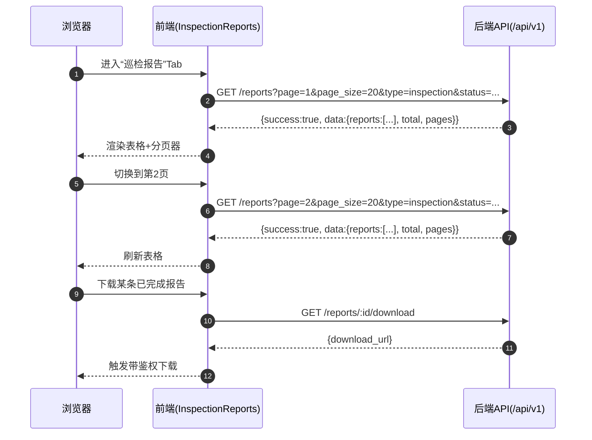
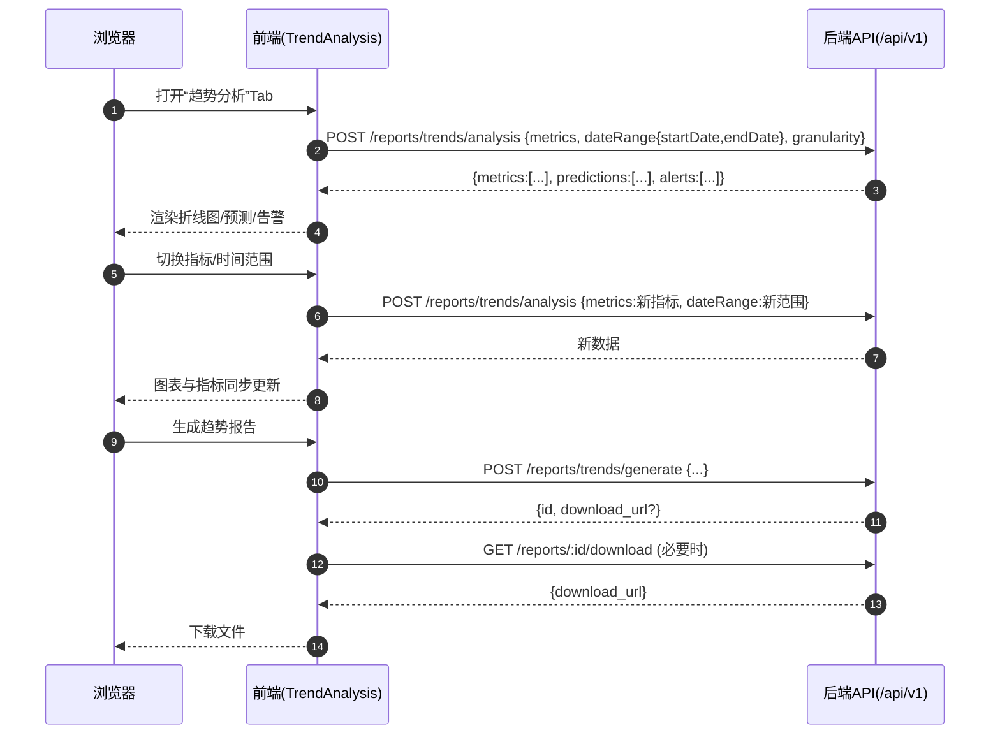
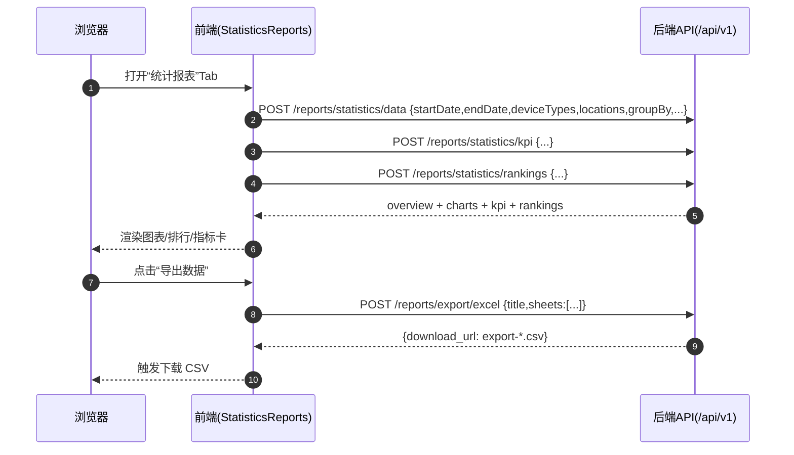
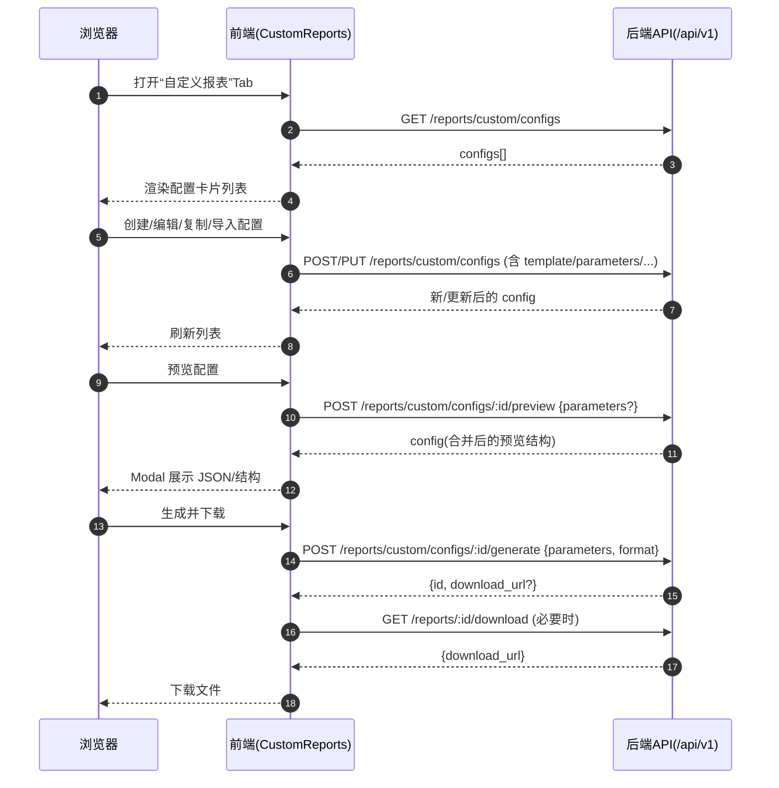

# 报表分析页面业务流程图（/reports）

本文用于梳理 `/reports`（报表分析）页面四个子模块的端到端业务流程、关键 API 交互与分页/导出等闭环链路，便于审查与验收。

## 1. 页面入口与鉴权

- 页面入口：`frontend/src/app/reports/page.tsx`
- 业务容器：`frontend/src/features/reports/components/ReportsView.tsx`
- 鉴权：入口通过 `RouteGuard` 校验至少具备 `reports:read`（读取权限）。
  - 需要额外注意：页面内存在“生成/编辑/删除”等操作，需按 `reports:create / reports:update / reports:delete` 进一步控制按钮显隐/禁用。

## 2. 总体流程（Flowchart）

```mermaid
flowchart TD
  U[用户访问 /reports] --> P[ReportsPage\nfrontend/src/app/reports/page.tsx]
  P --> RG[RouteGuard\n至少 reports:read]
  RG -->|拒绝| DENY[阻止访问/跳转登录]
  RG -->|通过| RV[ReportsView\nfrontend/src/features/reports/components/ReportsView.tsx]

  RV --> STATS[useReportStats\nGET /api/v1/reports/stats]
  RV --> SEARCH[SearchText\n影响四个 Tab 的前端过滤]
  RV --> TAB{切换 Tab}

  TAB --> INSP[巡检报告 InspectionReports]
  TAB --> TREND[趋势分析 TrendAnalysis]
  TAB --> STAT[统计报表 StatisticsReports]
  TAB --> CUST[自定义报表 CustomReports]

  %% Inspection
  INSP --> INSP_LIST[useReports\nGET /api/v1/reports?page&page_size&type=inspection&status=...]
  INSP_LIST --> INSP_TABLE[Table + Pagination]
  INSP --> INSP_GEN[生成\nPOST /api/v1/reports/inspection/generate]
  INSP --> INSP_PREVIEW[预览\nGET /api/v1/reports/:id/preview]
  INSP --> INSP_DL[下载\nGET /api/v1/reports/:id/download]
  INSP --> INSP_DEL[删除\nDELETE /api/v1/reports/:id]

  %% Trend
  TREND --> TREND_Q[useTrendAnalysis\nPOST /api/v1/reports/trends/analysis]
  TREND --> TREND_GEN[生成趋势报告\nPOST /api/v1/reports/trends/generate]
  TREND_GEN --> TREND_DL[下载\nGET /api/v1/reports/:id/download]

  %% Statistics
  STAT --> STAT_DATA[useStatistics\nPOST /api/v1/reports/statistics/data]
  STAT --> STAT_KPI[useKPIData\nPOST /api/v1/reports/statistics/kpi]
  STAT --> STAT_RANK[useRankings\nPOST /api/v1/reports/statistics/rankings]
  STAT --> STAT_GEN[生成统计报告\nPOST /api/v1/reports/statistics/generate]
  STAT_GEN --> STAT_DL[下载\nGET /api/v1/reports/:id/download]
  STAT --> STAT_EXP[导出数据\nPOST /api/v1/reports/export/excel\n(当前后端输出 CSV)]

  %% Custom
  CUST --> CUST_LIST[useCustomReportConfigs\nGET /api/v1/reports/custom/configs]
  CUST --> CUST_CRUD[创建/编辑/复制/删除\nPOST/PUT/DELETE /api/v1/reports/custom/configs]
  CUST --> CUST_PREVIEW[预览配置\nPOST /api/v1/reports/custom/configs/:id/preview]
  CUST --> CUST_GEN[生成报表\nPOST /api/v1/reports/custom/configs/:id/generate]
  CUST_GEN --> CUST_DL[下载\nGET /api/v1/reports/:id/download]
```

## 3. 关键时序（Sequence）

### 3.1 巡检报告：列表+分页+下载



### 3.2 趋势分析：指标切换+生成报告



### 3.3 统计报表：导出数据（CSV）



### 3.4 自定义报表：配置管理+生成下载



## 4. 分页与参数口径（重点）

- 报表列表分页（巡检报告 Tab 使用）：  
  - Query：`page`（从 1 开始）、`page_size`（建议后端 clamp 上限）、`type/status/...`  
  - Response：`total`（总条数）与 `pages`（总页数）用于前端分页器。
  - 约束：后端会对 `page/page_size` 做边界保护（例如 `page>=1`，`page_size<=100`）。
  - 特殊语义：`status=scheduled` 对外表示“已配置定时但尚未完成”，后端内部按 `pending + schedule_id IS NOT NULL` 过滤，避免 total/pages 口径错误。
- 趋势/统计模块不走传统分页，主要通过 `timeRange/topN/groupBy` 等参数控制数据量。

> 字段命名口径说明：前端 UI/Hook 通常使用 camelCase（如 `dateRange/startDate/endDate`），后端兼容 snake_case（如 `date_range/start_date/end_date`）。

## 5. 异常与降级

- 前端报表模块存在“非生产 + `NEXT_PUBLIC_REPORTS_ENABLE_MOCK=1` 时回退默认数据”的兜底逻辑；验收真对接时应关闭该开关。
- 错误态建议提供“重试（refetch）”与明确的错误提示，避免用户误认为无数据。
