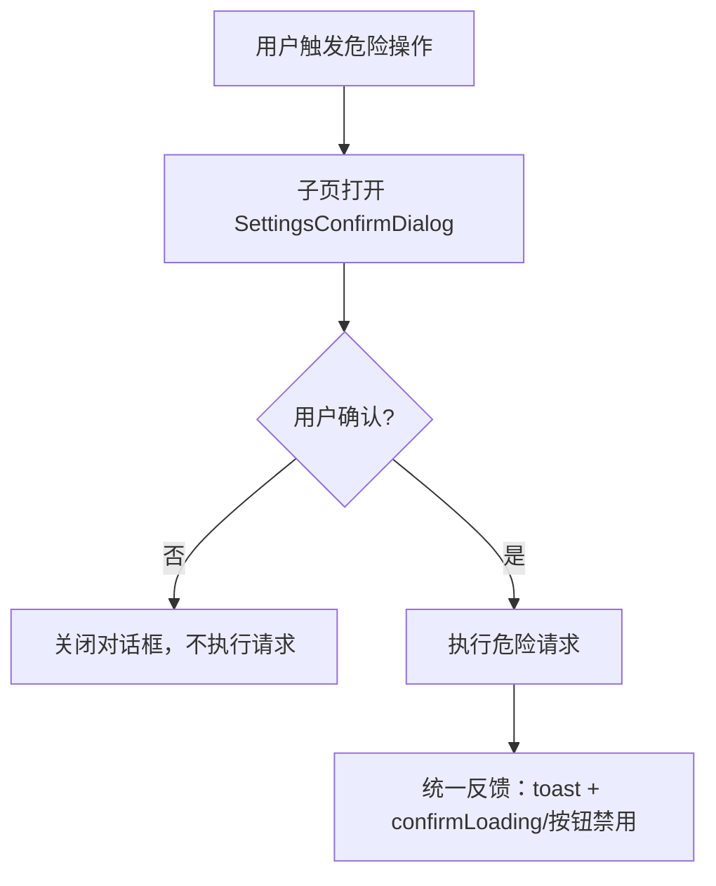
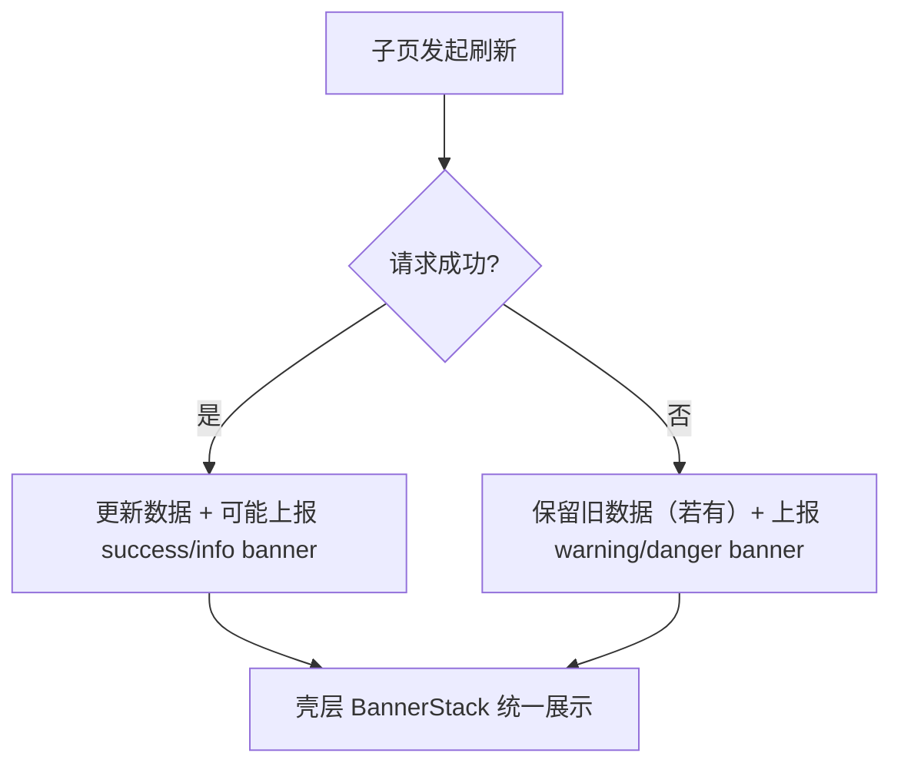

# 系统设置（/settings）壳层业务流程图（框架层统一）

> 更新时间：2026-03-20  
> 目的：用一份“可追溯、可验收”的流程文档，描述系统设置页壳层在**导航、权限、能力上报、离开拦截、危险确认、状态横幅**上的统一机制。

---

## 1. 范围与术语

### 1.1 范围

- 页面：`/settings`（系统设置）
- 子分页（9 个）：`general / logs / users / roles / security / audit / backup / notifications / monitoring`
- 重点：**壳层统一、内容自治**（壳层负责框架；子页只上报能力并渲染内容）

### 1.2 核心术语

- **Tab 注册表（Registry）**：统一声明 9 个子页的 `key/label/icon/description/permission/scrollMode/...`
- **壳层（Shell）**：统一承载 TabNav、工具栏、统计条带、状态横幅、离开拦截等“框架层能力”
- **能力上报（Capabilities）**：子页通过 hook 把 `dirty/saving/actions/stats/banners/...` 上报给壳层

---

## 2. 关键实现落点（路径）

- 注册表：`frontend/src/features/settings/registry/settings-tabs.tsx`
- 壳层入口：`frontend/src/features/settings/shell/SettingsPageShell.tsx`
- 能力上报：`frontend/src/features/settings/hooks/useSettingsTabCapabilities.ts`
- 壳层状态读取：`frontend/src/features/settings/hooks/useSettingsShellState.ts`
- 离开拦截：`frontend/src/features/settings/hooks/useSettingsLeaveGuard.ts` + `frontend/src/features/settings/shell/SettingsLeaveGuard.tsx`
- 统一顶部组件：
  - TabNav：`frontend/src/features/settings/shell/SettingsTabNav.tsx`
  - Toolbar：`frontend/src/features/settings/shell/SettingsToolbar.tsx`
  - StatsStrip：`frontend/src/features/settings/shell/SettingsStatsStrip.tsx`
  - BannerStack：`frontend/src/features/settings/shell/SettingsStatusBannerStack.tsx`

---

## 3. 流程图：页面入口、权限过滤与 Tab 纠偏

```mermaid
flowchart TD
  A[访问 /settings] --> B[壳层读取权限]
  B --> C[Registry 过滤：visibleTabs]
  C --> D{visibleTabs 是否为空?}
  D -- 是 --> E[EmptyState: 暂无可访问的设置模块]
  D -- 否 --> F[读取 URL ?tab=]
  F --> G{tab 合法且可见?}
  G -- 否 --> H[纠偏到默认可见 tab + router.replace]
  G -- 是 --> I[activeTab = tab]
  H --> I
  I --> J[SettingsShellProvider(activeTabKey)]
  J --> K[渲染壳层：TabNav/Banners/Stats/Toolbar/ContentViewport]
  K --> L[渲染子页内容组件 ActiveTabComponent]
```

验收点：

- 手动输入非法 `?tab=` 时能纠偏到首个可见 Tab，并同步更新 URL（replace）
- 当前账号无任何可见 Tab 时能稳定显示 EmptyState，不触发子页请求

---

## 4. 流程图：能力上报（Capabilities）→ 壳层编排

```mermaid
flowchart LR
  A[子页渲染] --> B[useSettingsTabCapabilities(tabKey, caps)]
  B --> C[SettingsShellContext.setCapabilities]
  C --> D[useSettingsShellState 读取 activeTabCapabilities]
  D --> E[SettingsStatusBannerStack 渲染 banners]
  D --> F[SettingsStatsStrip 渲染 stats]
  D --> G[SettingsToolbar 渲染 search/filters/actions]
  D --> H[SettingsPageShell 统一承载顶部能力]
```

说明：

- 子页不再自行渲染“顶部动作条/统计条/状态条”，而是把它们抽象成 capabilities 交由壳层渲染。
- 为避免无限重渲染，capabilities 上报实现会对对象做“稳定快照”处理（忽略函数/ReactElement 等非序列化值）。

---

## 5. 流程图：Tab 切换与未保存离开拦截

```mermaid
flowchart TD
  A[用户点击 Tab] --> B[壳层 confirmLeaveIfNeeded(nextTabKey)]
  B --> C{shouldBlockLeave?}
  C -- 否 --> D[允许切换：router.push 更新 URL]
  C -- 是 --> E[弹窗确认：当前页面有未保存更改，确定离开?]
  E -->|取消| F[停留当前 Tab]
  E -->|确认| D
```

验收点：

- 当子页上报 `dirty=true` 或显式上报 `blockLeave=true` 时，切换 Tab 会触发拦截
- 浏览器刷新/关闭页签时会触发 beforeunload 保护（壳层级）

---

## 6. 流程图：危险操作确认（现状 / 目标）

### 6.1 现状（截至 2026-03-20）

危险操作确认已统一接入 `SettingsConfirmDialog`（避免 `window.confirm` 分散在各子页），目前覆盖：

- `logs`：立即清理设备日志
- `users`：删除用户
- `roles`：删除角色
- `backup`：恢复备份、删除备份

补充：离开拦截（未保存更改）仍使用 `window.confirm` 作为浏览器级兜底（更贴合“导航拦截”语义，与危险操作确认区分）。

### 6.2 现状落地（Task 6）



验收点：

- 危险确认统一走 `SettingsConfirmDialog`，文案、禁用/加载态策略可复用且可测试
- 确认前不应触发任何请求；确认后才触发；失败时保留对话框上下文并提示错误

---

## 7. 流程图：状态横幅（Monitoring 等）



验收点：

- 请求失败但存在旧数据时，页面不应“空白化”，而应提示“刷新失败但仍展示旧数据”
- 子页只上报 banners 描述，壳层负责样式与布局

---

## 8. 验收清单（建议）

- URL(tab) 纠偏：非法/不可见 tab → 自动纠偏并 replace URL
- 权限过滤：不可见 tab 不应渲染、不应发请求
- Capabilities：子页能稳定上报 actions/stats/banners，壳层读取并渲染
- LeaveGuard：dirty 时切换 Tab 拦截；刷新/关闭触发 beforeunload
- Confirm：危险操作统一确认（完成 Task 6 后验收）
- Monitoring：状态横幅与重试/暂停等动作能被壳层承接（完成 Task 8 后验收）
