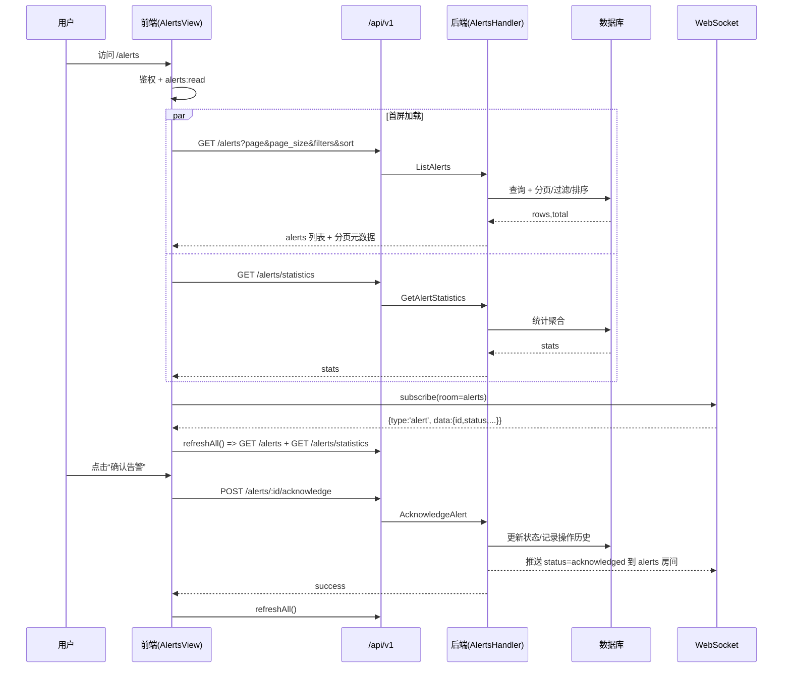

# 告警中心审查与修复方案（2026-03-15）

> 目标：深度审查「告警中心」页面前端/后端是否完善、是否真实对接后端 API/WS，并梳理端到端业务流程；在此基础上给出可执行的优化/修复/完善计划（P0/P1/P2），并配套可回归的测试与验收标准。
>
> 说明：本方案基于**静态源码核对**（未包含线上环境差异），后续修复应以“契约测试 + 冒烟联调”验证闭环。

---

## 0. 范围与入口（已核对源码）

### 0.1 前端真实入口（无 mock）

- 路由入口：`frontend/src/app/alerts/page.tsx`
  - `RouteGuard` 要求登录 + `Permission.ALERTS_READ`
- 懒加载：`frontend/src/components/lazy/LazyComponents.tsx` → `LazyAlertCenter`
- 实际页面：`frontend/src/features/alerts/components/AlertsView.tsx`
- 历史页面（已标注废弃，仅参考）：`frontend/src/components/pages/AlertCenter.tsx`（含 mock 数据，但**不在当前路由链路中**）

### 0.2 后端入口

- 路由注册：`backend-go/internal/http/handlers/alerts.go`（统一前缀 `/api/v1`）
- 服务层：`backend-go/internal/alerts/service.go`
- 实时推送：`backend-go/internal/alerts/evaluator.go`（新告警推送）+ `backend-go/internal/http/handlers/alerts.go`（状态变更推送）
- WS 权限门禁：`backend-go/internal/ws/handler.go`（`alerts` 房间要求 `alerts:read`）

---

## 1. 现状结论（前端/后端/对接）

### 1.1 前端已真实对接后端 API（非 mock）

前端告警数据链路为真实 HTTP 请求：

- 列表：`GET /api/v1/alerts`（分页/筛选/排序）
- 详情：`GET /api/v1/alerts/:alert_id`
- 状态流转：`POST /api/v1/alerts/:alert_id/acknowledge`、`POST /api/v1/alerts/:alert_id/resolve`、`POST /api/v1/alerts/:alert_id/reactivate`
- 删除：`DELETE /api/v1/alerts/:alert_id`
- 批量：`POST /api/v1/alerts/bulk`
- 统计：`GET /api/v1/alerts/statistics`
- 最近：`GET /api/v1/alerts/recent`
- 导出：`GET /api/v1/alerts/export`

对应前端实现主要在：
- `frontend/src/features/alerts/api/alerts.api.ts`
- `frontend/src/lib/api-client.ts`（`api.alerts.*`）

### 1.2 WebSocket 已接入且参与刷新

- 前端订阅：`frontend/src/lib/websocket.ts`（订阅房间 `alerts`，入站 `type=alert` 映射为 `NEW_ALERT/ALERT_UPDATE/ALERT_RESOLVED`）
- 页面监听并刷新：`frontend/src/features/alerts/components/AlertsView.tsx`
- 后端推送：
  - 新告警：`backend-go/internal/alerts/evaluator.go` → `SendToRoom("alerts", type="alert")`
  - 状态变更：`backend-go/internal/http/handlers/alerts.go` → `broadcastAlertStatus()` 推送到 `alerts` 房间

### 1.3 功能完备性概览（当前实现）

- ✅ 权限：页面级 `RouteGuard` + 组件内 `usePermission(Permission.ALERTS_READ)`（双保险）
- ✅ 列表：分页/排序/筛选、单条与批量操作（确认/解决/删除）
- ✅ 统计：顶部统计卡（总数/级别/状态）
- ✅ 导出：CSV 下载（但实现与统一 api-client 存在一致性风险，见问题清单）
- ✅ 自动刷新：默认 30 秒轮询刷新列表+统计
- ✅ WS 实时刷新：订阅 `alerts` 房间，收到推送触发刷新
- ⚠️ 备注/操作历史：后端支持“新增备注”（`POST /alerts/:id/comment`），但缺少“历史查询契约”，前端很难展示备注历史/操作时间线
- ⚠️ 指派/负责人：后端存在 `assign` 动作与 `assignee` 入参，但当前数据模型未持久化“负责人”字段，语义需澄清后再完善

---

## 2. 业务流程图（Mermaid）

### 2.1 页面端到端流程（Flowchart）

```mermaid
flowchart TD
  A[用户访问 /alerts] --> B{RouteGuard 鉴权\\nrequireAuth + alerts:read}
  B -- 未登录/无权限 --> B1[阻断/跳转/提示]
  B -- 通过 --> C[渲染 AlertsView]

  C --> D1[HTTP: GET /api/v1/alerts\\n分页/筛选/排序]
  C --> D2[HTTP: GET /api/v1/alerts/statistics]
  C --> W1[WS: subscribe room=alerts]

  D1 --> R1[渲染告警列表]
  D2 --> R2[渲染统计卡]

  U1[筛选/排序/分页] --> Q[更新 queryParams]
  Q --> D1

  U2[查看详情\\n来源：列表点击/深链?id] --> M1[打开 AlertDetailModal]
  M1 --> M2{详情数据是否齐全?}
  M2 -- 否 --> M3[HTTP: GET /api/v1/alerts/:id\\n兜底补拉]
  M2 -- 是 --> M4[展示详情]

  U3[单条操作\\n确认/解决/删除] --> S1[HTTP: POST/DELETE]
  S1 --> F1[refreshAll()\\n并行刷新列表+统计]

  U4[批量操作] --> S2[HTTP: POST /api/v1/alerts/bulk]
  S2 --> F1

  U5[导出] --> X1[HTTP: GET /api/v1/alerts/export?...]
  X1 --> X2[下载 CSV]

  W2[WS 入站 type=alert] --> E1{事件分类\\nnew/update/resolved}
  E1 --> F1
```

### 2.2 核心时序（Sequence）



---

## 3. 前后端对接清单（契约对齐点）

### 3.1 HTTP 路由对齐（主要接口）

- `GET /alerts`：前端 `fetchAlerts()` ↔ 后端 `ListAlerts()`
  - Query：`page/page_size/status/severity/category/device_ids/start_date/end_date/search/sort_by/sort_order`
  - 返回：`alerts,total,page,page_size,current_page,has_next,has_prev,pages`
- `GET /alerts/:id`：前端 `fetchAlert()` ↔ 后端 `GetAlert()`
- `POST /alerts/:id/acknowledge`：前端 `acknowledgeAlert()` ↔ 后端 `AcknowledgeAlert()`（权限 `alerts:update`）
- `POST /alerts/:id/resolve`：前端 `resolveAlert()` ↔ 后端 `ResolveAlert()`（权限 `alerts:update`）
- `DELETE /alerts/:id`：前端 `deleteAlert()` ↔ 后端 `DeleteAlert()`（权限 `alerts:delete`）
- `POST /alerts/bulk`：前端 `bulkAlertAction()` ↔ 后端 `BulkAlertAction()`（按 action 分配 `alerts:update/alerts:delete`）
- `GET /alerts/statistics`：前端 `fetchAlertStats()` ↔ 后端 `GetAlertStatistics()`
- `GET /alerts/export`：前端 `exportAlerts()` ↔ 后端 `ExportAlerts()`（CSV）

### 3.2 WebSocket 契约对齐（关键点）

建议明确并固化以下契约（并以测试锁定）：

- 订阅协议：客户端发送 `{type:'subscribe', data:{room:'alerts'}}`
- 推送消息：服务端发送 `{type:'alert', data:{id,status,severity,timestamp,...}}`
- `data.id` 类型：建议与 REST 一致（推荐 string）
- 权限门禁：订阅 `alerts` 房间必须具备 `alerts:read`

---

## 4. 问题清单（P0/P1/P2）

> P0：影响安全/数据正确性/核心链路可用性；P1：高频影响体验或易出线上问题；P2：增强项/长期可维护性。

### P0（必须修复）

1) **删除/批量删除缺少二次确认 + 权限可见性不一致**
- 现象：列表项“删除”与批量删除当前缺少统一的确认/提示机制；同时页面仅要求 `alerts:read`，但 UI 层未按 `alerts:update/alerts:delete` 对按钮进行禁用/隐藏，读权限用户会看到操作入口但最终 403。
- 影响：误操作风险高；用户体验差（“能点但失败”）。
- 建议：
  - 前端：对 `delete/bulk delete` 增加二次确认（且文案明确不可逆）；按权限控制按钮可用性（`ALERTS_UPDATE/ALERTS_DELETE`）。
  - 后端：保持权限校验不变，同时在错误响应中返回可读的错误信息（便于前端提示）。

2) **筛选 Query/时间范围契约不清晰，容易出现“筛选不生效”**
- 现象：后端读取 `status/severity/category` 为多值 query；不同客户端可能发 `status[]=...`/逗号分隔/重复 key，兼容性需要明确；时间过滤若仅使用 `YYYY-MM-DD` 会被解析为 UTC 零点，容易导致“今天数据被排除”等问题。
- 影响：筛选“看似生效但结果不对”，属于隐性高风险。
- 建议：
  - 后端：明确支持的多值 query 编码方式（推荐重复 key + 兼容逗号分隔），并可选兼容 `status[]`；对 `end_date` 进行“包含整天”的语义修正（或引导使用 `end_time` RFC3339）。
  - 前端：时间范围统一发送 RFC3339 的 `start_time/end_time`（避免 date-only 误差）。

3) **统计中的 recent/trends DTO 形态不一致（契约不稳定）**
- 现象：`/alerts/recent` 与 `GET /alerts/statistics` 的 `recent` 字段结构存在多套 DTO；`trends` 字段前后端含义不一致（前端期望 today/yesterday/change，后端返回 up/down/stable）。
- 影响：前端扩展“最近告警/趋势”时会踩坑；对外接口也不稳定。
- 建议：统一 DTO 与字段名，并补契约测试锁定。

### P1（建议修复）

1) **高级筛选“全部时间”与日期范围计算存在逻辑缺陷**
- 现象：高级筛选选择“全部时间”时应清空日期过滤；日期预设（今天/近7天/近30天）应生成可被后端正确解析的时间区间（建议 RFC3339）。
- 影响：过滤结果不准确。
- 建议：前端修复筛选状态机（清空/预设/自定义）并统一出参；后端明确 start/end 的包含关系。

2) **自动刷新 + WS 推送触发刷新，缺少节流/降噪策略**
- 现象：WS 每条事件触发 `refreshAll()`（列表+统计），叠加 30s 自动刷新，告警风暴场景可能造成接口压力与页面抖动。
- 建议：对 WS 触发刷新做 debounce/throttle；统计接口低频刷新；或按事件类型做“增量更新/局部刷新”。

3) **时间字段序列化不统一（字符串 vs time.Time）**
- 现象：部分字段为 RFC3339 字符串，部分为 JSON time；同对象内混用。
- 影响：严格 DTO 客户端与前端解析复杂度上升。
- 建议：后端统一时间字段输出格式（推荐 RFC3339 字符串）。

4) **WS 本端去重逻辑对 payload 字段名敏感**
- 现象：前端去重仅依赖 `payload.id`；若后端推送结构变为 `alert_id` 或嵌套，将出现双刷闪烁。
- 建议：明确 WS payload 字段并加兼容读取（`id/alert_id/alert.id`）。

### P2（可选优化/完善）

1) **“备注/操作历史”缺少查询 API，导致前端难以展示时间线与备注列表**
- 现状：已记录 `alert_operation_history`（含 note/metadata），但缺少读取接口。
- 建议：新增 `GET /alerts/:id/operations`（或 `/history`）返回操作历史，前端详情页渲染时间线/备注历史。

2) **“负责人/指派”语义与数据模型不匹配**
- 现状：后端模型无 assignee 列，现有 `assignee` 入参仅落在操作历史 metadata；前端展示“负责人”容易误导。
- 建议二选一：
  - 方案A（更快）：前端改为展示“确认人/解决人”（来自 acknowledged_by/resolved_by），去掉“负责人”概念；
  - 方案B（更完整）：新增 alerts.assignee 字段 + 赋值逻辑（ack/assign）+ 返回契约 + UI/筛选完善。

3) **类型/字段扁平化导致后续扩展返工**
- 建议：前端 `Alert` 类型补齐可选字段（`deviceId/deviceIp/ruleId/ruleName/triggeredAt` 等），transform 统一映射，UI 按需渐进使用。

---

## 5. 修复与完善计划（可执行）

### 5.1 Phase 1（P0）— 核心正确性与安全兜底

- 前端
  1) 删除/批量删除增加二次确认；并按 `ALERTS_UPDATE/ALERTS_DELETE` 控制按钮可用性
  2) 时间范围筛选统一发送 `start_time/end_time` RFC3339；并修复“全部时间清空”逻辑
  3) 统一处理 `refreshAll()` 异常（避免未处理 Promise 拒绝）
- 后端
  1) 明确并锁定多值 query 的解析方式（兼容重复 key + 逗号分隔，必要时兼容 `status[]`）
  2) 统一 recent DTO（`/alerts/recent` 与 `statistics.recent`）
  3) 统一 trends 输出字段（与前端对齐或调整前端展示策略）

### 5.2 Phase 2（P1）— 性能与体验

- WS 触发刷新节流（debounce/throttle）+ 统计低频刷新策略
- 时间字段统一序列化（后端）+ 前端统一格式化展示（列表/详情）
- WS payload 字段名兼容与契约测试

### 5.3 Phase 3（P2）— 业务能力补齐

- 新增“操作历史/备注历史”查询接口，并在详情页展示
- “负责人/指派”做产品语义确认后落地（A/B 二选一）
- 告警规则管理 UI（如纳入本次范围）

---

## 6. 测试与验收（≤60s 优先）

### 6.1 自动化测试（建议补齐）

- 后端契约/冒烟（Go）
  - `GET /alerts`：分页字段齐全、字段类型稳定、sort_by 白名单
  - 多值 query：重复 key / 逗号分隔 / `status[]`（若支持）解析一致
  - `GET /alerts/statistics`：trends/recent DTO 与 `/alerts/recent` 一致（或明确差异）
  - 状态流转：ack/resolve/reactivate 的状态机约束与权限 403/400/404
- 前端单测（Jest）
  - 导出：URL 拼接不双前缀 + Authorization 头正确
  - WS：本端操作 TTL 去重（同 id 不双刷，不同 id 正常刷新）
  - 高级筛选：预设/清空逻辑 + start_time/end_time 生成正确

### 6.2 手工回归（联调冒烟）

- 权限：仅 `alerts:read` 账号访问 `/alerts`，操作按钮应禁用/隐藏且提示明确
- 深链：访问 `/alerts?id=<不在当前页的告警>`，应能加载详情或给出明确错误态
- 筛选：严重级别/状态/分类/时间范围组合筛选正确
- 操作：确认/解决/删除/批量后列表与统计同步更新
- 导出：CSV 编码（含中文）与列内容正确
- WS：新告警/状态更新推送能触发刷新；本端操作不出现“双刷新闪烁”

---

## 7. 风险与回滚策略

- 契约改动（recent/trends/time 序列化）属于对外接口变更：建议采取“新增字段兼容旧字段→前端切换→最后移除旧字段”的渐进方式，并记录在 `docs/api/changelog.md`。
- 若引入 DB 变更（负责人 assignee 等），需提供迁移脚本与回滚点（本轮方案默认优先选择不改表的快修路径）。

---

## 8. 附录：关键文件清单

- 前端
  - `frontend/src/app/alerts/page.tsx`
  - `frontend/src/features/alerts/components/AlertsView.tsx`
  - `frontend/src/features/alerts/api/alerts.api.ts`
  - `frontend/src/lib/api-client.ts`
  - `frontend/src/lib/websocket.ts`
- 后端
  - `backend-go/internal/http/handlers/alerts.go`
  - `backend-go/internal/alerts/service.go`
  - `backend-go/internal/alerts/evaluator.go`
  - `backend-go/internal/ws/handler.go`

