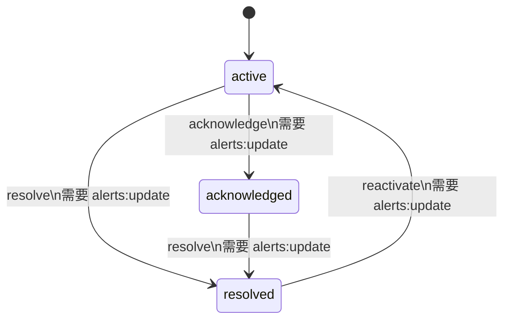
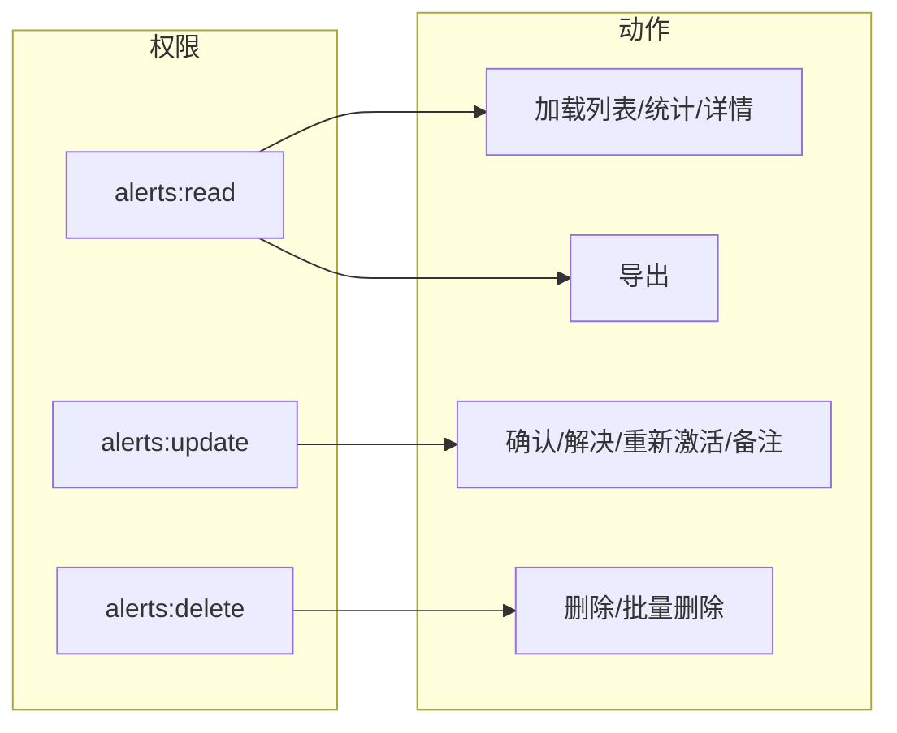
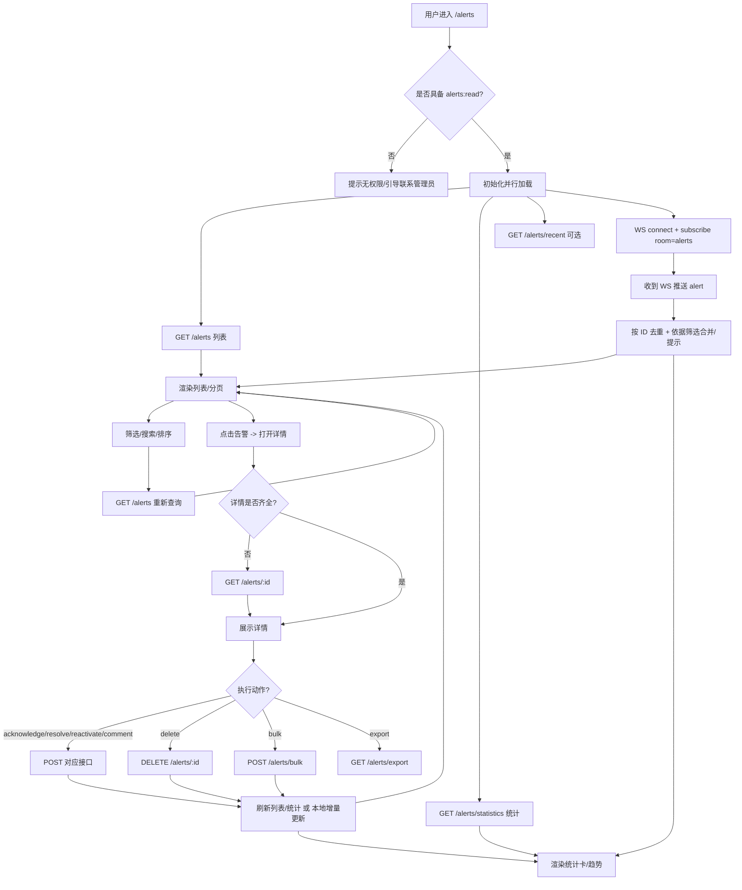
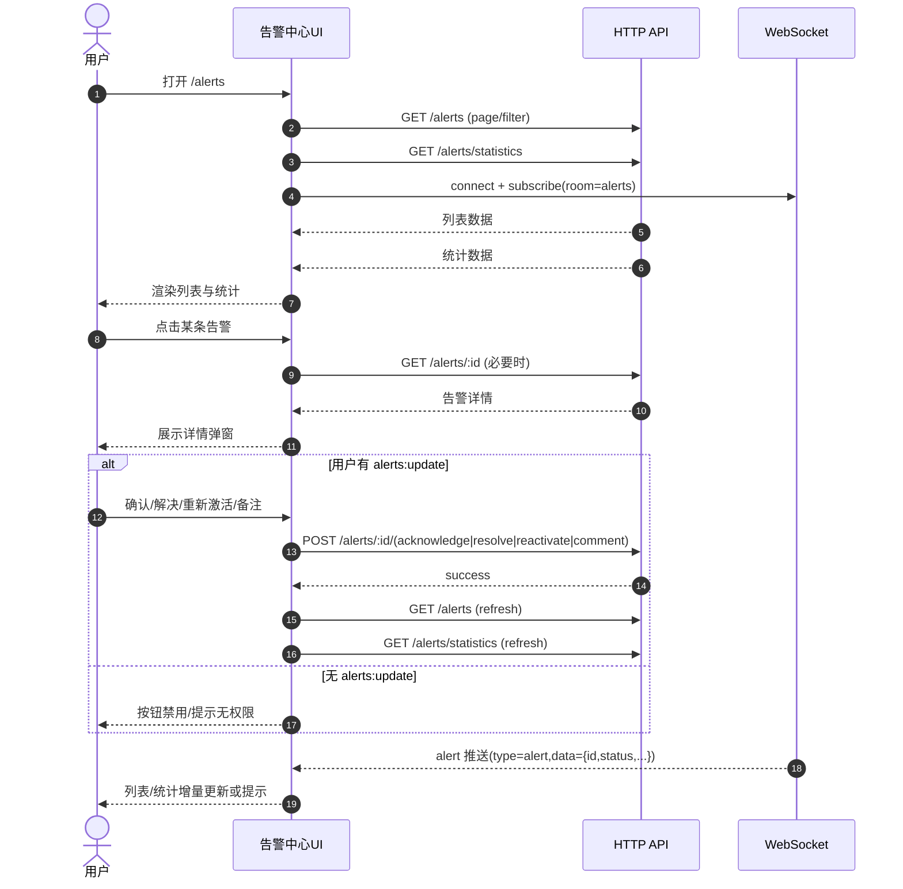

# 告警中心（二次审查）业务流程复核与优化计划

> 目标：从用户视角复核告警中心端到端流程、状态机与权限门禁，校正流程图，并给出本轮可执行的 P0/P1/P2 优化计划与验收清单。

## 1. 页面范围与角色假设

### 1.1 页面范围（告警中心）

- 页面入口：`/alerts`
- 页面能力：列表、统计、筛选/搜索/排序、分页、详情、确认/解决/重新激活、备注、删除/批量、导出、WebSocket 实时更新、错误/空状态

### 1.2 角色与权限（最小集合）

- `alerts:read`：查看告警（进入页面、加载列表/统计/详情、订阅 WS 房间）
- `alerts:update`：修改告警状态与备注（确认/解决/重新激活/备注等）
- `alerts:delete`：删除告警（单条删除/批量删除）

> 说明：导出通常可归入 `alerts:read`；如需更严格可引入 `alerts:export`（本轮不强制）。

---

## 2. 端到端业务流程（用户视角）

### 2.1 进入页面 → 初始化加载

1. 用户进入 `/alerts`
2. 前端读取用户权限（至少需要 `alerts:read`）
3. 并行初始化请求：
   - 列表：`GET /alerts`（分页 + 条件）
   - 统计：`GET /alerts/statistics`（统计卡与趋势）
   - 最近（可选）：`GET /alerts/recent`
4. 建立 WS 连接并订阅 `room=alerts`，用于实时刷新列表/统计

### 2.2 统计卡（总量/分级/状态/趋势）

- 数据来源：`GET /alerts/statistics`
- 若统计卡可点击：必须映射为筛选条件并触发 `GET /alerts` 刷新；否则应取消点击态，避免“可点但无效”。

### 2.3 筛选/搜索/排序

- 前端筛选值映射为查询参数（建议统一为数组风格，后端兼容非数组）：
  - `status[]` / `severity[]` / `category[]` / `device_ids[]`
  - `start_date` / `end_date`（时间范围）
  - `search`、`sort_by`、`sort_order`
- 变更筛选后分页应归 1，避免“空列表假象”。

### 2.4 分页

- `GET /alerts?page=&page_size=&...` 刷新列表
- `total/pages/has_next/has_prev` 与分页按钮状态一致。

### 2.5 查看详情（弹窗/抽屉）

- 点击列表项打开详情；若深链进入（仅带 id）或列表数据不完整：
  - `GET /alerts/:alert_id` 补拉详情。

### 2.6 确认/解决/重新激活（核心动作）

- 确认：`POST /alerts/:id/acknowledge`
- 解决：`POST /alerts/:id/resolve`
- 重新激活：`POST /alerts/:id/reactivate`
- 动作后应保证：列表项状态、详情状态、统计卡一致（可触发统计重拉或本地增量修正）。

### 2.7 备注（comment）

- `POST /alerts/:id/comment`
- 业务闭环期望：备注可回看（理想为时间线/操作记录）。
- 若仅能提交但无法回看，会形成“写入黑洞”。

### 2.8 删除/批量操作

- 单条删除：`DELETE /alerts/:id`（强制二次确认）
- 批量：`POST /alerts/bulk`（action + alert_ids；delete 强制二次确认）
- 删除后建议触发统计刷新，避免统计卡与列表不一致。

### 2.9 导出

- `GET /alerts/export`（建议支持沿用当前筛选条件）
- 失败提示明确（鉴权失败/参数非法/服务端错误）。

### 2.10 WebSocket 实时更新

- 订阅：`room=alerts`
- 推送（MessageType=alert）按 payload.status 映射为：
  - active → NEW
  - acknowledged → UPDATE
  - resolved/closed → RESOLVED
- 去重主键：告警 ID；同一告警多次推送按时间戳择优覆盖。

### 2.11 错误/空状态

- 401/403：提示“登录失效/无权限”，引导重新登录或联系管理员
- 5xx/网络：可重试，保留筛选条件
- 空列表：区分“无数据”与“无匹配”，提供一键清空筛选

---

## 3. 关键状态机（状态跃迁 + 权限约束）

---

## 4. 二次复核发现：断点/不一致/边界问题

### P0（必须修复）

1) 导出 URL 组装与 API 基址/前缀约定不一致风险  
- 风险：`NEXT_PUBLIC_API_URL` 若包含 `/api/v1`，导出/少数 fetch 若再拼 `/api/v1/...`，会出现双前缀或漏前缀，导致 404（环境相关必现）。

2) 时间范围契约必须稳定化  
- 风险：date-only 若按 UTC 转换会错天；`end_date=YYYY-MM-DD` 若解释为当日 00:00 会漏掉当天数据，损害数据可信度。

3) CSV 导出安全性（Excel 公式注入）  
- 风险：导出 CSV 的单元格若以 `=` / `+` / `-` / `@` 开头，可能被 Excel 解析为公式，带来数据泄露/恶意跳转等风险（典型“CSV 注入”）。

### P1（强烈建议修复）

1) 备注/操作历史缺少“可回看”链路  
- 风险：用户提交备注但无法在 UI 中查看历史，处理闭环不完整；审计与协作价值不足。  
- 建议：增加 `GET /alerts/:id/operations`（不改表，读取操作历史表）。

2) WS 推送与列表筛选共存策略未明确  
- 风险：推送插入不匹配筛选会破坏筛选语义；忽略则“漏提醒”。  
- 建议：列表严格遵循筛选；不匹配推送改为“提示条/角标 + 一键清空筛选查看”。

### P2（体验优化）

- 统计卡点击交互统一（可点击就触发筛选，否则禁用点击态）
- 空态/错态文案与按钮统一（重试/清空筛选/返回）

---

## 5. 本轮计划（P0/P1/P2）

### P0

- [已完成] 统一前端 API 基址/前缀拼接策略（覆盖导出与所有直接 fetch 场景）
- [已完成] 时间范围契约：文档化 + 后端契约测试（date-only end_date）
- [已完成] CSV 导出公式注入防护（服务端导出）

### P1

- [已完成] 增加操作历史查询 API（不做 DB 变更）+ 前端详情时间线展示
- [已完成] 明确 WS 推送与筛选共存策略，并形成可验收行为（筛选/分页/关闭自动刷新时改为提示条累计 + 手动应用）

### P2

- [已完成] 统计卡交互一致性优化（点击统计卡→映射筛选条件→触发列表刷新，避免“可点但无效”）
- [已完成] 空/错态统一组件化与文案（区分“暂无告警/无匹配”，并提供“刷新/清空筛选并重试”等操作入口）

---

## 6. Mermaid 流程图（端到端 + 时序）

### 6.1 端到端流程（Flowchart）

### 6.2 核心时序（Sequence）

---

## 7. 推荐验收清单（可操作）

### 7.1 权限与可见性

- [ ] 无 `alerts:read`：进入 `/alerts` 被拦截或明确提示无权限
- [ ] 有 `alerts:read` 但无 `alerts:update`：确认/解决/重新激活/备注入口不可用且不会触发请求
- [ ] 有 `alerts:read` 但无 `alerts:delete`：删除/批量删除入口不可见或禁用且不会触发请求

### 7.2 核心流程闭环

- [ ] 初次进入：列表与统计均能加载（含 loading/错误态）
- [ ] 统计卡点击：点击“严重/警告/信息/活跃/已确认/已解决/总告警”可映射为筛选条件并刷新列表
- [ ] 筛选/搜索/排序：变更后列表刷新且分页重置为第 1 页
- [ ] 查看详情：深链进入（仅带 id）能自动补拉详情并展示
- [ ] 确认/解决/重新激活：动作成功后列表与统计状态一致
- [ ] 备注：提交成功后可在详情中看到（若未做操作历史 API，至少可在刷新后从后端读取到或有明确提示）
- [ ] 删除/批量：二次确认生效；删除后列表移除、统计刷新
- [ ] 导出：不同 `NEXT_PUBLIC_API_URL` 配置都可用；导出内容与当前筛选一致

### 7.3 时间范围正确性

- [ ] 最近 7/30 天：包含今天，按本地自然日边界计算
- [ ] `end_date=YYYY-MM-DD`：包含当天所有数据（到 23:59:59.999...）

### 7.4 WS 实时更新

- [ ] 订阅成功后收到推送：列表按 ID 去重更新
- [ ] 无筛选 + 在第一页 + 开启自动刷新：WS 推送自动刷新列表与统计
- [ ] 开启筛选或不在第一页或关闭自动刷新：WS 推送不自动刷新列表，提示条累计数量并提供“刷新列表/清空筛选查看/回到第一页/忽略”
- [ ] 点击“刷新列表”：清除提示条并刷新列表与统计
- [ ] 点击“清空筛选查看”：清除提示条、清空基础/高级筛选并回到第 1 页后刷新
- [ ] 点击“回到第一页”：清除提示条、回到第 1 页后刷新（不改筛选）
- [ ] 点击“忽略”：仅清除提示条，不触发刷新

---

## 8. 本轮实施进度（截至 2026-03-16）

### 8.1 已完成（交付物与验证）

- 基址/前缀策略已统一：将 `NEXT_PUBLIC_API_URL` 明确为“origin（不含 `/api/v1`）”，同时对误配置（包含 `/api/v1`）做归一化剥离；下载/导出等直接拼接场景统一走归一化后的 origin，避免出现 `/api/v1/api/v1` 或漏前缀。
- 时间范围契约已稳定化：后端对 date-only 的解析与 `end_date` 的“包含当日”语义有契约测试覆盖，减少错天/漏天。
- 备注闭环已补齐：后端新增 `GET /alerts/:alert_id/operations`，前端详情弹窗按需加载并展示“操作/备注历史”时间线，实现可回看。
- CSV 导出已加固：对潜在 Excel 公式注入的字段进行转义，降低导出被利用风险。
- WS 推送与筛选共存策略已落地：在“筛选/分页/关闭自动刷新”场景不强制刷新列表，改为提示条累计与手动应用；同时保持统计可刷新，避免用户漏感知。
- 统计卡交互已统一：统计卡支持“点击即筛选”，并保证行为可验收（映射筛选条件 + 列表刷新 + 分页归 1）。
- 空/错态已统一：列表加载失败时提供“重试/清空筛选并重试”；空列表时区分“暂无告警/无匹配”，并提供“刷新/清空筛选”等入口。
- 已做回归验证：后端 `go test ./...`、前端告警相关 Jest 用例与 `type-check` 通过（详见对应测试目录与 CI/本地执行记录）。

### 8.2 待办（未覆盖/需产品策略确认）

- 本轮 P2 项已完成；后续体验增强与可维护性优化请参见第 9 节 Backlog。

---

## 9. 后续优化建议（建议进入 Backlog）

### P1（近期，建议 1-2 个迭代内完成）

- 进一步完善“WS 推送 × 筛选”：优化提示条计数聚合/去重/节流策略，并评估后端补齐推送字段以支持“仅提示匹配当前筛选的更新”。
- 补齐接口契约与变更记录：在 `docs` 增加告警中心 API 约定说明（含新增 `operations`、基址约定、时间范围语义、错误码与权限门禁），减少环境/联调歧义。
- 增加端到端冒烟用例（可选）：覆盖“进入页面→筛选→详情→备注→解决→导出”的关键路径，作为回归基线。

### P2（中期体验与可维护性优化）

- 统计卡/趋势与列表联动：统一“点击即筛选”的映射表与回显逻辑，并明确是否会触发统计重拉或本地增量。
- 操作历史能力增强：支持分页/按类型过滤（comment/ack/resolve/reactivate/delete/bulk 等）、以及更清晰的操作人/时间/来源展示。
- 代码清理与降本：识别并清理告警中心遗留的未使用页面/组件/Mock（涉及删除或大范围改动时需提前确认范围与回滚方案）。
