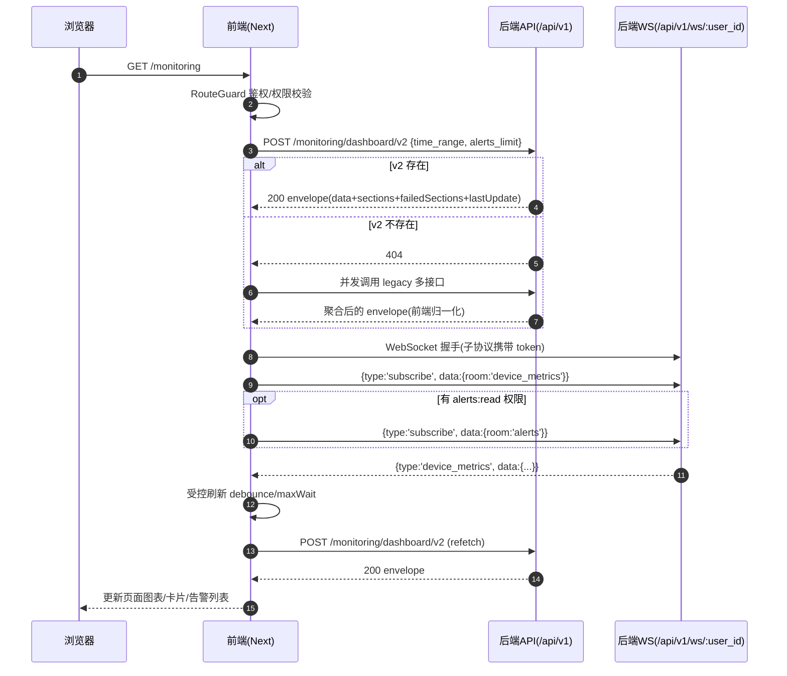

# 监控中心审查与修复方案（2026-03-15）

## 0. 执行进度（更新至 2026-03-15）

- ✅ 第一轮修复已完成并提交：`048fb46b`（端口统一 33000/8000、P0/P1 修复、后端缺表回退、测试与文档同步）
- ✅ 第二轮优化已完成并提交：`7012e5f3`（WS 连接健康度 stale + 基于 lastUpdate 的数据新鲜度提示）
- ✅ 已验证：`pnpm -C frontend test`、`pnpm -C frontend run type-check`、`cd backend-go && go test ./internal/http/handlers -run MonitoringDashboardV2 -count=1`、`cd tests/backend-go && go test ./internal/ws -run HeartbeatAck_ReturnsOk -count=1`；浏览器打开 `/monitoring` 可正常渲染连接与更新时间徽标

## 1. 背景与目标

本次目标：

1) 深度审查「监控中心」页面前端/后端是否完善（含权限、降级、实时刷新、导出链路）。  
2) 确认前端是否真正对接后端 API/WS（非 mock）。  
3) 梳理端到端业务逻辑流程图与接口时序。  
4) 基于审查输出问题清单（P0/P1/P2）与可执行修复方案，并落地修复与回归。

运行端口约定（本地开发）：
- 前端：`http://127.0.0.1:33000`
- 后端：`http://127.0.0.1:8000`（API 基础路径：`/api/v1`；WS 路径：`/api/v1/ws/:user_id`）

---

## 2. 现状结论（已核对源码）

### 2.1 前端确实对接真实后端 API

- 入口 Hook：`frontend/src/features/monitoring/hooks/useMonitoringV2.ts`
  - `queryFn` 直接调用 `fetchMonitoringDataV2(timeRange)`。
- 聚合接口优先：`frontend/src/features/monitoring/api/monitoring.api.ts`
  - 优先 `POST /monitoring/dashboard/v2`（由 `api-client` 统一加上 `/api/v1` 前缀）。
  - 仅当 `404` 才回退到 legacy 扇出拉取（仍为后端真实接口并发请求）。

### 2.2 后端已提供 v2 聚合接口 + legacy 回退接口

- 路由注册：`backend-go/internal/http/handlers/monitoring.go`
  - `POST /monitoring/dashboard/v2` → `GetMonitoringDashboardV2`
  - legacy 关键接口：`/monitoring/stats`、`/monitoring/availability`、`/monitoring/devices/distribution`、`/monitoring/system/performance`、`/monitoring/devices/temperature`、`/monitoring/network/traffic/history`
- 统一 API 前缀：`backend-go/internal/http/router.go`（`/api/v1`）
- v2 envelope 字段 `lastUpdate`：语义为**最新数据时间**（优先取性能/温度/流量时序分区的最新时间点；若无时序数据则回退为本次请求生成时间），用于前端“数据新鲜度”提示。

### 2.3 WebSocket 已真实接入并参与刷新

- 前端 WS SDK：`frontend/src/lib/websocket.ts`
  - 订阅：`subscribe_device_monitoring` → 发送 `{type:'subscribe', data:{room:'device_metrics'}}`
  - 订阅：`subscribe_alerts` → 发送 `{type:'subscribe', data:{room:'alerts'}}`
  - 入站类型映射：后端推送 `device_metrics / alert / system_status ...` 会映射到前端 `WebSocketEvents.*`。
  - ✅ 已增强：订阅幂等 + 重连后自动重放订阅；基于 heartbeat ack 的连接健康度（stale）判断。
- 后端 WS Handler：`backend-go/internal/ws/handler.go`
  - 订阅协议：`type: subscribe/unsubscribe` + `data.room`
  - 权限映射：`alerts` 需 `alerts:read`，`device_metrics` 需 `monitoring:read`
  - 心跳：支持客户端发送 `{type:'heartbeat'}`，服务端返回 `{type:'heartbeat', data:{status:'ok'}}` 用于连接保活与 stale 判定。

---

## 3. 业务流程图（Mermaid）

### 3.1 页面端到端流程（Flowchart）

```mermaid
flowchart TD
  U[访问 /monitoring] --> P[MonitoringPage<br/>frontend/src/app/monitoring/page.tsx]

  P -->|DEV 且 NEXT_PUBLIC_DISABLE_AUTH_CHECK=true| DEV[开发绕过鉴权<br/>直接渲染 MonitoringView]
  P -->|默认| RG[RouteGuard 鉴权/授权<br/>Permission.MONITORING_READ]

  RG -->|未登录/无权限| DENY[阻止访问/跳转登录]
  RG -->|通过| MV[MonitoringView<br/>frontend/src/features/monitoring/components/MonitoringView.tsx]
  DEV --> MV

  MV --> Q[useMonitoringV2 查询<br/>frontend/src/features/monitoring/hooks/useMonitoringV2.ts]
  Q --> F[fetchMonitoringDataV2(timeRange)<br/>frontend/src/features/monitoring/api/monitoring.api.ts]

  F --> V2[POST /api/v1/monitoring/dashboard/v2]
  V2 -->|200| ENV[返回 envelope<br/>data/sections/failedSections/lastUpdate]
  V2 -->|404| LEG[legacy 并发扇出回退]

  LEG --> L1[POST /api/v1/monitoring/system/performance]
  LEG --> L2[POST /api/v1/monitoring/devices/temperature]
  LEG --> L3[GET /api/v1/monitoring/devices/distribution]
  LEG --> L4[GET /api/v1/monitoring/availability]
  LEG --> L5[POST /api/v1/monitoring/network/traffic/history]
  LEG --> L6[GET /api/v1/monitoring/stats]
  LEG --> L7[GET /api/v1/alerts]
  LEG --> ENV

  ENV --> R[渲染/分区降级/权限隐藏]

  MV --> WS[WS 订阅与事件监听<br/>frontend/src/lib/websocket.ts]
  WS --> SUB[subscribe room=device_metrics<br/>可选 room=alerts]
  SUB --> PUSH[后端推送 device_metrics/alert]
  PUSH --> DEB[debounce + maxWait 受控刷新]
  DEB --> Q

  MV --> UI[交互：时间范围/刷新/导出]
  UI -->|切换 timeRange| Q
  UI -->|手动刷新| Q
  UI --> EXP[导出报告]
  EXP --> EX1[POST /api/v1/monitoring/reports/export]
```

### 3.2 时序图（Sequence）



---

## 4. 问题清单（按优先级）

### P0（必须修复）

1) **`alertCount` 可能崩溃**  
   - 位置：`frontend/src/features/monitoring/components/MonitoringView.tsx`  
   - 表现：`data?.realtimeAlerts?.filter(...).length` 在 `realtimeAlerts` 为空时访问 `undefined.length`。  
   - 状态：✅ 已修复（改为 `?.length ?? 0` 的安全写法）  

2) **“实时连接”时完全停轮询，存在“假在线不刷新”风险**  
   - 位置：`frontend/src/features/monitoring/components/MonitoringView.tsx`（轮询间隔依据 `wsHealth` 动态调整）  
   - 场景：WS 已连接但后端短期无推送/订阅失败/推送异常 → 页面长期不更新。  
   - 期望：WS 在线也保留低频轮询兜底；当连接半开/无响应时应能识别并自动降级刷新策略。  
   - 状态：✅ 已修复（页面可见即轮询：connected 5min / stale 60s / disconnected 120s；stale 触发限流自动 refetch，并在 UI 标记“连接不活跃”）  

3) **长时间范围（7d/30d）后端聚合依赖缺表，导致分区失败**  
   - 现象：选择“近7天/近30天”出现“监控数据不完整”，分区报错 `SQLSTATE 42P01`（`device_metrics_hourly` 不存在）。  
   - 影响分区：`systemPerformance / temperature / networkTraffic`  
   - 状态：✅ 已修复（后端在 hourly 聚合表缺失时自动回退为动态 `time_bucket('1 hour', collected_at)` 聚合）  

### P1（建议修复）

1) **带宽格式化边界不完整（0<bps<1、NaN/Infinity）**  
   - 位置：`frontend/src/features/monitoring/api/monitoring.api.ts` → `formatBandwidthValue`  
   - 风险：出现 `undefined` 单位或 `NaN` 文案，影响指标可信度。  
   - 状态：✅ 已修复（`Number.isFinite` + 单位索引 clamp）  

2) **告警列表 URL 风格不统一**  
   - 位置：`frontend/src/features/monitoring/api/monitoring.api.ts` → `GET /alerts?...`  
   - 现状：后端已兼容 `/alerts` 与 `/alerts/`，但建议前端统一为无尾斜杠，减少歧义与潜在重定向。  
   - 状态：✅ 已修复（统一为无尾斜杠）  

### P2（可选优化）

1) **监控指标区空态与错误态可更友好**  
   - 位置：`frontend/src/features/monitoring/components/MonitoringView.tsx`（stats 区域）  
   - 建议：当 `statsV2` 为空时展示明确“暂无数据/采集未启动”的空态卡片。  
   - 状态：✅ 已完成（无设备引导卡 + 关键指标空态 CTA：去设备管理/采集配置/重试）  

2) **错误文案对用户不够友好**  
   - 位置：`frontend/src/features/monitoring/components/MonitoringView.tsx`（error message 直出）  
   - 建议：对网络错误/权限错误/服务不可用做用户可理解的分级提示。  
   - 状态：✅ 已完成（保留 `ApiClientError` 并做 401/403/5xx/网络/超时分级提示 + 可折叠详情）  

3) **“实时连接但数据不动”缺少可感知提示与自动降级**  
   - 位置：`frontend/src/lib/websocket.ts` + `frontend/src/features/monitoring/components/MonitoringView.tsx` + `backend-go/internal/http/handlers/monitoring.go`  
   - 现象：WS 连接可能处于半开/无推送，UI 仍显示“实时连接”，用户感知为“在线但不更新”。  
   - 状态：✅ 已完成（WS 健康度 stale + 数据新鲜度超时变黄；后端 `lastUpdate` 改为最新数据时间；stale 自动降级更短轮询并触发一次限流刷新）  

---

## 5. 修复方案（已落地实施）

### 5.1 前端修复

- 修复 `alertCount` 空值链：改为安全写法（数组兜底或 `?.length`）。  
- WS 在线时保留低频轮询兜底：例如在线 5 分钟一次、离线 2 分钟一次（仅页面可见时启用）。  
- 补齐 `formatBandwidthValue` 边界：`Number.isFinite` + 单位索引 clamp（`>=0`）。  
- 统一 `fetchRealtimeAlerts` URL：改为 `/alerts?...`。  

### 5.2 后端修复

- 修复长时间范围聚合缺表导致的分区失败：当 `device_metrics_hourly/system_metrics_hourly` 不存在时，自动回退为基于原始指标表的动态聚合查询，避免 `SQLSTATE 42P01` 直接导致分区失败。  

### 5.3 测试与回归（≤60s 优先）

- ✅ 前端 Jest：已新增监控 API normalize/回退/权限分区单测（`frontend/src/features/monitoring/api/monitoring.api.test.ts` 等）。  
- ✅ 后端 Go：已新增 `/monitoring/dashboard/v2` 契约测试（`backend-go/internal/http/handlers/monitoring_dashboard_v2_contract_test.go`）。  
- ✅ 联调冒烟：已验证 `/monitoring` 正常渲染、真实请求后端 v2、WS 触发刷新、离线/不活跃自动兜底轮询、控制台无 `/favicon.ico 404`。  

---

## 6. 补充问题与优化（已完成）

以下问题在完成 P0/P1 修复并通过浏览器冒烟验证后补充发现（2026-03-15）：

### P2（已完成）

1) **页面级错误文案缺少“分级 + 可操作引导”**  
   - 位置：`frontend/src/features/monitoring/components/MonitoringView.tsx`（error 分支）  
   - 现状：直接展示 `error.message`，且上游在 `fetchMonitoringDataV2` 中会把 `ApiClientError` 挤压为通用 `Error('监控数据加载失败')`，导致 401/403/5xx/网络断开无法区分。  
   - 影响：用户不清楚“是登录过期/权限不足/后端未启动/服务异常”，只能盲点重试。  
   - 状态：✅ 已完成（错误分级 + CTA + 可折叠详情；`fetchMonitoringDataV2` 保留 `ApiClientError`）  

2) **关键指标/图表区空态可更“像引导”而不是“像故障”**  
   - 位置：`frontend/src/features/monitoring/components/MonitoringView.tsx`（关键指标 stats 区 + 图表区无数据分支）  
   - 现状：当设备为 0 或数据为空时，多处仅提示“暂无数据/统计数据不可用”，缺少明确下一步入口。  
   - 建议：区分“无设备/采集未启动/时间范围无数据/分区失败”，并提供 CTA（去设备管理/查看采集配置/切换时间范围/重试）。  
   - 状态：✅ 已完成（新增“尚未添加设备”引导卡；关键指标空态补齐 CTA）  

3) **WS 订阅缺少幂等与重连后的订阅恢复（有重复订阅/漏订阅风险）**  
   - 位置：`frontend/src/lib/websocket.ts`（subscribe/unsubscribe 仅 emit，无状态）  
   - 风险：重复 subscribe 可能放大推送与刷新；重连后如果页面未重新触发订阅逻辑，可能出现“已连接但不推送”。  
   - 状态：✅ 已完成（订阅幂等 + 记录订阅意图 + 重连后自动重放）  

4) **推送触发的 debounce 定时器在切换 timeRange 时可能残留**  
   - 位置：`frontend/src/features/monitoring/components/MonitoringView.tsx`（`refetchDebounced` 定时器）  
   - 风险：用户切换时间范围后，旧定时器仍可能触发旧 query 的 refetch，造成无意义请求与日志噪音。  
   - 状态：✅ 已完成（timeRange 变化时清理 pending 定时器）  

5) **“监控数据不完整”提示可补充失败分区信息**  
   - 位置：`frontend/src/features/monitoring/components/MonitoringView.tsx`（黄色提示条）  
   - 建议：展示失败分区名称（例如“系统性能趋势/温度/流量/设备状态/可用性/关键指标/实时告警”），并保留一键重试。  
   - 状态：✅ 已完成（展示失败分区名称列表）  

### P3（体验噪音）

1) **favicon.ico 缺失导致控制台 404**  
   - 现象：浏览器控制台出现 `GET /favicon.ico 404`。  
   - 建议：补充 `frontend/public/favicon.ico`（或 Next app router 的 favicon 文件），避免误报与日志污染。  
   - 状态：✅ 已完成（新增 `frontend/public/favicon.ico` + 文件存在性测试）  

---

## 7. 追加修复计划（已执行）

1) **前端：保留后端错误状态并做页面级错误分级**  
   - 改造：`fetchMonitoringDataV2` 遇到非 404 的 `ApiClientError` 时直接抛出，避免丢失 `status/type`。  
   - 页面：按 401/403/5xx/网络错误分级展示（文案 + 可操作按钮），原始错误信息仅作为“可折叠详情”辅助排障。  
   - 状态：✅ 已完成  

2) **前端：关键指标/无设备空态引导 + 失败分区可见化**  
   - 新增：当检测到“总设备=0”或 `statsV2` 为空时，展示引导卡片与 CTA。  
   - 提示条：在“监控数据不完整”中显示失败分区列表（排除因权限受限隐藏的告警分区）。  
   - 状态：✅ 已完成  

3) **前端：WS 订阅幂等 + 重连恢复 + timeRange 切换清理**  
   - WS：在 `websocket.ts` 内对订阅做幂等（已订阅则不重复 emit）；连接建立后重放 active 订阅。  
   - 页面：`timeRange` 变化时清理 pending debounce 定时器，避免旧 refetch 泄漏。  
   - 状态：✅ 已完成  

4) **前端：补齐 favicon**  
   - 添加：`frontend/public/favicon.ico`。  
   - 状态：✅ 已完成  

5) **测试：补强 P2 覆盖（≤60s）**  
   - 前端：新增 `frontend/src/features/monitoring/components/MonitoringView.p2.test.tsx`（`WS stale/connected` + `lastUpdate` 超阈值提示），避免“实时连接但数据不动”文案回归。  
   - 前端：补齐回归测试对 WS Mock 的 `getHealthStatus()`（`tests/frontend/monitoring/components/MonitoringView.visibility.test.tsx`），避免接口升级导致测试失真/误挂。  
   - 后端：新增 WS 心跳回包测试（`tests/backend-go/internal/ws/handler_origin_test.go` → `TestHeartbeatAck_ReturnsOk`），确保 stale 判定依赖稳定。  
   - 轻量护栏：新增 favicon 文件存在性测试（避免再出现 404）。  
   - 状态：✅ 已完成  

### 7.1 验证清单（不重复启动服务）

- 打开 `http://127.0.0.1:33000/monitoring`：  
  - 无设备时：出现明确引导（去设备管理/采集配置/重试）。  
  - 后端未启动/断开时：错误提示应区分“无法连接/服务不可用”，不直出内部错误。  
  - 权限不足（alerts:read 缺失）时：出现“权限受限”提示，且不应触发“监控数据不完整”误报。  
  - WS 断线/重连：页面仍可通过兜底轮询保持更新，不应出现重复刷新风暴。  
  - 控制台：不应再出现 `/favicon.ico 404`。  

---

## 8. 第二轮优化（已完成）：WS 健康度 stale + 数据新鲜度提示

目标：彻底降低“显示实时连接但数据不动”的体验落差，让用户能**看见**连接是否活跃、数据是否新鲜，并在异常时自动降级刷新策略。

### 8.1 后端：lastUpdate 语义修正为“最新数据时间”

- 位置：`backend-go/internal/http/handlers/monitoring.go` → `GetMonitoringDashboardV2`
- 变更：`lastUpdate` 优先取 `systemPerformance/temperature/networkTraffic` 三个时序分区的最新时间点；若均无数据，则回退为本次请求生成时间。
- 保障：`backend-go/internal/http/handlers/monitoring_dashboard_v2_contract_test.go` 增加断言，锁定 lastUpdate 语义。

### 8.2 前端：WS 连接健康度（stale）与数据新鲜度 UI

- 位置：`frontend/src/lib/websocket.ts`
  - 新增：记录 `lastMessageAt/lastHeartbeatAckAt`，提供 `getHealthStatus()`（`connected/stale/disconnected`）。
  - 依据：后端对 `{type:'heartbeat'}` 返回 `{type:'heartbeat', data:{status:'ok'}}`，用于判断链路是否仍在活跃响应。
- 位置：`frontend/src/features/monitoring/components/MonitoringView.tsx`
  - 展示：连接不活跃时徽标显示“连接不活跃”；数据超阈值未更新时“更新”徽标变黄并显示“已X未更新”。  
  - 降级：当 `stale` 时自动提高轮询频率（60s）并触发一次限流刷新，尽快恢复数据更新体验。
