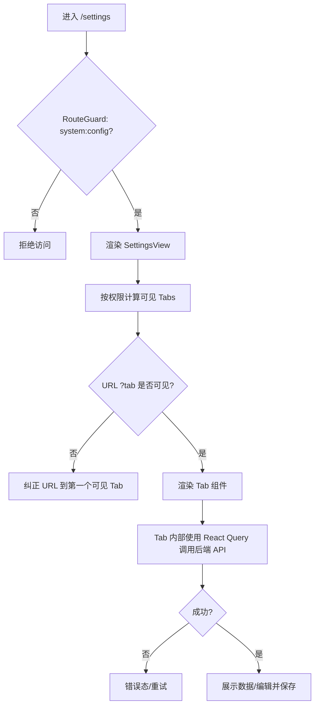
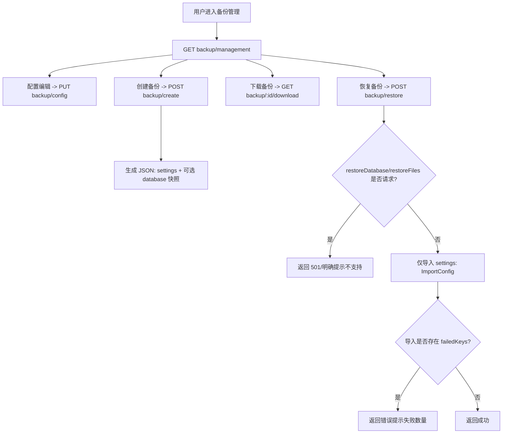

# 系统设置页面（9 子模块）对接审查与修复实施计划

> **For Claude:** REQUIRED SUB-SKILL: Use superpowers:executing-plans to implement this plan task-by-task.

**Goal：**对 `系统设置` 页面 9 个子模块做前后端对接核查，修复已发现的 P0/P1 缺陷，补齐关键回归测试，并输出可追溯的业务流程图与验收标准。

**Architecture：**以“URL(tab) 作为单一事实源 + 权限可见性过滤 + 组件/Hook 双层兜底”为前端主线；以“后端能力与接口参数语义一致、禁止假成功”为后端主线；对配置类接口统一做类型归一化（boolean/number/json），避免 `|| 默认值` 破坏 `false/0`。

**Tech Stack：**Next.js(App Router) + React Query + Jest；Go(Echo) + GORM。

---

## 执行进度（截至 2026-03-20）

- [x] P0：安全策略/通知中心布尔解析错误已修复（`false` 不再被默认值覆盖），并补齐回归单测
- [x] P0：备份恢复/创建语义一致化（不支持能力返回 501、禁止假成功），前端 UI 与调用参数对齐
- [x] P0：审计日志/系统监控错误态与空态补齐，并补齐回归单测
- [x] P0：SettingsView 的 URL(tab) 同步 + 权限可见性纠偏，并补齐回归单测
- [x] P1：历史聚合版 `settings.api.ts` 的 stub/假成功已改为显式抛错（并加弃用说明）
- [x] P1：备份 includeFiles（未实现能力）已被前后端一致禁用/拒绝（避免误导）
- [x] P1：`settingsMap.get(key) || 默认值` 误覆盖 `0/""/false` 的问题已治理（general/notification 等已改为显式解析/枚举归一化），并新增 falsy 回归用例
- [x] P1：配置类子页动作区迁移至壳层统一承载（general/security/notifications/backup 的保存/重置/离开拦截能力上报），并补齐迁移单测（参考壳层重构计划 `docs/plans/2026-03-19-system-settings-shell-refactor-implementation-plan.md`）

补充说明：
- 本文档为 Round 1（首轮）审查与修复计划，以上条目已全部完成并通过验证。
- Round 2（二次审查）新增问题与优化计划详见：`docs/plans/2026-03-19-system-settings-page-round2-audit-and-fix-plan.md`。

验证：
- `cd backend-go && go test ./...` ✅
- `pnpm -C frontend type-check` ✅
- `pnpm -C frontend test -- --runInBand tests/frontend/settings` ✅

## 0. 现状结论（审查摘要）

### 0.1 9 个 Tab 与对接清单（已核对）

页面入口与主体：
- 前端入口：`frontend/src/app/settings/page.tsx`
- 主体容器：`frontend/src/features/settings/components/SettingsView.tsx`

9 个 Tab：
- `general / logs / users / roles / security / audit / backup / notifications / monitoring`

对接方式结论：
- 除“历史聚合版 settings.api.ts 的 stub/假成功”外，当前 SettingsView 所用的各 Tab 已基本走真实后端 API（可视为“已对接”，但存在若干会导致功能错误或强误导的缺陷，需要修复）。

### 0.2 P0 问题（必须修复）

- [x] 1) 安全策略/通知中心布尔值解析错误：`false` 会被 `|| true` 覆盖为 `true`，导致开关“关不掉”。  
涉及：`frontend/src/features/settings/api/security.api.ts`、`frontend/src/features/settings/api/notification.api.ts`

- [x] 2) 备份恢复“假成功”：后端 `RestoreBackup` 忽略 `restoreDatabase/restoreFiles`，且忽略导入结果；前端 UI 语义宣称可恢复数据库/文件。  
涉及：`backend-go/internal/settings/backup.go`、`backend-go/internal/http/handlers/settings_backup.go`、`frontend/src/features/settings/components/backup/*`

- [x] 3) 审计日志/系统监控缺少错误态：403/网络失败会表现为“空表格/一直骨架屏”，误导用户。  
涉及：`frontend/src/features/settings/components/audit/AuditLogs.tsx`、`frontend/src/features/settings/components/monitoring/MonitoringDashboard.tsx`

- [x] 4) SettingsView Tab 与 URL/权限不同步：手动输入 `?tab=` 可能短暂渲染不可见 Tab 并触发无意义请求；点击 Tab 不回写 URL，刷新/分享/回退不稳定。  
涉及：`frontend/src/features/settings/components/SettingsView.tsx`

### 0.3 P1 风险（建议修复/治理）

- [x] 1) 历史聚合版 `frontend/src/features/settings/api/settings.api.ts` 存在大量 stub/假成功：已改为“显式抛错 + 顶部弃用说明”，避免误用造成假成功（后续建议逐步下线）。  
- [x] 2) 备份 includeFiles 目前“名义支持、实际未实现”：前端已显式禁用并强制关闭；后端已强制回显为 `false`、禁止更新为 `true`（请求时返回 501），消除误导。  
- [x] 3) 多处 `settingsMap.get(key) || 默认值` 对 `0/false/""` 不友好：已在 settings 相关 API 中统一改为显式解析/枚举归一化（参考 `frontend/src/features/settings/api/logs.api.ts` 的 `toBoolean/toNumber`）。

---

## 1. 业务流程图（Mermaid）

### 1.1 系统设置页面总体流程

### 1.2 备份：创建/下载/恢复（当前能力与目标语义）

---

## 2. 修复策略与验收标准

### 2.1 修复策略（原则）
- 禁止“假成功”：后端参数必须影响行为或明确拒绝；前端 UI/文案必须与后端能力一致。
- URL(tab) 作为单一事实源：点击 Tab 必须回写 `?tab=`；无权限/不可见 Tab 不应被渲染、更不应触发请求。
- 类型归一化：对后端 `SettingItem.value` 做 `toBoolean/toNumber/toString/toJson` 显式解析，禁用 `||` 处理布尔默认值。
- 测试优先：对 P0 修复点补回归单测，确保“先红后绿”。

### 2.2 验收标准（AC）
- 安全策略/通知中心：后端返回 `false` 时，前端开关显示 `false`，保存后刷新仍为 `false`。
- 审计日志：后端 403/500 时页面显示明确错误态，不再显示空表格；支持重试。
- 系统监控：后端 403/500 时页面显示明确错误态，不再无限骨架屏；无数据时显示空态。
- SettingsView：点击 Tab URL 变更（`?tab=`），刷新保持当前 Tab；URL 指向不可见 Tab 时不会渲染该 Tab，且 URL 被纠正到第一个可见 Tab。
- 备份恢复：请求 `restoreDatabase/restoreFiles=true` 时后端明确返回“不支持”；前端不再默认传 true/true，且 UI 明确“当前仅恢复系统配置(settings)”。

---

## 3. 任务拆解（TDD + 最小改动）

### [x] Task 1：为布尔回退 bug 补回归单测（先红）

**Files：**
- Create: `tests/frontend/settings/security/securityApi.getSecuritySettings.boolFallback.test.ts`
- Create: `tests/frontend/settings/notifications/notificationApi.getNotificationSettings.boolFallback.test.ts`

**Step 1：编写失败用例**
- mock `httpClient.get` 返回 `value: false`
- 断言解析结果必须为 `false`

**Step 2：运行单测确认失败**
- Run: `cd frontend; pnpm test ../tests/frontend/settings/security/securityApi.getSecuritySettings.boolFallback.test.ts`
- Expected: FAIL（现状会被 `|| true` 覆盖为 true）

---

### [x] Task 2：修复 security/notification 配置解析（转绿）

**Files：**
- Modify: `frontend/src/features/settings/api/security.api.ts`
- Modify: `frontend/src/features/settings/api/notification.api.ts`
- (可选) Create: `frontend/src/features/settings/api/normalize.ts`（提取 `toBoolean/toNumber` 复用）

**Step 1：最小实现**
- 将 `settingsMap.get(key) || true/false/数字` 替换为显式解析：
  - `toBoolean(value, fallback)`
  - `toNumber(value, fallback)`
  - 对数组/对象使用 `Array.isArray` / `typeof === 'object'` 判断

**Step 2：运行 Task 1 单测**
- Expected: PASS

---

### [x] Task 3：SettingsView 的 URL(tab) 同步与可见性纠偏（补测试 + 修复）

**Files：**
- Modify: `frontend/src/features/settings/components/SettingsView.tsx`
- Create: `tests/frontend/settings/SettingsView.urlSync.test.tsx`
- (可选) Create: `tests/frontend/settings/SettingsView.permissionsVisibility.test.tsx`

**Step 1：测试（先红）**
- 点击任一 Tab 断言 `router.push` 被调用并包含 `tab=<key>`
- URL 指向不可见 Tab 时，不渲染该 Tab 组件（并纠正 URL）

**Step 2：实现**
- 去除/弱化本地 `activeTab` 状态的竞态：用 `tabParam + 可见 tabs` 推导 `effectiveTab`
- 用户点击 Tab 使用 `router.push` 更新 `?tab=`（支持浏览器后退回到上一个 Tab）
- 自动纠偏（tab 非法/不可见）使用 `router.replace`（避免污染历史栈）
- `tabs.length===0` 渲染 EmptyState（未来放宽路由权限时也安全）

**Step 3：运行相关单测**

---

### [x] Task 4：审计日志与系统监控错误态/空态（补测试 + 修复）

**Files：**
- Modify: `frontend/src/features/settings/components/audit/AuditLogs.tsx`
- Modify: `frontend/src/features/settings/components/monitoring/MonitoringDashboard.tsx`
- (可选) Modify: `frontend/src/features/settings/hooks/useAuditLogs.ts`
- (可选) Modify: `frontend/src/features/settings/hooks/useSystemMonitoring.ts`
- Create: `tests/frontend/settings/audit/AuditLogs.errorState.test.tsx`
- Create: `tests/frontend/settings/monitoring/MonitoringDashboard.errorState.test.tsx`

**Step 1：测试（先红）**
- mock hook 返回 `error`，断言组件显示“加载失败”提示

**Step 2：实现**
- AuditLogs：当 `error && logs.length===0` 显示错误态；当 `!isLoading && logs.length===0` 显示空态
- MonitoringDashboard：优先处理 `error`；`metrics` 缺失且不在加载时显示空态

**Step 3：运行单测**

---

### [x] Task 5：后端备份恢复语义一致化（消除假成功）

**Files：**
- Modify: `backend-go/internal/settings/backup.go`
- Modify: `backend-go/internal/http/handlers/settings_backup.go`

**Step 1：实现（最小安全改动）**
- `RestoreBackup`：
  - `restoreDatabase==true` 或 `restoreFiles==true` 直接返回明确错误（建议 501/Not Implemented）
  - 不再忽略 `ImportConfig` 返回：若存在 failedKeys，返回错误并提示失败数量
  - 记录操作者（将 handler 的 user.ID 传入 service，用于 updated_by）
- handler 默认值：
  - `restoreDatabase/restoreFiles` 默认改为 `false`（避免老客户端不传参数就触发“不支持”）
  - `includeFiles` 默认改为 `false`（避免 create 请求不传就形成误导）

**Step 2：后端快速验证**
- Run: `cd backend-go; go test ./...`（若耗时过长则降级为 `go test ./internal/settings -run TestName`，或至少 `go test ./...` 看编译通过）

---

### [x] Task 6：前端备份 UI 与调用参数对齐（避免误导）

**Files：**
- Modify: `frontend/src/features/settings/components/backup/BackupManagement.tsx`
- Modify: `frontend/src/features/settings/components/backup/BackupConfigSection.tsx`
- (可选) Modify: `frontend/src/features/settings/components/backup/BackupHistorySection.tsx`

**Step 1：实现**
- 恢复备份请求默认传 `restoreDatabase:false`、`restoreFiles:false`
- UI 文案明确：“当前版本仅支持恢复系统配置(settings)，不支持恢复数据库/文件”
- includeFiles 选项显式禁用或标记“暂不支持”，避免用户误以为已备份文件

**Step 2：手动冒烟**
- 本地打开设置页，创建备份、下载、恢复（settings）流程可走通；请求 DB/files 时获得明确提示

---

## 4. 风险与回滚
- URL 同步改动可能影响少量依赖 `activeTab` 状态的逻辑（通过单测覆盖与手动冒烟降低风险）。
- 后端把“静默忽略”改为“明确不支持”属于行为修正：通过把默认值改为 false 降低对老客户端的破坏性。
- 回滚方式：保留改动在小范围文件；如需回滚，仅需撤回对应文件变更即可。
