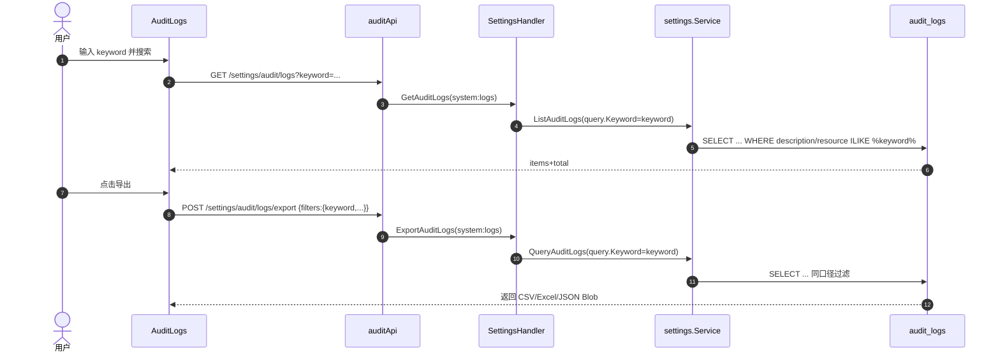

# 系统设置页面（9 子模块）二次审查与优化修复计划（Round 2）

> **For Claude:** REQUIRED SUB-SKILL: Use superpowers:executing-plans to implement this plan task-by-task.

**Goal：**在上一轮 P0/P1 修复完成的基础上，对“系统设置”9 个子模块再次做端到端对接复核（前端调用链 → 后端路由/权限 → 数据契约 → 错误态/空态/加载态），补齐新增的 P0/P1 缺陷修复与回归测试，并完善关键业务流程图，确保页面不存在“假成功/保存不生效/权限误导”等问题。

**Architecture：**
- 前端：坚持“URL(tab) 为单一事实源 + 权限可见性过滤 + Hook/组件兜底错误态”的基线；配置类保存统一走 `/settings/general/bulk`，并对 `failed_keys` 做显式失败处理（避免 200 假成功）。
- 后端：坚持“能力不支持必须明确拒绝（501）+ 入参校验与错误码语义一致”，通用配置读取端点确保覆盖 UI 实际写入的 category（避免读写不对称）。

**Tech Stack：**Next.js(App Router) + React Query + Jest；Go(Echo) + GORM。

---

## 0. 二次审查结论（摘要）

### 0.1 对接真实性结论
- 9 个子模块（`general / logs / users / roles / security / audit / backup / notifications / monitoring`）均已走真实后端 API（非 mock/stub），核心链路可视为“已对接”。
- 二次审查发现的主要问题集中在：**通用设置读写不对称（P0）**、**bulk 保存局部失败未感知（P1）**、**通知 legacy 键兼容（P1）**、**审计导出与列表筛选不一致（P1）**、**用户管理动作级权限缺失（P1）**、**后端角色描述无法清空（P1）**、**Syslog 应用错误根因被吞（P1）**。

### 0.2 本轮新增问题分级

**P0（必须修复）**
- General：前端保存了 `user_preference.*`，但后端 `GET /settings/general` 未返回该 category，导致“保存后刷新看起来未生效/被重置”。

**P1（建议修复）**
- bulk：后端返回 `failed_keys` 但前端全部忽略，UI 一律 toast 成功，存在“部分失败但提示成功”的假成功风险（general/security/notifications/logs）。  
- notifications：前端仅读取新键 `notification.email.*`，但后端发送逻辑兼容旧键 `email.*`；历史环境可能出现“实际可发送但 UI 显示为空/默认值”。  
- audit：导出未携带 keyword/resource 等筛选，用户“列表筛选后导出”拿到的数据与预期不一致。  
- users：用户管理缺少动作级权限控制（create/update/delete），仅靠后端 403，体验与可解释性较差。  
- roles：后端更新角色描述时无法清空（payload 传空字符串会被忽略）。  
- logs：Syslog `apply` 失败时后端返回泛化错误，前端难以定位根因。

**P2（可选优化）**
- 数值输入清空导致 NaN 风险（security/notifications 若输入被清空可能写入 `null`/空串）；建议做输入侧防御与解析侧“空串不当 0”治理。  
- settings 目录内仍存在旧聚合 API/Hook 的导出并存，存在未来误用风险（建议逐步收敛导出面）。

---

## 执行进度（截至 2026-03-19）

- [x] Task 1：后端 general 端点补齐 `user_preference` category（读写对称）
- [x] Task 2：bulk 保存显式处理 `failed_keys`（防止 200 假成功）
- [x] Task 3：notifications 读取兼容 legacy `email.*` 键（避免 UI 与实际发送不一致）
- [x] Task 4：审计导出携带 keyword/resource 等筛选（与列表口径一致）
- [x] Task 5：用户管理动作级权限控制 + 空态
- [x] Task 6：后端角色描述允许清空（修复“清空不生效”）
- [x] Task 7：Syslog apply 返回真实错误根因（提升可观测性）

验证：
- `cd backend-go; go test ./...` ✅
- `pnpm -C frontend type-check` ✅
- `pnpm -C frontend test` ✅

---

## 1. 业务流程图（Mermaid）

### 1.1 配置类 Tab（general/security/notifications/logs）统一读写流程

```mermaid
flowchart TD
  A[进入 /settings?tab=xxx] --> B[渲染 SettingsView -> Tab 组件]
  B --> C[useQuery: GET 对应 settings 列表]
  C --> D[前端归一化: toBoolean/toNumber/toEnum/toJson]
  D --> E[编辑本地 state -> isDirty=true]
  E --> F[点击保存]
  F --> G[POST /settings/general/bulk {settings}]
  G --> H[后端 BulkUpdateSettings -> UpsertSetting]
  H --> I{failed_keys 是否为空?}
  I -- 是 --> J[toast 成功 + invalidateQueries]
  I -- 否 --> K[提示部分失败 + 保持 isDirty + 引导重试]
```

### 1.2 审计：列表筛选与导出对齐



---

## 2. 任务拆解（TDD + 最小改动）

### [x] Task 1（P0）：后端 general 端点补齐 `user_preference` category（读写对称）

**Files：**
- Modify: `backend-go/internal/http/handlers/settings_general.go`

**变更要点：**
- `GetGeneralConfigs/GetGeneralStats` 的 categories 补齐 `user_preference`。

**验证：**
- `cd backend-go; go test ./...`（至少编译通过）

---

### [x] Task 2（P1）：bulk 保存显式处理 `failed_keys`（防止 200 假成功）

**Files：**
- Modify: `frontend/src/features/settings/api/general.api.ts`
- Modify: `frontend/src/features/settings/api/security.api.ts`
- Modify: `frontend/src/features/settings/api/notification.api.ts`
- Modify: `frontend/src/features/settings/api/logs.api.ts`
- (可选) Create: `frontend/src/features/settings/api/bulk.ts`（统一解析 bulk 响应）

**变更要点：**
- `POST /settings/general/bulk` 后读取 `failed_keys`：非空则抛错（或返回结构供 UI 展示），避免 toast 永远成功。

**测试：**
- 新增/补齐 API 单测：模拟 bulk 返回 `failed_keys`，断言保存 Promise reject。

---

### [x] Task 3（P1）：notifications 读取兼容 legacy `email.*` 键（避免 UI 与实际发送不一致）

**Files：**
- Modify: `frontend/src/features/settings/api/notification.api.ts`
- Test: `tests/frontend/settings/notifications/*`

**变更要点：**
- 当 `notification.email.smtp_*` 为空时，回退读取：`email.smtp_server/email.smtp_port/email.smtp_username/...`（与后端 `loadSMTPConfig` 对齐）。

---

### [x] Task 4（P1）：审计导出携带 keyword/resource 等筛选（与列表口径一致）

**Files：**
- Modify: `frontend/src/features/settings/api/audit.api.ts`
- Modify: `backend-go/internal/http/handlers/settings_audit.go`

**变更要点：**
- 前端：把 `keyword/resource`（以及其它已支持筛选项）写入 `filters`。
- 后端：`ExportAuditLogs` 从 `filters` 读出 `keyword/search/resource` 并写入 `AuditQuery`。

---

### [x] Task 5（P1）：用户管理动作级权限控制 + 空态

**Files：**
- Modify: `frontend/src/features/settings/components/users/UserManagement.tsx`

**变更要点：**
- 按 `users:create/users:update/users:delete` 禁用/隐藏按钮，并给出明确提示；用户列表为空时展示 EmptyState。

---

### [x] Task 6（P1）：后端角色描述允许清空（修复“清空不生效”）

**Files：**
- Modify: `backend-go/internal/settings/roles.go`

**变更要点：**
- 当 payload 显式包含 `description` 字段时，即使为空字符串也应更新（置空/置 NULL）。

---

### [x] Task 7（P1）：Syslog apply 返回真实错误根因（提升可观测性）

**Files：**
- Modify: `backend-go/internal/http/handlers/logs.go`

**变更要点：**
- `ApplySyslogConfig` 失败时返回包含根因的错误信息（避免“failed to apply syslog config”泛化）。

---

## 3. 验收标准（AC）
- General：修改“用户偏好”保存后刷新仍保持，不会回落到默认值。
- bulk：当后端返回 `failed_keys` 时，前端不再 toast “保存成功”，而是提示失败并保持可重试状态。
- Notifications：历史环境仅配置 `email.*` 时，通知页能展示实际 SMTP 配置；保存后新键落库并与发送行为一致。
- Audit：列表 keyword 筛选后导出，导出内容口径与列表一致（至少包含 keyword 过滤）。
- Users：无对应权限时不展示/禁用危险操作按钮，提示清晰；无数据时有空态。
- Roles：角色描述可清空并真实落库。
- Logs：Syslog apply 失败能在前端看到更明确的错误原因（便于排障）。
